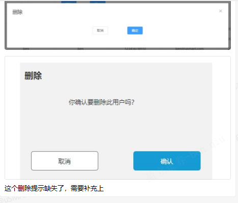

[WIN10的桌面和虚拟桌面的切换有快捷键吗， 是什么快捷键？](https://www.zhihu.com/question/35905507/answer/70463897)

- [ ] 白标的券商中台 用户权限模块：问题 1.删除提示缺失  2.生成的随机密码点击的没有显示

这个分页的功能也是有问题的，总共是有7条数据的，下面也没有显示总数量，而且只有7条数据是不能进行翻页的

同一个用户登录名做新增的时候，是直接提示已存在不能新增还是做修改的操作？

> 已存在不能新增