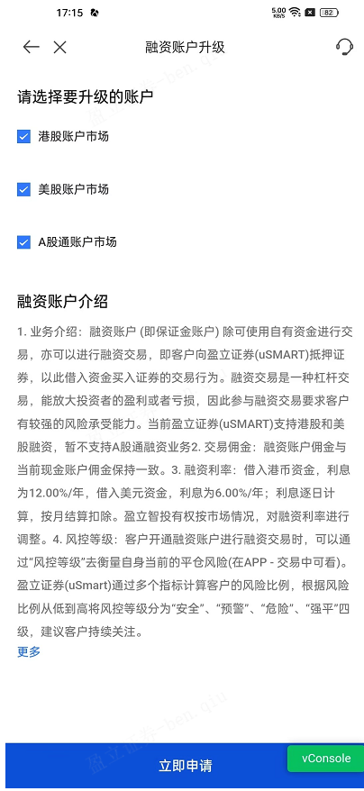
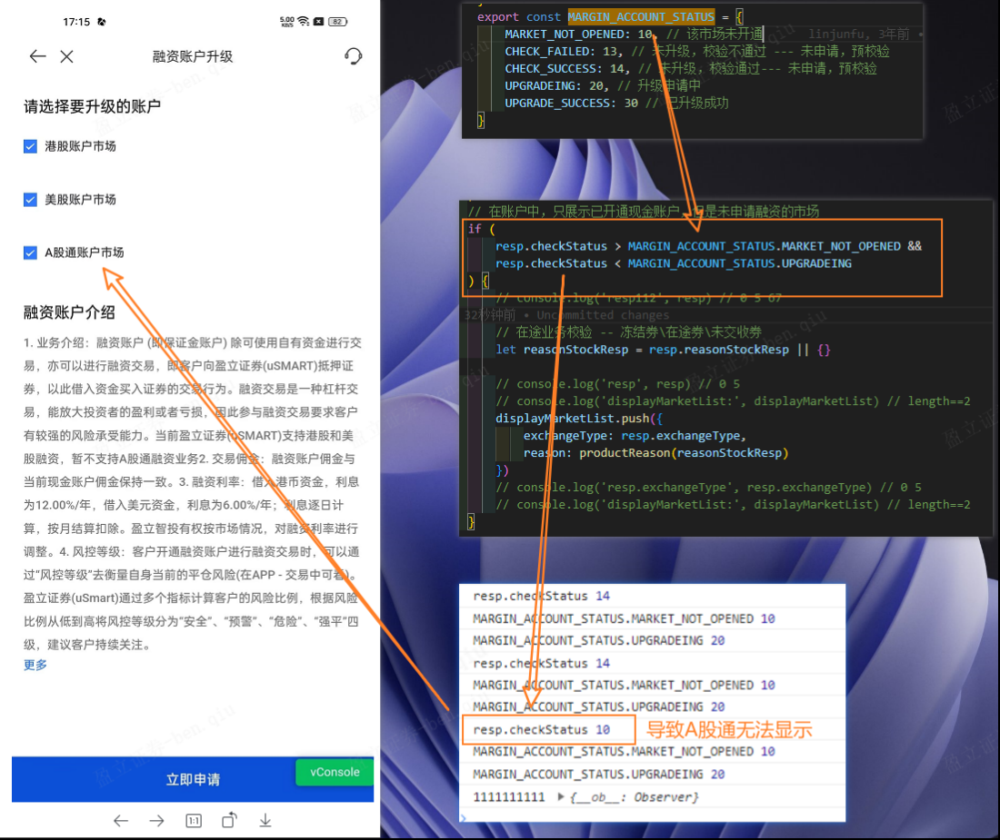
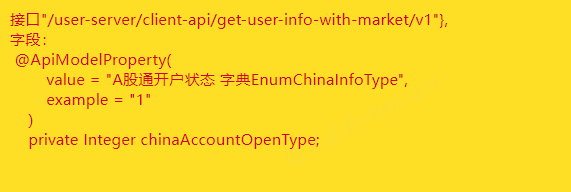

报非法token的可能原因

- token不对
- url不对（看清楚给的是哪个环境的token，不同环境所用的token是不一样的）

​	

uuid是什么

> UUID（Universally Unique Identifier）是一种标识符，用于唯一标识信息或实体。它是由一组字符组成的标准化字符串，通常表现为32位的十六进制数字，形式为8-4-4-4-12，例如："550e8400-e29b-41d4-a716-446655440000"。
>
> UUID的目的是确保生成的标识符在时间和空间上都是唯一的，几乎可以被认为是唯一的。它广泛应用于分布式系统、数据库、网络协议、安全领域等各种场景中，用于标识数据、实体或操作的唯一性。
>
> UUID的生成算法基于机器的网络地址、当前时间戳、随机数等信息，通过这些信息的组合生成一个全局唯一的标识符。UUID的生成过程可以在不同的编程语言和平台上进行，通常有多种算法可供选择。
>
> 需要注意的是，UUID并不是严格意义上的全局唯一标识符，因为在极端情况下（如不同机器上同时生成大量UUID），仍然存在概率性的重复。但是在实际应用中，UUID的重复概率非常低，可以满足大多数情况下的唯一性需求。

​	

## 解决：vconsole.min.js:10     GET http://localhost:8082/user-account-server/api/check-open-china-tong/v1 415 (Unsupported Media Type)

这个错误表示在发送GET请求时，服务器返回了"415 Unsupported Media Type"错误。这个错误通常是由于请求的媒体类型不受服务器支持引起的。

常见的解决方法包括：

1. 检查请求头的Content-Type：确认请求头中的Content-Type是否正确设置为服务器支持的媒体类型。如果不确定，可以尝试将Content-Type设置为"application/json"或"application/x-www-form-urlencoded"。

2. 检查请求参数：确认请求参数是否正确，并且符合服务器接口的要求。特别是对于POST请求，确保请求体中的数据格式正确，并且与服务器期望的数据类型一致。

3. 检查服务器接口：确认服务器接口的实现是否正确，包括对请求的媒体类型的支持。查看服务器的文档或与后端开发人员进行沟通，确保服务器端正确处理相应的媒体类型。

4. 检查网络代理或防火墙设置：有时候，网络代理或防火墙可能会干扰请求的媒体类型。尝试在没有代理或防火墙的环境下发送请求，查看是否能够正常访问服务器接口。

5. 检查服务器端的错误日志：如果以上方法都没有解决问题，查看服务器端的错误日志，看是否有更详细的错误信息可以提供线索。

需要注意的是，具体的解决方法可能因服务器和应用程序的设置而异。如果问题仍然存在，建议与服务器端的开发人员或系统管理员进行进一步的沟通和调试。