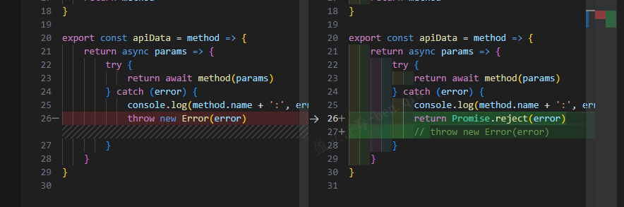

account项目，测试号：12555555666

测试机拿token：【盈立智投APP】-【我的】-【设置】-【Debug信息】-【用户ID】-【复制用户信息】-【拿取token】

[vscode软件窗口标题栏显示文件完整路径](https://www.bmqy.net/1451.html)

​	

因为apiData抛出错误了，所以图一catch捕获不到，应该改成return Promise.reject(error)