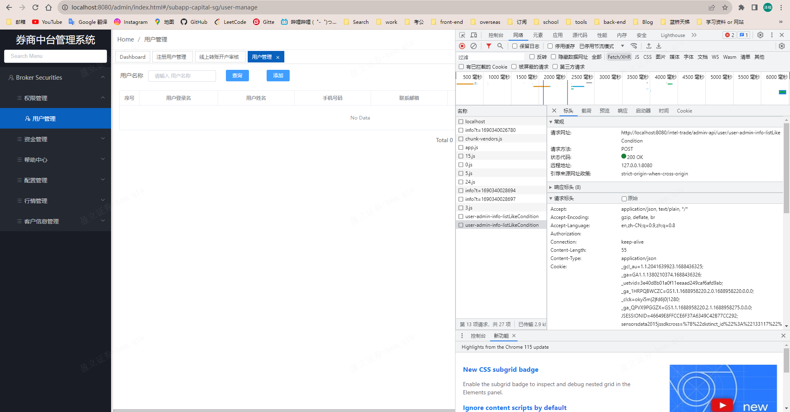
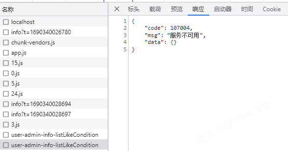

- [ ] 做一个模板文件，负责生成每日需要完成的任务列表（当前每日需完成的有，沸点、伴读、校友邦签到以及周报）

​	

**项目知道找付费，学习其他知识也可以找呀，慕课网/腾讯课堂/极客XX(时间)/掘金课程 or 小册等等（数据结构/算法这些都可以找付费）**

​	

本地调用接口200但响应是未登录授权，部署到sit环境却可以，因为有的接口是只在sit环境生效，这个问题主要是代理问题，但代理问题还报200是后端的问题，代理失败本来应该报404的

​	

## 本地想调一下用户管理的接口但调用失败，服务不可用





测试环境没问题的话，说明接口没问题，前端的问题

原因是我使用的dev分支，应该使用sit分支，因为测试环境是sit环境，我本地修改在sit分支，提交用--build，之后才会自动化部署到sit测试环境，而且不只是当前服务需要切换到sit分支，main项目也要切换到sit，主要的原因是你的main没有切换到sit（你如果是用main的启动的域名访问，那就是走main项目的代理配置），看看文档说明了解一下 https://webpack.docschina.org/configuration/dev-server/#devserverproxy （嘉俊哥推荐）

​	

## 脑瓜子嘎嘎疼系列

- 大创驳回-新问题

- 实习项目

- 自学项目

- 青训营项目

- 补基础（+各个技术官方文档）

- 所学复盘

​	

## react 做过一个敏捷开发的项目，什么意思

当说 "react 做过一个敏捷开发的项目"，意味着使用 React 技术栈来开发了一个敏捷开发项目。让我们分别解释这两个概念：

1. React：React 是一个由 Facebook 开发的JavaScript库，用于构建用户界面。它是一个用于构建交互式用户界面的组件化库，允许开发者将 UI 拆分为可重用的组件，并通过这些组件构建整个应用程序。

2. 敏捷开发：敏捷开发是一种软件开发方法论，旨在通过迭代和自适应的方式开发软件。它强调团队合作、快速响应变化、持续交付和持续反馈。在敏捷开发中，项目会被划分为多个小周期（通常称为迭代或冲刺），每个周期都会产生可工作的软件版本，然后团队会根据用户反馈和需求的变化来调整项目计划和开发优先级。

因此，当说 "react 做过一个敏捷开发的项目"，意味着使用 React 技术栈开发了一个采用敏捷开发方法论的项目。在这个项目中，开发团队使用 React 来构建用户界面，并采用敏捷开发方法来以迭代和快速响应的方式进行项目开发，以满足用户需求和不断变化的市场条件。


````html
我是一个编程小白，现在想做一个项目，帮我提供下开发思路

目标：期望实现一个工具，用于从 package.json 出发，递归遍历所有 node_modules 中的 package.json ，生成模块依赖关系图。

原因：平常我们做项目，项目变大，依赖变多之后，这种依赖关系会变得非常非常复杂，常常让我们看不清：

为什么会安装某个特定 package；
为什么某些 package 会安装多个版本；
子 package 之间形成了怎样的父子依赖关系；
是否存在循环依赖；
等等。
需求​：
•需要封装为 node 命令行工具；​
•支持 xx-cli analyze 命令，用于分析从当前目录 package.json 开始递归查找到的全量依赖关系(包名 & 版本号)，分析完成后自动打开网页，并渲染依赖关系图；​
◦注意处理好循环依赖问题，避免陷入死循环；​
◦支持 --depth=n 参数，限制向下递归分析的层次深度；​
◦支持 --json=[file-path] 参数，传入后不再打开网页，只是将依赖关系以 JSON 形式存储到用户指定的文件；​
•在打开的页面中，除了渲染依赖关系图外，期望对依赖关系做出初步分析，例如：​
◦是否包含循环依赖；​
◦同一个 package 是否包含多个版本实例；​
分析页面的具体样式，由各组自行决定；

技术栈

功能开发：
依赖关系图：antv/x6、echarts、D3 等均可；
工程化：
使用 TypeScript 开发；
使用 vitest/jest 实现单元测试；
接入 eslint、lint-staged 工具；
产出

源码，期望提交到 github；
发布到 npm 的 CLI 工具包；
项目说明文档。

----------------------------------------------------

< GPT-4 > 这是一个非常有趣的项目。下面是我提供的一个可能的开发思路：

## 1. 项目初始化

首先，你需要初始化你的项目。你可以使用 `npm init` 命令来创建一个新的 Node.js 项目，并安装你需要的依赖。

```shell
npm init -y
npm install --save-dev typescript eslint lint-staged vitest
```

然后，你需要配置你的 `package.json` 文件，以便在提交代码时运行 eslint 和 lint-staged。

## 2. 解析 package.json

你需要创建一个函数来读取和解析 `package.json` 文件。这个函数需要接收一个文件路径作为参数，并返回一个包含所有依赖关系的对象。你可以使用 Node.js 的 `fs` 模块来读取文件，然后使用 `JSON.parse()` 方法来解析 JSON 数据。

```typescript
import fs from 'fs';
import path from 'path';

function parsePackageJson(filePath: string) {
  const content = fs.readFileSync(filePath, 'utf8');
  const data = JSON.parse(content);
  return data.dependencies || {};
}
```

## 3. 递归遍历依赖关系

接下来，你需要创建一个函数来递归遍历所有的依赖。这个函数应该接收一个依赖对象和一个深度限制作为参数。在每次递归调用中，你需要减少深度限制，并检查是否达到了限制。如果达到了深度限制，那么就停止递归。

在遍历的过程中，你需要注意检查循环依赖。你可以创建一个已访问的集合来存储你已经访问过的依赖，以此来检查是否存在循环依赖。

## 4. 生成依赖关系图

在你完成了依赖关系的遍历之后，你需要将这些数据转换为一个依赖关系图。你可以使用 antv/x6、echarts、D3 等库来实现这个功能。

## 5. 创建 CLI 工具

为了使你的工具可以在命令行中使用，你需要创建一个 CLI 工具。这个工具应该接收一个 `analyze` 命令，以及一些可选的参数，如 `--depth` 和 `--json`。你可以使用 Node.js 的 `process.argv` 来获取命令行参数。

你的 CLI 工具应该像这样工作：

1. 解析命令行参数。
2. 读取和解析 `package.json` 文件。
3. 递归遍历所有的依赖。
4. 生成依赖关系图。
5. 如果提供了 `--json` 参数，那么将依赖关系保存为 JSON 文件。否则，打开一个网页来显示依赖关系图。

## 6. 发布到 npm

最后，你可以将你的 CLI 工具发布到 npm。你需要在你的 `package.json` 文件中添加一个 `bin` 字段来指定你的 CLI 工具的入口文件。

在你完成了所有的开发工作后，你可以使用 `npm publish` 命令来发布你的 CLI 工具。

## 7. 文档

别忘了编写一份详细的文档来说明你的工具的用法和功能。你可以使用 Markdown 来编写你的文档，并将它添加到你的 GitHub 仓库中。

这只是一个大致的开发思路，具体的实现可能会根据你的需求和技术栈的选择有所不同。祝你在这个项目中学习愉快！

-------------------------------------------------

< GPT3.5 > 实现这个项目涉及多个方面，包括递归遍历文件系统、解析JSON、构建依赖关系图、处理循环依赖等。下面给出一个大致的开发思路：

1. 初始化项目：
   - 创建一个新的npm项目，选择TypeScript作为主要开发语言。
   - 初始化package.json，并添加相关依赖，例如antv/x6、echarts、D3等用于生成依赖关系图的库。

2. 编写命令行工具：
   - 使用Node.js中的`yargs`库来处理命令行参数解析。
   - 创建一个CLI命令`analyze`，并处理参数`--depth`和`--json`。
   - 实现递归遍历package.json文件，并解析其中的依赖关系。
   - 处理循环依赖，避免陷入死循环。
   - 根据参数，决定是打开网页渲染图还是将依赖关系以JSON形式保存到指定文件。

3. 解析package.json和依赖关系：
   - 使用Node.js的文件系统模块`fs`来读取package.json文件。
   - 使用`JSON.parse()`解析package.json文件内容。
   - 从package.json中获取依赖关系信息，包括包名和版本号。

4. 构建依赖关系图：
   - 使用antv/x6、echarts、D3等库来生成依赖关系图。
   - 将解析得到的依赖关系数据传递给图形库，生成可视化图形。

5. 实现初步分析功能：
   - 对生成的依赖关系图进行分析，判断是否存在循环依赖。
   - 判断同一个包是否包含多个版本实例。

6. 单元测试和Lint检查：
   - 使用vite/jest来编写和运行单元测试，保证代码质量和稳定性。
   - 接入eslint和lint-staged工具，确保代码风格和规范。

7. 编写项目说明文档：
   - 在README.md文件中提供项目的详细说明，包括项目的背景、目标、使用方法、命令行参数等。
   - 解释依赖关系图的生成和分析结果。

8. 发布到GitHub和npm：
   - 将源码提交到GitHub，确保代码版本管理和分享。
   - 将完成的CLI工具包发布到npm，供其他人使用和安装。

以上是一个大致的开发思路，具体实现过程中可能还会遇到一些挑战，需要逐步解决。在开发过程中，可以根据实际需要和自己的技术经验做一些调整和优化。最终，完成这样一个工具后，你将拥有一个方便查看Node.js项目依赖关系的工具，帮助你更好地理解项目的结构和依赖关系，解决一些潜在的问题。祝你项目开发成功！
````

