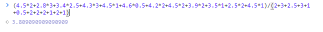

## 今日Get√——驼峰转换工具（接口定义命名时好用）

​	

本地用的哪个测试环境看你proxyTarget的代理是哪个

​	

- [Markdown 进阶技能：用代码画时序图](https://zhuanlan.zhihu.com/p/70261692)
  - [在线网页版](https://mermaid-js.github.io/mermaid-live-editor/edit#pako:eNpFj8GKwkAMhl8l5OSCfYEeBG1XL8IKeut4CG3qDO5khmnKIm3ffccV2Vv48uXnz4Rt6BhLvCWKFi61kW1T2eQG9TRcoSg284EVfBB-zLBbHQIMNsTo5PZhZPcUoJqOT4VBrZP7YqT6u_sSnqFujhQ1xOubXn7CDJ-NO9kc-U9t4mzvm57KnoqWElSU8hrX6Dl5cl0uORkBMKiWPRss89hxT-O3GjSyZJVGDeeHtFhqGnmNY-xIuXaU3_MvuPwC2SlSMw)

​	


​	

综合绩点才4.3 我很伤心



## git项目名称变更

这个项目命名变更一下，之前没改完整。本地修改的要重新拉一下或者变更一下origin

```bash
git remote set-url origin ssh://git@git.yxzq.com:222/hengyun-web/admin-broker-config.git
```

