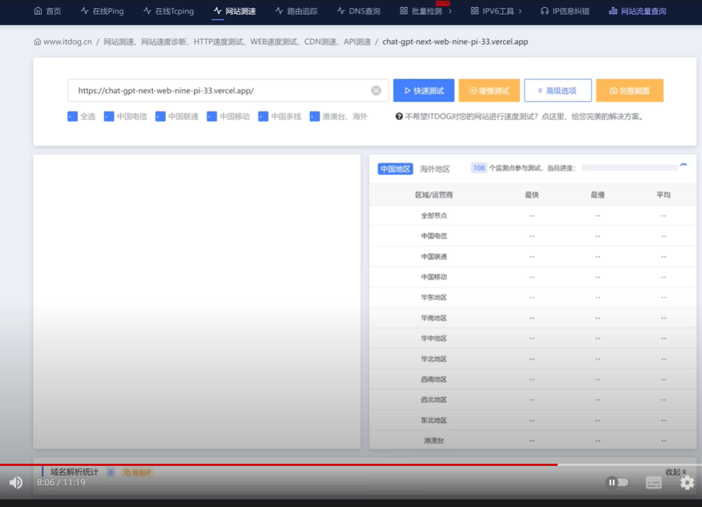
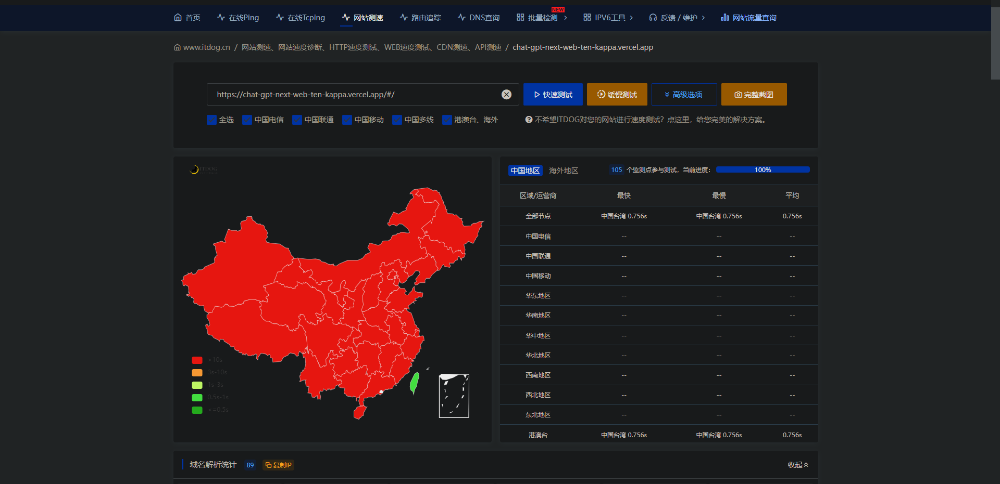
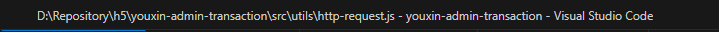
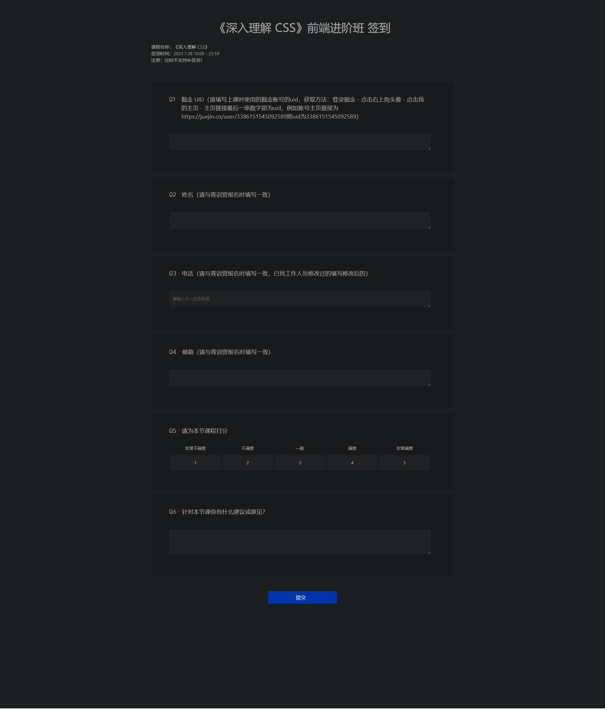

==心态很重要，多思考问题出在哪里，不要总想着不会要问别人，保持冷静对待很重要。请教别人请先带好自己的基础答案，不要一个答案都没有就去请教==

​	

测试大陆是否可以访问域名

测试结果：该域名在国外访问没问题，国内访问不了，需要给他绑定新域名（支持大陆访问的新域名）

​	

如果企微看不了在线文档或者群公告详情，是企微自身bug，重启就好了

​	

如果想查看接口的域名地址（代理地址），可以去接口文档的接口调试，调试看网络日志，具体是哪个接口就是哪个，域名代理超过一个，就是后端做的不完善，需要要求后端改

控制台也可以ctrl + F 查找信息

vue-devtool 查看用法

​	

知识点待解决

            // 更新分页组件中的当前页码 搞懂下面代码
            this.$nextTick(() => {
                this.$refs[`filters${n}`].selfPageNum = this[`pageNum${n}`];
            });

this[`filters${n}`] 这种什么语法

yxapp注册在全局，怎么注册的，没看到

​	

