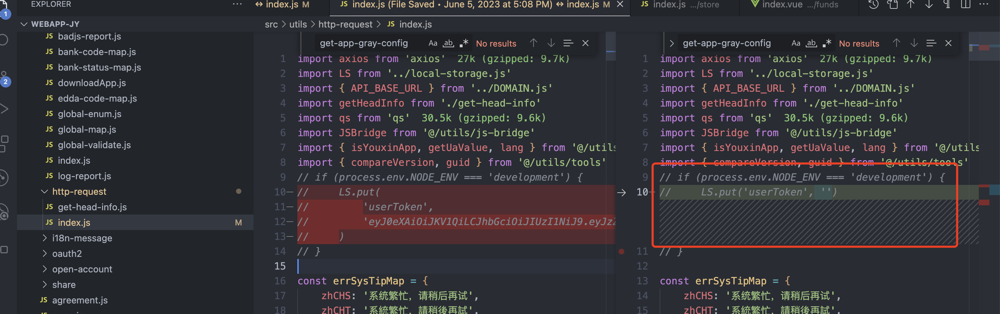
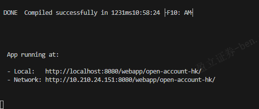

## 回顾一下昨天的问题

获取token可以在 https://admin1-sit.yxzq.com/admin/index.html?from=hk#/index 先获取客户手机号（例如可以在`客户管理/客户信息管理/港版开户审核获取开户的手机号（因为我做的这一部分昨天`，看你在什么模块，就去相应模块找，获取手机号其实接口会返回信息，不然在 `客户消息记录`查看验证码也可以）），然后再登录（网页或者APP），APP下载在了夜神模拟器，APP的验证码在测试环境中是自动填充，只需要能获取到手机号就行，进到里面获取token

最开始网页一直无法登录进去报非法Token，因为这个代码

导致用户登录成功后生成的Token被置为空，导致报非法Token，但最开始又不知道，然后听之可以在APP进行H5调试，我们项目启动成功的时候会给两个地址

在模拟器的APP里进行H5调试时要使用Network的地址，而不是local，local是无法打开网页，会报network connect refused的错误，不过APP调试太麻烦，没有浏览器高效，没有审查元素，很难受

​	

要在点击img后使输入框失去焦点，你可以使用`ref`属性和`blur`方法来实现。首先，在输入框元素中添加`ref`属性，然后在点击img时调用`blur`方法。

在模板中，将输入框添加`ref="amountInput"`属性，并且在点击img时调用blur方法：

```html
<template>
  <div>
    <div class="ctn flex-box input-box">
      <van-field
        v-model="applyAmount"
        ref="amountInput" <!-- 添加 ref 属性 -->
        clearable
        :placeholder="$t('placeHolderText', withdrawBalanceStr, moneyUnit)"
        @input="checkInput"
        @blur="checkInputNum"
        @focus="decodeInputNum"
      ></van-field>
      
    </div>
  </div>
</template>
```

在方法中添加`clearAndBlurInput`方法，并在其中调用`blur`方法：

```javascript
export default {
  methods: {
    clearAndBlurInput() {
      this.applyAmount = '';
      this.$refs.amountInput.blur(); // 调用 blur 方法使输入框失去焦点
    },
    // 其他方法...
  },
  // 其他配置...
};
```

现在，当你点击img图标时，输入框的值将被清除，并且输入框会失去焦点。

​	

## ref属性的作用

`ref` 是 Vue 中用来给元素或子组件添加引用标识的特殊属性。它允许你在代码中通过引用标识来访问该元素或组件实例。使用 `ref` 属性，你可以在 Vue 组件中直接访问 DOM 元素或子组件，而不必通过选择器或事件来操作。

`ref` 属性可以用在以下几个方面：

1. 访问 DOM 元素：可以通过 `ref` 属性给 HTML 元素添加引用标识，然后在 Vue 组件中通过 `$refs` 来访问该 DOM 元素。

```html
<template>
  <div>
    <input ref="myInput" type="text" />
  </div>
</template>
```

```javascript
export default {
  mounted() {
    this.$refs.myInput.focus(); // 获取焦点
  },
};
```

2. 访问子组件：可以通过 `ref` 属性给子组件添加引用标识，然后在父组件中通过 `$refs` 来访问该子组件实例。

```html
<template>
  <div>
    <ChildComponent ref="childComp" />
  </div>
</template>
```

```javascript
import ChildComponent from './ChildComponent';

export default {
  components: {
    ChildComponent,
  },
  methods: {
    callChildMethod() {
      this.$refs.childComp.someMethod(); // 调用子组件的方法
    },
  },
};
```

3. 访问子元素：可以通过 `ref` 属性给 `v-for` 循环生成的元素添加引用标识。

```html
<template>
  <div>
    <ul>
      <li v-for="(item, index) in items" :key="index" :ref="'listItem' + index">
        {{ item }}
      </li>
    </ul>
  </div>
</template>
```

```javascript
export default {
  data() {
    return {
      items: ['Item 1', 'Item 2', 'Item 3'],
    };
  },
  methods: {
    accessListItem(index) {
      this.$refs['listItem' + index][0].classList.add('highlighted');
    },
  },
};
```

需要注意的是，`$refs` 是一个直接访问 DOM 元素或子组件实例的引用对象，并不是响应式的。也就是说，如果在模板中使用了 `v-if` 或 `v-for`，可能会导致 `$refs` 不稳定。在大多数情况下，最好使用 Vue 的响应式数据来操作 DOM 元素或组件，而不是依赖 `$refs`。只有在需要直接访问元素或组件实例时，才使用 `$refs`。

​	

## VanField 输入框无法实时显示双向绑定内容（直接DOM操作解决）

> 可能的原因是项目其他代码干预了VanField导致无法正确显示，但我又找不出哪里，刚刚有一次调试的时候显示正常了，不过我又修改了代码，很诡异很神奇mad

1. 使用 ref 来获取输入框元素并手动清空其值：

```vue
<template>
  <div>
    <van-field
      ref="applyInput"
      v-model="applyAmount"
      :placeholder="$t('placeHolderText', withdrawBalanceStr, moneyUnit)"
      @input="checkInput"
      @blur="checkInputNum"
      @focus="decodeInputNum"
    />
    
  </div>
</template>

<script>
export default {
  data() {
    return {
      applyAmount: '',
      // 其他数据和方法...
    };
  },
  methods: {
    clearApplyAmount() {
      this.$refs.applyInput.$el.querySelector('input').value = '';
    },
    // 其他方法...
  },
};
</script>
```

请注意，在上面的代码中，我们通过在 `van-field` 上添加了 `ref` 属性，并赋予其值为 "applyInput"。然后在 `clearApplyAmount` 方法中，我们使用 `this.$refs.applyInput` 来获取输入框的引用，然后通过 `querySelector` 方法找到输入框元素，并手动清空其值。