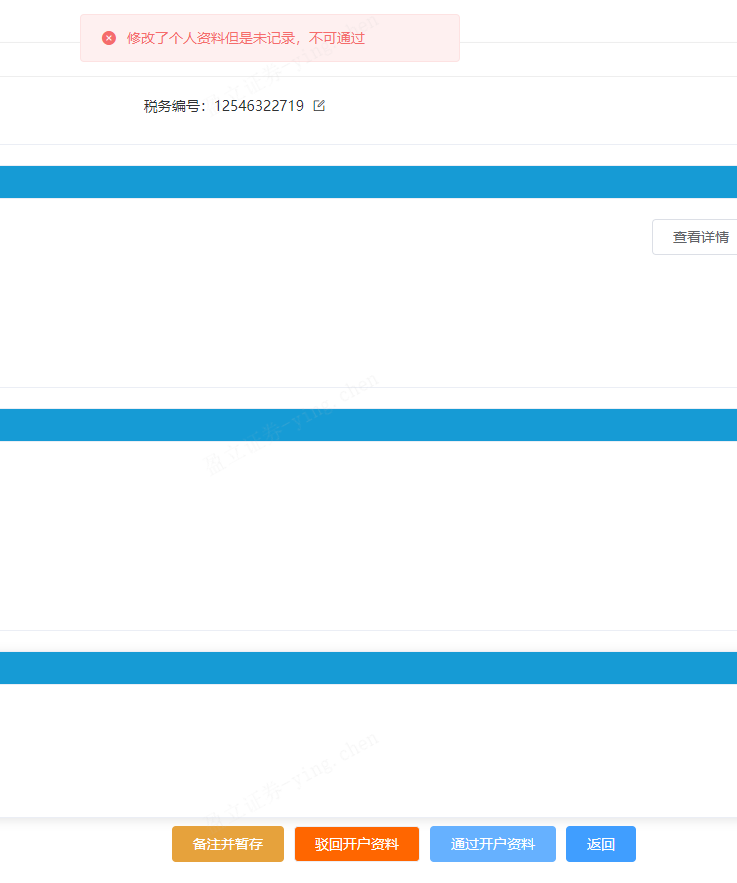
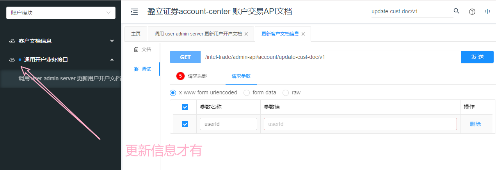

- [x] 当前错误进行ing

> 先解决forEach遍历this.identityVerificationOnline的问题✔，再解决recordPersonData和personData是否相等的问题

- [ ] 图片不显示是接口原因导致无法成功调用bucket桶数据

- [ ] 开户文档和住址证明数据显示不完整

- [x] 核实身份No Data，原因是期望数组，但变量为对象无法遍历，所以设置为 [] 了，回头查看

​	

- [ ] /intel-trade/admin-api/account/get-cust-doc/v1?userId=47377184859729920 无法获取开户文档
  - {
        "code": 320603,
        "data": {},
        "enumMultiLanguageType": null,
        "msg": "获取开户资料失败，客户开户资料不完整。"
    }

## Unauthorized响应的接口——券商-线上开户转账审核

> 估计是无权限，找后端问清楚

- [ ] /config-manager-admin/admin-api/app-system-other-server/v1
  - mixins.vue 中 `let professionalListRes = await getProfessionalList(2)` 导致进入catch打印”失败了吗？？“
- [ ] /config-manager-admin/admin-api/get-file-cred-app/v1
- [ ] /config-manager-admin/admin-api/get-cred-admin/v1
- [ ] ben note未处理
- [ ] /intel-trade/admin-api/finish-hk-first-audit/v1
  {code: 320501, data: {}, enumMultiLanguageType: null, msg: "开户审核初审查询信息失败"}

​	

## final.vue

1. 注释了loding-btn 818行 以及相关导入和定义组件代码
2. 修改了:data="identityVerificationOnline"为list变量
3. 反洗钱AML信息 v-loading="amlLoading" 设置成false

mounted/created有获取到传值变量，但template标签获取不到值，可以先看控制台问题报错，报错内容与你当前内容有无冲突（获取值），看是否是当前问题阻塞值的渲染（目前是的），可以先注释掉相关代码

​	

又学一招，哪个自定义组件报错，影响你的进度，可以先把组件换成普通组件，提取里面的内容到普通组件，先通主流程

​	

0808中午-线上开户转账审核主流程终于通过了

​	

沉下心来源码分析问题所在真的需要心态和能力

​	

新项目别太依赖搜索，自己手动找，熟悉项目

​	

## 在网络中打开控制台


​	

**要学会用try-catch调试报错**

​	

前进和后退在vscode里依旧适用，cool！

​	

filter只适用数组

​	

提测的意思就是开发完毕（自己测试功能没问题），jira单点击showcase转给测试

​	

[vscode 快速修复(quick fix) 快捷键(Ctrl + .)被占用（无法生效）](https://huanfenz.top/archives/vscode-kuai-su-xiu-fu-quickfix-kuai-jie-jian-ctrl-bei-zhan-yong)

​	

表格渲染存数组对象，每一项都是一行的所有数据（里面对象包括属性和值），key和prop的一一对应element-ui已经内部封装好了，前端不需要按照表格顶端属性的顺序写

再学一个，表格数据渲染，接口返回一个对象obj，表格渲染如果需要数组，只需将变成a=[obj]传入data:"a"这样就可以了

​	

核实身份——线上转账核实 el-table-column 不显示原因

> 经过审查元素，发现背景色失效变成白色，加上字体颜色本身就是白色，导致因样式出现以为不显示的问题
>
> 学会看审查元素

​	

**获取COS指定文件/文件夹临时秘钥** 是 获取公司桶的静态资源权限

```html
访问地址：
生产公司中台
 http://admin.inteltrade.hk/admin/index.html 

生产券商中台：
 http://ruifeng.inteltrade.hk/admin/index.html 

任务分配：
 https://docs.qq.com/sheet/DU05EYXdNQVlIUG5m?tab=rm9uca&code=Xe7tdFniOgdTYO0eOd6IwFiSHg9j6ybivWf6Yf7Mb3A&state=weworklogin 

仓库地址：
 https://git.yxzq.com/hengyun-web 

测试环境：
公司端:
中台测试账号：admin/123456
中台： https://admin-sit.inteltrade.hk/admin/index.html 
H5:   https://m-sit.inteltrade.hk/transaction/open-account-sg/deposit.html 
接口侧域名：  jy-sit.inteltrade.hk 

券商端：
中台测试账号：test/123456
中台： https://broker-sit.inteltrade.hk/admin/index.html 
H5:   https://m-broker-sit.inteltrade.hk/transaction/open-account-sg/deposit.html 
接口侧域名： jy-broker-sit.inteltrade.hk 


文件上传：
白标项目上传的桶用下面的，用法跟cicc一样：

公司端：
web-intel-prd-hongkong-1317566874
web-intel-uat-hongkong-1317566874
web-static-intel-prd-hongkong-1317566874
web-static-intel-uat-hongkong-1317566874

券商：
web-ruifeng-prd-hongkong-1317566874
web-ruifeng-uat-hongkong-1317566874
web-static-ruifeng-prd-hongkong-1317566874
web-static-ruifeng-uat-hongkong-1317566874

web私有桶，static公有桶，uat给所有sit|dev|uat 共用，prd给生产，接入点hongkong

完整链接：桶名+  .cos.ap-hongkong.myqcloud.com 

```

​	

`el-tab-pane` 导航标签页

​	

