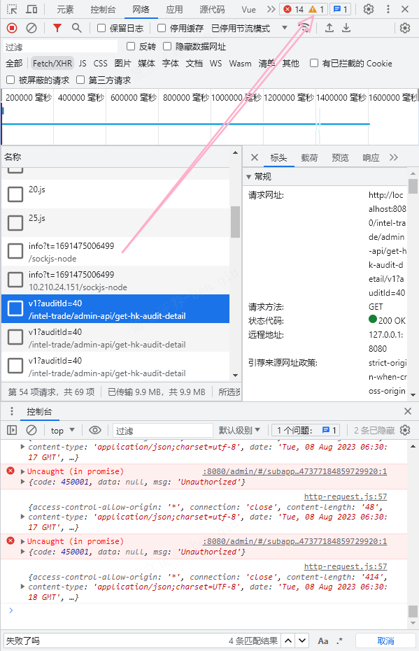
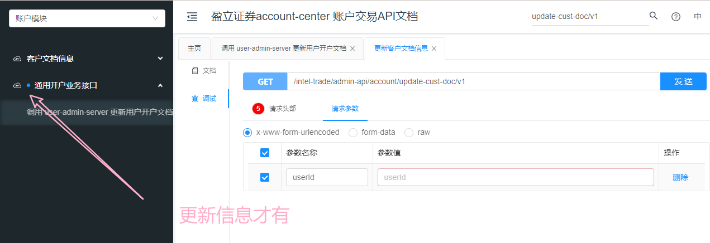

## 问题汇总

- [ ] 驳回开户资料:disable条件判断修改（如需恢复查看原项目）
  - 测试一下三个接口
  - [ ] 初审驳回开户资料 /intel-trade/admin-api/reject-hk-audit-to-cust/v1
  - [ ] 终审驳回到客服 /intel-trade/admin-api/reject-hk-audit-to-cs/v1
  - [ ] 终审驳回到客户 /intel-trade/admin-api/reject-hk-audit-open-account/v1
- [ ] 反洗钱AML信息 text="查看凭证") 按钮无法正常显示 || 不显示，不知其原因
- [x] 当前错误进行ing

> 先解决forEach遍历this.identityVerificationOnline的问题✔，再解决recordPersonData和personData是否相等的问题

- [ ] 图片不显示是接口原因导致无法成功调用bucket桶数据

- [ ] 开户文档和住址证明数据显示不完整

- [x] 核实身份No Data，原因是期望数组，但变量为对象无法遍历，所以设置为 [] 了，回头查看

​	

- [ ] /intel-trade/admin-api/account/get-cust-doc/v1?userId=47377184859729920 无法获取开户文档
  - {
        "code": 320603,
        "data": {},
        "enumMultiLanguageType": null,
        "msg": "获取开户资料失败，客户开户资料不完整。"
    }
  - 这个接口等后端那边调完看看，页面静态显示也不正常

### Unauthorized响应的接口——券商-线上开户转账审核

> 估计是无权限，找后端问清楚

- [ ] /config-manager-admin/admin-api/app-system-other-server/v1
  - mixins.vue 中 `let professionalListRes = await getProfessionalList(2)` 导致进入catch打印”失败了吗？？“
- [x] /config-manager-admin/admin-api/get-file-cred-app/v1
  - 已解决，更换为v2接口即可（最新）

- [ ] /config-manager-admin/admin-api/get-cred-admin/v1
- [ ] ben note未处理（2个）
- [ ] /intel-trade/admin-api/finish-hk-first-audit/v1
  {code: 320501, data: {}, enumMultiLanguageType: null, msg: "开户审核初审查询信息失败"}

​	

### final.vue

1. 注释了loding-btn 818行 以及相关导入和定义组件代码
2. 修改了:data="identityVerificationOnline"为list变量
3. 反洗钱AML信息 v-loading="amlLoading" 设置成false

mounted/created有获取到传值变量，但template标签获取不到值，可以先看控制台问题报错，报错内容与你当前内容有无冲突（获取值），看是否是当前问题阻塞值的渲染（目前是的），可以先注释掉相关代码

​	

又学一招，哪个自定义组件报错，影响你的进度，可以先把组件换成普通组件，提取里面的内容到普通组件，先通主流程

​	

0808中午-线上开户转账审核主流程终于通过了

​	

沉下心来源码分析问题所在真的需要心态和能力

​	

新项目别太依赖搜索，自己手动找，熟悉项目

​	

### 在网络中打开控制台



​	

**要学会用try-catch调试报错**

​	

前进和后退在vscode里依旧适用，cool！

​	

filter只适用数组

​	

提测的意思就是开发完毕（自己测试功能没问题），jira单点击showcase转给测试

​	

[vscode 快速修复(quick fix) 快捷键(Ctrl + .)被占用（无法生效）](https://huanfenz.top/archives/vscode-kuai-su-xiu-fu-quickfix-kuai-jie-jian-ctrl-bei-zhan-yong)

​	

表格渲染存数组对象，每一项都是一行的所有数据（里面对象包括属性和值），key和prop的一一对应element-ui已经内部封装好了，前端不需要按照表格顶端属性的顺序写

再学一个，表格数据渲染，接口返回一个对象obj，表格渲染如果需要数组，只需将变成a=[obj]传入data:"a"这样就可以了

​	

核实身份——线上转账核实 el-table-column 不显示原因

> 经过审查元素，发现背景色失效变成白色，加上字体颜色本身就是白色，导致因样式出现以为不显示的问题
>
> 学会看审查元素

​	

**获取COS指定文件/文件夹临时秘钥** 是 获取公司桶的静态资源权限

```html
访问地址：
生产公司中台
 http://admin.inteltrade.hk/admin/index.html 

生产券商中台：
 http://ruifeng.inteltrade.hk/admin/index.html 

任务分配：
 https://docs.qq.com/sheet/DU05EYXdNQVlIUG5m?tab=rm9uca&code=Xe7tdFniOgdTYO0eOd6IwFiSHg9j6ybivWf6Yf7Mb3A&state=weworklogin 

仓库地址：
 https://git.yxzq.com/hengyun-web 

测试环境：
公司端:
中台测试账号：admin/123456
中台： https://admin-sit.inteltrade.hk/admin/index.html 
H5:   https://m-sit.inteltrade.hk/transaction/open-account-sg/deposit.html 
接口侧域名：  jy-sit.inteltrade.hk 

券商端：
中台测试账号：test/123456
中台： https://broker-sit.inteltrade.hk/admin/index.html 
H5:   https://m-broker-sit.inteltrade.hk/transaction/open-account-sg/deposit.html 
接口侧域名： jy-broker-sit.inteltrade.hk 


文件上传：
白标项目上传的桶用下面的，用法跟cicc一样：

公司端：
web-intel-prd-hongkong-1317566874
web-intel-uat-hongkong-1317566874
web-static-intel-prd-hongkong-1317566874
web-static-intel-uat-hongkong-1317566874

券商：
web-ruifeng-prd-hongkong-1317566874
web-ruifeng-uat-hongkong-1317566874
web-static-ruifeng-prd-hongkong-1317566874
web-static-ruifeng-uat-hongkong-1317566874

web私有桶，static公有桶，uat给所有sit|dev|uat 共用，prd给生产，接入点hongkong

完整链接：桶名+  .cos.ap-hongkong.myqcloud.com 

```

​	

`el-tab-pane` 导航标签页

​	



​	

*今日名言：怕麻烦，以后只会更麻烦*

​	

table_x_column_x  这种是elementui内部转化的类名，不能写死style，不然只对当前用户有效（但是我写外围的类名又不生效。。。麻了）

> 解决：继承的样式不知道为什么会失效，只需在原文件（mixins.vue）的具体样式加上`!important` 提升优先级就好了


### !important优先级是最高的吗

是的，`!important` 是 CSS 中的一个标记，用于给样式规则赋予最高的优先级，覆盖其他相同属性的样式规则。这意味着带有 `!important` 标记的样式会优先于其他样式，无论这些样式是内联样式、嵌入式样式还是外部样式表中的。

虽然 `!important` 具有很高的优先级，但不建议滥用它，因为它可能会导致样式表难以维护，并且可能破坏样式继承的自然流程。最好的实践是在需要时谨慎使用 `!important`，并尽量遵循 CSS 选择器优先级规则来管理样式。

当出现样式冲突或优先级问题时，首先应该尝试通过合理的选择器结构和优先级来解决，而不是过度使用 `!important`。只有在其他方法无法解决问题的情况下，才应该使用 `!important`。

### 前后同一样式都用!important，会以最后一个为准吗？

是的，当同一元素的前后两个样式规则都使用了 `!important` 标记，并且具有相同的选择器权重，浏览器会以最后一个样式规则为准。这是因为后面的样式规则会覆盖前面的样式规则，即使两者都使用了 `!important`。

这种情况下，浏览器会选择最后一个应用的样式，以确保 `!important` 的规则始终具有最高的优先级。不过，尽管可以通过这种方式解决某些样式冲突问题，但过度使用 `!important` 可能会导致样式难以维护和理解，因此仍然建议谨慎使用。

如果您在代码中多次使用了 `!important`，最好的做法是考虑是否有更好的方法来组织和管理样式，以减少对 `!important` 的依赖。

​	

`this.$route.query` 是一个属性，用于获取当前路由的查询参数。

​	

vscode手势终端失效？需要将焦点汇集在终端界面才行

​	

```html
解决：Syntax Error: Unexpected token


 @ ./src/pages/customer-manage/hk-open-account-audit/trial/account-data.vue?vue&type=template&id=ab1d1362&lang=pug& 1:0-516 1:0-516
 @ ./src/pages/customer-manage/hk-open-account-audit/trial/account-data.vue
 @ ./node_modules/cache-loader/dist/cjs.js??ref--12-0!./node_modules/babel-loader/lib!./node_modules/cache-loader/dist/cjs.js??ref--0-0!./node_modules/vue-loader/lib??vue-loader-options!./src/pages/customer-manage/hk-open-account-audit/trial/index.vue?vue&type=script&lang=js&
 @ ./src/pages/customer-manage/hk-open-account-audit/trial/index.vue?vue&type=script&lang=js&
 @ ./src/pages/customer-manage/hk-open-account-audit/trial/index.vue
 @ ./src/router/modules/customer-manage.js
 @ ./src/router/modules sync \.js$
 @ ./src/router/index.js
 @ ./src/main.js
 @ multi (webpack)-dev-server/client?http://10.210.24.151:8087/sockjs-node (webpack)/hot/only-dev-server.js ./src/main.js

> 这个错误提示是“语法错误：意外的标记”，这通常意味着在代码中出现了无法被解析的不合法的标记或语法。

从错误信息中可以看出，问题发生在 `account-data.vue` 文件的模板部分（template）的语法中，可能是在 `.vue` 文件的 Pug（以前称为 Jade）模板中出现了不正确的标记。Pug 是一种简洁的模板语言，它使用缩进来表示层级和嵌套，所以错误可能在于不正确的缩进、标签匹配等。

您需要仔细检查 `account-data.vue` 文件中的模板部分，并确保其中的 Pug 语法是正确的。以下是一些常见的错误原因和修复方法：

1. **缩进问题**：Pug 使用缩进来表示标签之间的嵌套关系，确保缩进是正确的。不同的标签层级应该有不同的缩进级别。

2. **标签闭合问题**：Pug 不使用闭合标签，而是使用缩进来表示标签嵌套的关系。确保标签嵌套正确，不要在不合适的地方添加闭合标签。

3. **属性书写问题**：Pug 中属性的书写方式也不同于 HTML，确保您正确使用了 Pug 的属性语法。

4. **Pug 特有语法**：Pug 使用了一些特有的语法，如`#` 表示 `id`，`.` 表示 `class` 等。确保您理解了 Pug 的特有语法并正确使用。

如果您能提供 `account-data.vue` 文件中模板部分的代码，我可以帮您检查可能的语法错误。
```

​	

### 提问的艺术

询问gpt格式：报错相关代码+报错信息

​	

## 排期的一些小知识

有新需求需要你处理，组长问你评估排期，要根据接口什么时候出，进行排期，一般调试接口需要3天左右（具体看数量而定），所以排期是接口搭建完成后的3天左右（初定）还有就是排期要看日历排，除去周末时间往后延

​	

[神策分析简介](https://manual.sensorsdata.cn/sa/latest/%E7%A5%9E%E7%AD%96%E5%88%86%E6%9E%90%E6%98%AF%E4%BB%80%E4%B9%88%EF%BC%9F-22249853.html)

​	

在 JavaScript 中，`null` 被认为是一个“假值”（Falsy），因此在布尔上下文中被视为 `false`。