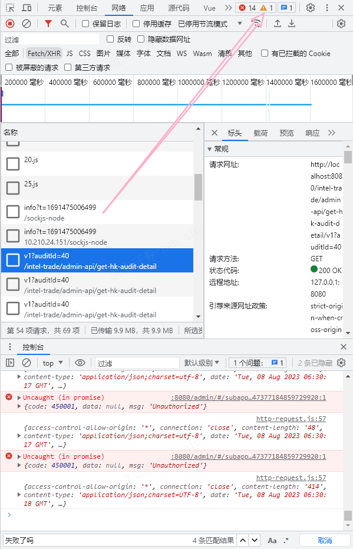

- [ ] 图片不显示是接口原因导致无法成功调用bucket桶数据

- [ ] 开户文档和住址证明数据显示不完整

- [ ] 核实身份No Data，原因是期望数组，但变量为对象无法遍历，所以设置为 [] 了，回头查看

​	

- [ ] /intel-trade/admin-api/account/get-cust-doc/v1?userId=47377184859729920 无法获取开户文档
  - {
        "code": 320603,
        "data": {},
        "enumMultiLanguageType": null,
        "msg": "获取开户资料失败，客户开户资料不完整。"
    }

## Unauthorized响应的接口——券商-线上开户转账审核

> 估计是无权限，找后端问清楚

- [ ] /config-manager-admin/admin-api/app-system-other-server/v1
  - mixins.vue 中 `let professionalListRes = await getProfessionalList(2)` 导致进入catch打印”失败了吗？？“
- [ ] /config-manager-admin/admin-api/get-file-cred-app/v1
- [ ] /config-manager-admin/admin-api/get-cred-admin/v1

​	

## final.vue

1. 注释了loding-btn 818行 以及相关导入和定义组件代码
2. 修改了:data="identityVerificationOnline"为list变量
3. 反洗钱AML信息 v-loading="amlLoading" 设置成false

mounted/created有获取到传值变量，但template标签获取不到值，可以先看控制台问题报错，报错内容与你当前内容有无冲突（获取值），看是否是当前问题阻塞值的渲染（目前是的），可以先注释掉相关代码

​	

又学一招，哪个自定义组件报错，影响你的进度，可以先把组件换成普通组件，提取里面的内容到普通组件，先通主流程

​	

0808中午-线上开户转账审核主流程终于通过了

​	

沉下心来源码分析问题所在真的需要心态和能力

​	

新项目别太依赖搜索，自己手动找，熟悉项目

​	

## 在网络中打开控制台

​	

**要学会用try-catch调试报错**

​	

前进和后退在vscode里依旧适用，cool！