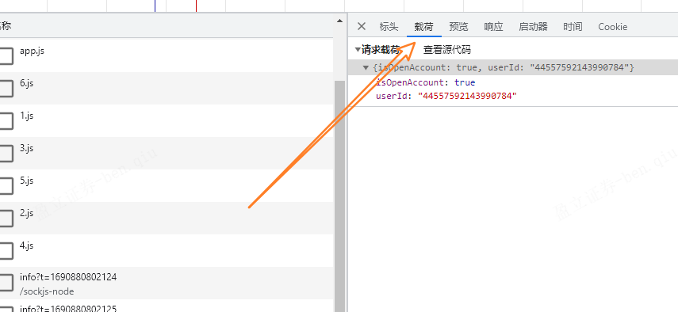
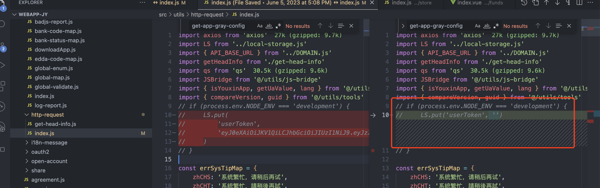
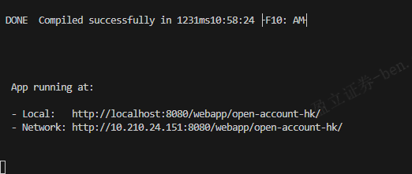

https://wx.zsxq.com/dweb2/index/topic_detail/181488541258422

```html
  这个代理有没有按顺序代理网址的
 const serviceMap = {
        '/intel-trade': proxyTarget,
        '/config-manager/': 'https://jy-sit.inteltrade.hk',
        '/config-manager-admin': 'https://jy-sit.inteltrade.hk',
        '/query-customer-aml-info': 'https://jy-broker-sit.inteltrade.hk',
        '/*': proxyTarget,
    }

根据您提供的`serviceMap`对象，这个代理配置按照顺序逐一匹配URL，并在匹配到第一个符合条件的URL前缀时进行代理。一旦找到匹配的前缀，代理就会停止匹配并将请求代理到相应的目标地址。

让我们分析一下`serviceMap`对象的配置：

1. 如果请求URL以`/intel-trade`开头，将被代理到`proxyTarget`所指定的地址。
2. 如果请求URL以`/config-manager/`开头，将被代理到`https://jy-sit.inteltrade.hk`。
3. 如果请求URL以`/config-manager-admin`开头，将被代理到`https://jy-sit.inteltrade.hk`。
4. 如果请求URL以`/query-customer-aml-info`开头，将被代理到`https://jy-broker-sit.inteltrade.hk`。
5. 对于所有其他请求，将被代理到`proxyTarget`所指定的地址。

注意事项：
- 配置的顺序很重要。如果URL匹配到多个前缀，只会匹配第一个符合条件的配置。
- `/*`配置通常用于设置默认代理目标。在这个配置中，所有未匹配到的请求都会被代理到`proxyTarget`。

请确保配置的顺序符合您的代理需求。如果存在代理问题，可以根据实际情况调整配置，确保URL匹配按照预期进行代理。
```

​	

## 请求载荷是接口入参吗



是的，请求载荷（Payload）通常指的是请求的主体部分，即发送给服务器的数据或参数。在HTTP请求中，请求载荷包含了请求所需的各种数据，比如请求的参数、表单数据、JSON数据等。

请求载荷在不同的请求方法中具有不同的形式：

1. **GET请求：** GET请求通常将参数放在URL的查询字符串中，而不在请求主体中。在GET请求中，请求载荷通常为空，因为参数都在URL中进行传递。

2. **POST请求：** POST请求可以将数据放在请求的主体中，作为请求载荷。POST请求主体可以包含表单数据、JSON数据、XML数据等。常见的POST请求Content-Type包括`application/x-www-form-urlencoded`、`application/json`等。

3. **PUT、PATCH、DELETE等请求：** 类似POST请求，PUT、PATCH、DELETE等请求也可以将数据放在请求主体中作为请求载荷。

例如，在使用`axios`库发送POST请求时，可以通过`data`参数设置请求载荷：

```javascript
// POST请求，发送JSON数据作为请求载荷
axios.post('/api/endpoint', {
  key1: 'value1',
  key2: 'value2',
})
  .then(response => {
    // 处理响应
  })
  .catch(error => {
    // 处理错误
  });
```

在上述示例中，我们通过`data`参数设置了一个JavaScript对象，它作为JSON数据作为请求的载荷，发送给服务器。

请注意，请求载荷的形式取决于您使用的请求方法和所发送的数据类型。在编写代码时，根据实际情况设置正确的请求载荷，以确保请求能够正确地传递给服务器并得到处理。

​	

## 不设置“content-type”的话，get请求会报错：  "msg": "http mediaType不支持"

把get请求换成getForm

​	

## 接口404问题总结

1. 路径错误（可能粗心导致，看下service目录下的接口信息）
2. 代理错误（看下接口文档调试的路径是哪个域名，在 `build/devServer` 下添加代理信息，匹配路径中某一个字段例如/aaa/bbb，可以把key只定为‘/aaa'，说明有aaa字段的时候就进行代理匹配，没有则不匹配）
   1. https://juejin.cn/post/6896297476546887694?searchId=202308011540518A1CF782019D5B015B3C


后端接口文档是自动生成的，根据插件 可以学下springboot，了解一下

master和sit最开始是一样的，后面有需求就不一样了

==接口如果我们发现有问题或者找不到的话，可以先去接口文档进行调试，调试完毕再回到项目中进行调试==

## 回顾一下昨天的问题

获取token可以在 https://admin1-sit.yxzq.com/admin/index.html?from=hk#/index 先获取客户手机号（例如可以在`客户管理/客户信息管理/港版开户审核获取开户的手机号（因为我做的这一部分昨天`，看你在什么模块，就去相应模块找，获取手机号其实接口会返回信息，不然在 `客户消息记录`查看验证码也可以）），然后再登录（网页或者APP），APP下载在了夜神模拟器，APP的验证码在测试环境中是自动填充，只需要能获取到手机号就行，进到里面获取token

最开始网页一直无法登录进去报非法Token，因为这个代码

导致用户登录成功后生成的Token被置为空，导致报非法Token，但最开始又不知道，然后听之可以在APP进行H5调试，我们项目启动成功的时候会给两个地址

在模拟器的APP里进行H5调试时要使用Network的地址，而不是local，local是无法打开网页，会报network connect refused的错误，不过APP调试太麻烦，没有浏览器高效，没有审查元素，很难受

​	

要在点击img后使输入框失去焦点，你可以使用`ref`属性和`blur`方法来实现。首先，在输入框元素中添加`ref`属性，然后在点击img时调用`blur`方法。

在模板中，将输入框添加`ref="amountInput"`属性，并且在点击img时调用blur方法：

```html
<template>
  <div>
    <div class="ctn flex-box input-box">
      <van-field
        v-model="applyAmount"
        ref="amountInput" <!-- 添加 ref 属性 -->
        clearable
        :placeholder="$t('placeHolderText', withdrawBalanceStr, moneyUnit)"
        @input="checkInput"
        @blur="checkInputNum"
        @focus="decodeInputNum"
      ></van-field>
      
    </div>
  </div>
</template>
```

在方法中添加`clearAndBlurInput`方法，并在其中调用`blur`方法：

```javascript
export default {
  methods: {
    clearAndBlurInput() {
      this.applyAmount = '';
      this.$refs.amountInput.blur(); // 调用 blur 方法使输入框失去焦点
    },
    // 其他方法...
  },
  // 其他配置...
};
```

现在，当你点击img图标时，输入框的值将被清除，并且输入框会失去焦点。

​	

## ref属性的作用

`ref` 是 Vue 中用来给元素或子组件添加引用标识的特殊属性。它允许你在代码中通过引用标识来访问该元素或组件实例。使用 `ref` 属性，你可以在 Vue 组件中直接访问 DOM 元素或子组件，而不必通过选择器或事件来操作。

`ref` 属性可以用在以下几个方面：

1. 访问 DOM 元素：可以通过 `ref` 属性给 HTML 元素添加引用标识，然后在 Vue 组件中通过 `$refs` 来访问该 DOM 元素。

```html
<template>
  <div>
    <input ref="myInput" type="text" />
  </div>
</template>
```

```javascript
export default {
  mounted() {
    this.$refs.myInput.focus(); // 获取焦点
  },
};
```

2. 访问子组件：可以通过 `ref` 属性给子组件添加引用标识，然后在父组件中通过 `$refs` 来访问该子组件实例。

```html
<template>
  <div>
    <ChildComponent ref="childComp" />
  </div>
</template>
```

```javascript
import ChildComponent from './ChildComponent';

export default {
  components: {
    ChildComponent,
  },
  methods: {
    callChildMethod() {
      this.$refs.childComp.someMethod(); // 调用子组件的方法
    },
  },
};
```

3. 访问子元素：可以通过 `ref` 属性给 `v-for` 循环生成的元素添加引用标识。

```html
<template>
  <div>
    <ul>
      <li v-for="(item, index) in items" :key="index" :ref="'listItem' + index">
        {{ item }}
      </li>
    </ul>
  </div>
</template>
```

```javascript
export default {
  data() {
    return {
      items: ['Item 1', 'Item 2', 'Item 3'],
    };
  },
  methods: {
    accessListItem(index) {
      this.$refs['listItem' + index][0].classList.add('highlighted');
    },
  },
};
```

需要注意的是，`$refs` 是一个直接访问 DOM 元素或子组件实例的引用对象，并不是响应式的。也就是说，如果在模板中使用了 `v-if` 或 `v-for`，可能会导致 `$refs` 不稳定。在大多数情况下，最好使用 Vue 的响应式数据来操作 DOM 元素或组件，而不是依赖 `$refs`。只有在需要直接访问元素或组件实例时，才使用 `$refs`。

​	

## VanField 输入框无法实时显示双向绑定内容（直接DOM操作解决）

> 可能的原因是项目其他代码干预了VanField导致无法正确显示，但我又找不出哪里，刚刚有一次调试的时候显示正常了，不过我又修改了代码，很诡异很神奇mad

1. 使用 ref 来获取输入框元素并手动清空其值：

```vue
<template>
  <div>
    <van-field
      ref="applyInput"
      v-model="applyAmount"
      :placeholder="$t('placeHolderText', withdrawBalanceStr, moneyUnit)"
      @input="checkInput"
      @blur="checkInputNum"
      @focus="decodeInputNum"
    />
    
  </div>
</template>

<script>
export default {
  data() {
    return {
      applyAmount: '',
      // 其他数据和方法...
    };
  },
  methods: {
    clearApplyAmount() {
      this.$refs.applyInput.$el.querySelector('input').value = '';
    },
    // 其他方法...
  },
};
</script>
```

请注意，在上面的代码中，我们通过在 `van-field` 上添加了 `ref` 属性，并赋予其值为 "applyInput"。然后在 `clearApplyAmount` 方法中，我们使用 `this.$refs.applyInput` 来获取输入框的引用，然后通过 `querySelector` 方法找到输入框元素，并手动清空其值。

​	

## 讲一下yargs

`yargs`是一个用于处理命令行参数的Node.js库。它可以帮助您在Node.js应用程序中解析和处理命令行参数，使得编写命令行工具和脚本更加简单和方便。

主要功能和特点：
1. 解析命令行参数：`yargs`可以解析用户在命令行中输入的参数，并将其转换为易于处理的JavaScript对象。

2. 定义命令和选项：您可以使用`yargs`定义各种命令和选项，以指定应用程序应如何处理不同的输入。

3. 选项配置：您可以配置选项的别名、默认值、数据类型和描述等信息，以便更好地处理输入。

4. 子命令：`yargs`支持创建具有子命令的复杂命令行工具，使得命令行工具的组织更加灵活。

5. 链式调用：`yargs`允许您通过链式调用方式构建和配置命令行工具，使得代码更加清晰和简洁。

6. 自动化帮助生成：`yargs`能够自动为您生成命令行工具的帮助信息，方便用户查看命令和选项的用法。

使用示例：
```javascript
const yargs = require('yargs');

// 定义命令和选项
const argv = yargs
  .command('greet', 'Greet a user', (yargs) => {
    yargs.option('name', {
      alias: 'n',
      describe: 'Specify the name of the user',
      demandOption: true,
      type: 'string',
    });
  })
  .help()
  .alias('help', 'h')
  .argv;

// 解析命令行参数并处理
if (argv._[0] === 'greet') {
  const name = argv.name;
  console.log(`Hello, ${name}!`);
}
```

在上述示例中，我们使用`yargs`定义了一个名为`greet`的命令，并添加了一个`name`选项。用户在命令行中输入`node app.js greet --name John`时，将会输出`Hello, John!`。

`yargs`是一个强大而灵活的库，它在许多Node.js命令行工具和脚本中广泛使用。您可以通过查阅`yargs`的文档了解更多功能和使用方法：https://yargs.js.org/