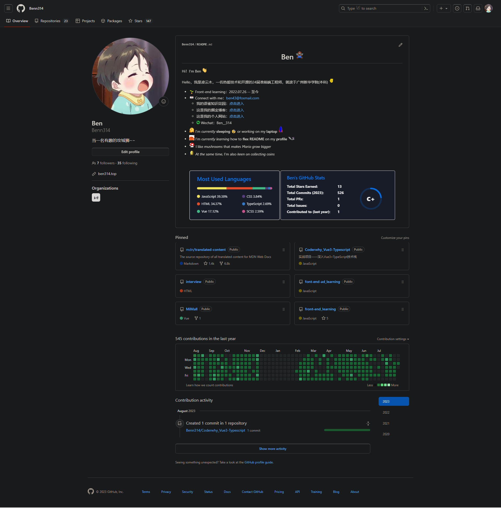

[用 HTTP 提交数据，基本就这 5 种方式](https://juejin.cn/post/7050430220632850440)

## 502 Bad Gateway（后端在部署）

> "502 Bad Gateway" 是一种 HTTP 状态码，通常表示一个网关（如代理服务器或反向代理服务器）未能从上游服务器（通常是应用服务器或Web服务器）获得有效的响应。
>
> 这个错误通常发生在以下情况下：
>
> 1. 上游服务器（应用服务器或Web服务器）出现故障或未响应，导致网关无法获取有效的响应。
>
> 2. 代理服务器或反向代理服务器的配置有问题，无法正确地将请求传递给上游服务器。
>
> 3. 负载均衡器配置有问题，导致请求未正确路由到可用的上游服务器。
>
> 如果您在浏览器中看到 "502 Bad Gateway" 错误，可能是因为您访问的网站的服务器遇到问题。这可能是暂时的，如果您刷新页面，有时问题会自动解决。如果问题持续存在，那么可能是网站的服务器管理员需要检查和修复。
>
> 如果您是网站的管理员或开发人员，您应该检查代理服务器、负载均衡器或上游服务器的配置，以确保它们正确地响应请求并正确地传递响应。您还可以查看服务器日志来了解更多关于问题的信息。

​	

看接口文档，请求的路径，今天有一个很傻的接口，post请求，然后参数是form-data，请求时发现参数是拼接在请求路径后面的（get请求才是明文传输，post是放在请求体），这个是后端定义入参时有问题，需要你先改变一下接口定义的写法

```js
// 开户入金详情uuid --> 原始写法
const adminRechargeOpenacctLastuuid = params =>
    api.postForm(`/admin-recharge-openacct-lastuuid/v1/`, params)

// 开户入金详情uuid --> 重新改写
const adminRechargeOpenacctLastuuid = params =>
    api.postForm(`/admin-recharge-openacct-lastuuid/v1/?uuid=${params}`)  // 这里要用反引号才能传输变量，单引号不行（只能通过拼接，麻烦）
```


