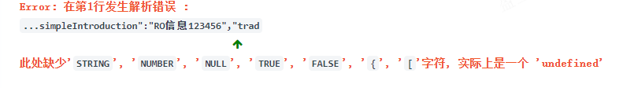
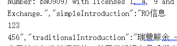
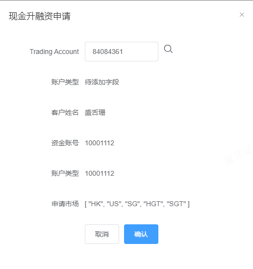

控制台报错先看第一个，第一个错会引发后边蝴蝶效应

## 现金升融资

查询接口字段如下

    {
        "code": 0,
        "data": {
            "list": [
                {
                    "applyTime": "2022-04-02 11:12:43",
                    "cashAccount": "10000155",
                    "id": "1027666001877803008",
                    "marginAccount": "",
                    "marketList": [
                        "HK",
                        "US",
                        "SG"
                    ],
                    "status": 29,
                    "statusName": "升级校验不通过",
                    "updateTime": "2023-08-21 10:00:53",
                    "updateUser": "",
                    "userId": "82037332",
                    "userName": "xin shang"
                },

### 未完成

- [ ] 字段增加：账户类型：个人客户/机构客户
- [ ] 弹框中属性多语言
- [x] 新增确认弹框

​	

### 报错解决

SyntaxError: Bad control character in string literal in JSON at position 580
    at JSON.parse (<anonymous>)
    at VueComponent._callee5$ (mixins.vue:536:1)
    at tryCatch (runtime.js:64:1)
    at Generator.invoke (runtime.js:299:1)
    at Generator.eval [as next] (runtime.js:124:1)
    at asyncGeneratorStep (asyncToGenerator.js:3:1)
    at _next (asyncToGenerator.js:22:1)





原因：JSON解析不了，多了两个换行，后端返回那个JSON是错的

​	

## gitlab pending状态

在 GitLab 中，"pending" 状态通常指的是持续集成/持续交付（CI/CD）管道中的一个阶段。这个阶段表示正在运行的作业（Job）还没有完成，因此整个管道还处于等待状态。

一般来说，当你提交代码到 GitLab 仓库并触发了一个 CI/CD 管道后，管道会被分成多个阶段，每个阶段包含了一个或多个作业。这些作业会按照顺序依次执行，然后管道的状态会根据这些作业的执行情况来更新。

如果你看到管道的状态为 "pending"，意味着至少一个作业还没有完成执行，而且目前管道还在等待这些作业的完成。一旦所有的作业都完成，管道的状态会相应地更新为 "success"（成功）或 "failed"（失败）。

你可以进入 GitLab 项目的 CI/CD 页面，查看具体的管道状态和每个作业的状态，以及作业的执行日志，从而找出哪个作业还在 "pending" 状态并查看问题。

如果你想了解更多关于 GitLab CI/CD 的信息，可以查阅 GitLab 官方文档中关于 CI/CD 的部分。

​	

## svg标签可以绑定点击事件

​	

## 今日小结

今天做了一个test Demo，现金升融资（融资升级管理）的新增button触发dialog，以下是相关新增字段

**src\pages\upgrade-manage\index.vue**

```vue
        // 点击新增按钮时的数据
        const addState = reactive({
            showeditDialog: false,
            dialogtitle: '',
            input: '',
            userId: '', // Trading account
            accountType: '',
            userName: '',
            cashAccount: '', // 资金账号分现金账号和保证金账号
            marginAccount: '', // 保证金账号
            marketList: []
        })

        // 查询接口的参数
        const params = reactive({
            pageNum: control.pageNum,
            pageSize: control.pageSize,
            query: {
                beginApplyTime: '',
                endApplyTime: '',
                name: '',
                statusList: [],
                userId: ''
            }
        })
```



输入userId点击搜索图标，触发搜索接口，获取返回数据渲染到弹框上，在点击事件里赋值

​	

## [Jenkins中文文档](https://www.w3cschool.cn/jenkins/)

