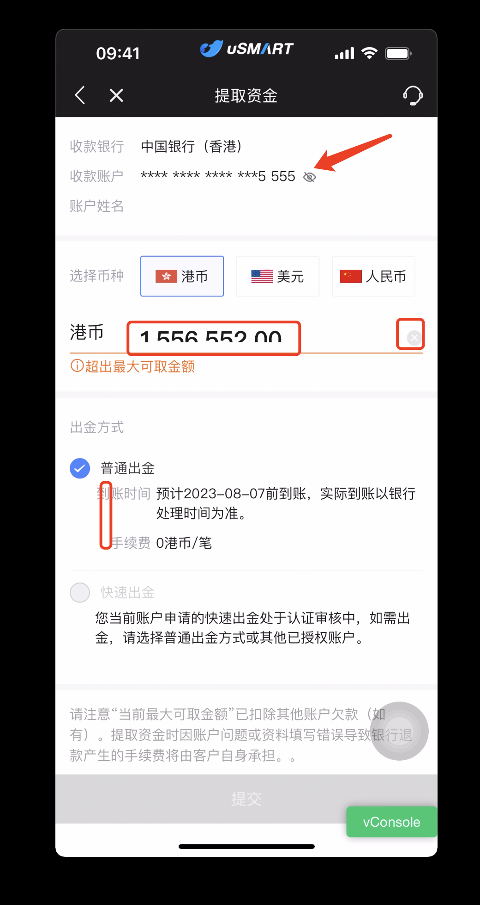
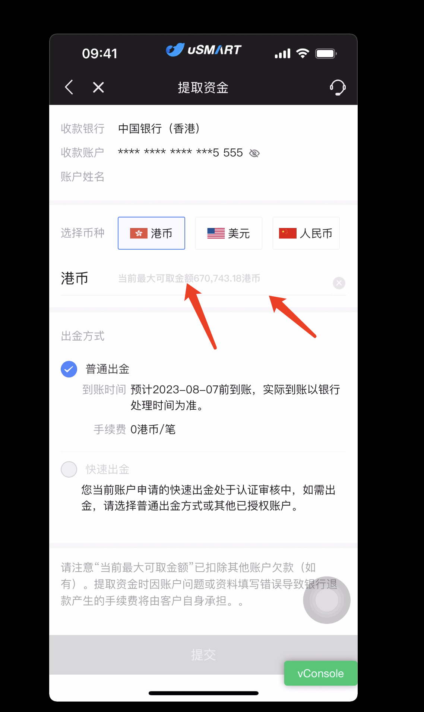

## 出金页面样式调整（港版/大陆）

Location: https://m-sit.yxzq.com/webapp/open-account-hk/withdrawal.html#/?market=hk

Location: https://m-sit.yxzq.com/webapp/open-account/withdrawal.html#/

大陆版UI ：https://lanhuapp.com/web/#/item/project/detailDetach?tid=46e83b55-e652-4b7a-bbe2-452725e81e1b&pid=4992e7e9-2a30-48b0-a8bd-cf974f3a34bc&project_id=4992e7e9-2a30-48b0-a8bd-cf974f3a34bc&image_id=56fc1271-ed9e-4f95-b507-bc3c4c822b1d&fromEditor=true&type=image

港版UI：https://lanhuapp.com/web/#/item/project/detailDetach?tid=46e83b55-e652-4b7a-bbe2-452725e81e1b&pid=4992e7e9-2a30-48b0-a8bd-cf974f3a34bc&project_id=4992e7e9-2a30-48b0-a8bd-cf974f3a34bc&image_id=d9923690-ea96-477e-bcf9-5508be940583&fromEditor=true&type=image

测试用例账号：<u>170 0000 0101</u>

---

### 大陆

- [x] 以后这种切图用三倍的哈，大屏幕会更清晰一些。
- [x] 输入的字符被线遮挡了（高度不够导致字体下方缺失）
- [x] 删除的icon 在输入的时候才出现。没有输入的时候是不出现的
- [x] 麻烦将到账时间和手续费这2个字断 和顶部的普通入金左对齐。 现在错位了



- [x] 未输入的提示文字，字号是18. 字体不加粗。常规体。 
- [x] 下划线多了半条 ，删掉。另外输入时候下划线是蓝色#2F79FF



### 港版

- [x] 最上面的字体字号是16. 灰色的字颜色#00000 60% . 黑色#00000 。2种字体间距30pt 
- [x] 选择币种和出金方式字体也是16号，字颜色#00000 60% 
- [x] 国家币种框高30pt，线框颜色为浅蓝色#0091FF，透明块蓝色为#0091FF 15% 。距离前面的选择币种四个字。间距30pt 
- [x] 输入框高42pt 
- [x] 下面的到账时间 手续费和普通出金四个字 ，左对齐。


​	

## 能力问题小结

目前对于样式调整的问题大部分能够解决，但缺乏规范（只针对当前问题效果进行解决，没有优化和规范意识），代码并不优美，样式后期如果累积会形成样式屎山代码，切记不能变成如此

## 设置左对齐css

要将一个元素设置为左对齐，你可以使用 CSS 中的 `text-align` 属性（对于文本内容的对齐）或 `float` 属性（对于元素的对齐）。下面是两种方法的示例：

1. 使用 `text-align` 属性（适用于文本内容的对齐）：
```css
.text-left {
  text-align: left;
}
```
然后在 HTML 中将这个类应用于相应的元素：
```html
<div class="text-left">
  This text is left-aligned.
</div>
```

2. 使用 `float` 属性（适用于元素的对齐）：
```css
.float-left {
  float: left;
}
```
然后在 HTML 中将这个类应用于相应的元素：
```html
<div class="float-left">
  This element is left-aligned.
</div>
```

这两种方法可以根据你的需要选择，`text-align` 属性用于文本内容的对齐，而 `float` 属性用于元素的对齐。请注意，`float` 属性可能会影响元素的布局，因此要谨慎使用。如果你只是想对齐文本内容，使用 `text-align` 是更合适的选项。

​	

## 如何修改input的placeholder提示字体大小样式

要修改 `<input>` 元素中的 `placeholder` 提示文字的样式，你可以使用 CSS 来进行定制。以下是如何修改 `placeholder` 的字体大小和样式的示例：

```html
<!DOCTYPE html>
<html>
<head>
<style>
/* 修改 input 元素的 placeholder 样式 */
.custom-input::placeholder {
  font-size: 14px;
  color: #999;
  font-style: italic;
}

/* 修改 input 元素的样式 */
.custom-input {
  padding: 10px;
  border: 1px solid #ccc;
}
</style>
</head>
<body>

<input type="text" class="custom-input" placeholder="Enter your text here">

</body>
</html>
```

在上面的示例中，我们使用了 `::placeholder` 伪元素来修改 `<input>` 元素的 `placeholder` 的样式。你可以在 `::placeholder` 选择器内部设置所需的样式属性，例如 `font-size`、`color` 和 `font-style`。

通过设置这些样式，你可以调整 `placeholder` 文字的字体大小、颜色和样式，以适应你的设计需求。

​	

### 用scss的话，.custom-input::placeholder要写在.custom-input里面吗

是的，如果你使用 SCSS，可以将 `::placeholder` 的样式规则写在 `.custom-input` 选择器内部，这样可以更好地组织你的样式代码。以下是使用 SCSS 的示例：

```scss
.custom-input {
  padding: 10px;
  border: 1px solid #ccc;

  &::placeholder {
    font-size: 14px;
    color: #999;
    font-style: italic;
  }
}
```

在这个示例中，`&` 符号表示当前选择器的上下文，因此 `&::placeholder` 将应用于 `.custom-input` 元素的 `placeholder` 文本。这样可以更清晰地表达规则之间的关系，并使代码更易于维护。

​	

## div里有一个input，如何在input（vant组件）输入时，使外面div的border-bottom变为1px solid #2f79ff;

借助computed，不要写在methods，methods经实践只能更新一次，将input的value清空后，仍为#2f79ff，这显然不是我们想要的，外围的div可以根据有双向绑定的van-field的v-model="applyAmount"来进行实时更新下划线样式，以下是这次问题解决涉及相关代码：

```vue
<template>
...
                .form-box.flex-box.center(v-else :class="{'bd-error':errorFlag}" :style="borderBottomStyle")
                    .label.moneyTypeLabel {{moneyTypeName}}
                    .ctn.flex-box.input-box
                        van-field(
                            v-model="applyAmount"
                            ref="applyInput"
                            :placeholder="$t('placeHolderText',withdrawBalanceStr,moneyUnit)"
                            @input="checkInput"
                            @blur="checkInputNum"
                            @focus="decodeInputNum"
                        )
                        img.close-icon(v-show="applyAmount" src="@/assets/img/open-account/withdrawal/closed-2x.png" @click="clearApplyAmount")
...
</template>

<script>
export default {
    data(){
        return{
            ...
            applyAmount: ''
            ...
        }
    },
    computed: {
        borderBottomStyle() {
            // 根据输入框的值更新外部 div 样式
            return this.applyAmount.trim() === ''
                ? {}
                : { borderBottom: '1px solid #2f79ff' }
        }
    }
}
</script>

<style>
.form-box {
    padding-top: 15px;
    border-bottom: 1px solid rgba(225, 225, 225, 0.5);
    align-items: center;
    ...
}
</style>
```

### 知识点补充

#### this.inputValue.trim()是什么

`this.inputValue.trim()` 是对 `this.inputValue` 字符串进行修剪（去除首尾空格）的操作。在 JavaScript 中，字符串的 `trim()` 方法用于去除字符串两端的空格或空白字符。

在上述的例子中，`this.inputValue.trim()` 用于判断输入框的值是否为空（只包含空格的情况也会被认为是空）。如果输入框的值经过修剪后为空字符串，说明用户输入的是空白字符或者是没有输入任何内容，因此边框颜色会设置为淡灰色。如果输入框的值经过修剪后不为空字符串，说明用户输入了有效的内容，因此边框颜色会设置为蓝色。

```html
解释：
van-field(
v-model="applyAmount"
ref="applyInput"
:placeholder="$t('placeHolderText',withdrawBalanceStr,moneyUnit)"
@input="checkInput"
@blur="checkInputNum"
@focus="decodeInputNum"
)

> 这段代码使用了 `van-field` 组件，该组件通常用于创建输入框表单元素。下面是对代码中各个属性和事件的解释：

1. `v-model="applyAmount"`：这是使用 Vue 的双向数据绑定功能，将输入框的值与 `applyAmount` 变量进行绑定。当输入框的值发生变化时，`applyAmount` 也会随之变化。

2. `ref="applyInput"`：通过设置 `ref` 属性，你可以在 Vue 组件中引用该输入框元素，以便在代码中对其进行操作。

3. `:placeholder="$t('placeHolderText',withdrawBalanceStr,moneyUnit)"`：通过 `:placeholder` 属性，将动态生成的占位文本绑定到输入框。这里使用了 `$t` 方法来翻译文本，并且传递了三个参数：`'placeHolderText'` 是翻译的键，`withdrawBalanceStr` 和 `moneyUnit` 是变量，用于填充翻译文本中的占位符。

4. `@input="checkInput"`：这是一个监听输入框输入事件的绑定。当用户在输入框中输入内容时，会触发 `checkInput` 方法。

5. `@blur="checkInputNum"`：这是一个监听输入框失去焦点事件的绑定。当用户输入框失去焦点（即点击其他地方）时，会触发 `checkInputNum` 方法。

6. `@focus="decodeInputNum"`：这是一个监听输入框获取焦点事件的绑定。当用户输入框获得焦点时，会触发 `decodeInputNum` 方法。

总的来说，这段代码是在一个 Vue 组件中创建了一个输入框元素，通过绑定各种属性和事件来控制输入框的交互行为，同时也利用了 Vue 的特性来实现数据的双向绑定和动态翻译占位文本。
```


​	

## flex:4; 是什么意思

`flex: 4;` 是一种用于设置 Flexbox 布局中的 flex 属性的简写方式。Flexbox（弹性布局）是一种用于创建灵活且可响应的布局结构的 CSS 特性。

在 `flex` 属性中，有三个值可以设置：`flex-grow`、`flex-shrink` 和 `flex-basis`。使用 `flex: 4;` 的方式可以同时设置这三个值，其含义如下：

- `flex-grow`: 定义项目在容器中分配剩余空间的能力。在这里，它被设置为 `4`，表示这个项目可以根据可用空间增长为容器中其他项目的 4 倍。
- `flex-shrink`: 定义项目在容器中收缩的能力。默认为 `1`，表示当空间不足时，项目将收缩。
- `flex-basis`: 定义项目的初始大小。在这里，没有显式设置，因此会根据内容自动确定大小。

使用 `flex: 4;` 的方式可以将上述三个属性同时设置，更方便地控制项目在 Flexbox 布局中的布局行为。这是一个常见的用法，有助于实现灵活的布局效果。

​	

## pt是什么单位

`pt` 是一种页面排版单位，通常用于印刷行业和印刷品设计。它表示“点”，是一个绝对长度单位，等于1/72英寸（英寸是常用长度单位）。在印刷行业中，1英寸被分成72个等分，每个等分就是1点（pt）。

虽然在网页设计中使用的更常见的长度单位是像素（px），但在印刷品设计和排版中，使用`pt`可以确保在不同输出设备上保持一致的尺寸。

### 10px转成pt等于多少

CSS 中的 `pt`（point）是一种单位，用于测量打印时的文本尺寸。而 `px`（pixel）是像素单位，用于屏幕上的显示。

在标准的转换中，1pt 约等于 1.333px。所以要将 `10px` 转换为 `pt`，可以使用以下公式：

10px * (1pt / 1.333px) ≈ 7.5pt

因此，`10px` 大约等于 `7.5pt`。请注意，这是一个近似值，因为不同的屏幕和浏览器可能存在细微的差异。

​	

## flex: inherit;

`flex: inherit;` 是一个 CSS 样式属性，用于设置一个元素的弹性盒子（Flexbox）布局的 `flex` 属性的值继承其父元素的值。

在弹性盒子布局中，`flex` 属性是一个复合属性，由三个子属性组成：`flex-grow`、`flex-shrink` 和 `flex-basis`。通过设置 `flex` 属性，你可以一次性设置这三个属性的值。

当你设置 `flex` 属性为 `inherit` 时，元素会继承其父元素的 `flex` 属性值，这样子元素的弹性盒子布局的行为将会与父元素的弹性盒子布局一致。

例如，假设有一个父元素的 `flex` 属性值为 `1 0 auto`，如果你在子元素中设置 `flex: inherit;`，那么子元素的弹性盒子布局属性将变为 `1 0 auto`，与父元素相同。

​	

## div不设置width为什么会自动换行

当 `<div>` 元素的内容超出其容器的可用宽度时，如果没有设置明确的宽度或者 `white-space` 属性，浏览器会根据默认的盒模型和文本流动性来决定元素的显示方式。

默认情况下，`<div>` 元素的 `width` 属性为 `auto`，这意味着它会尽可能地扩展以容纳其内容。如果内容超出了可用宽度，浏览器会自动将内容换行以适应容器。

要解决这个问题，你可以采取以下一些方法：

1. 设置固定宽度：通过为 `<div>` 元素设置固定的宽度，可以防止内容溢出并自动换行。

```html
<div style="width: 300px;">This is a long text that will wrap inside the div.</div>
```

2. 使用 `white-space` 属性：通过设置 `white-space` 为 `nowrap`，可以强制内容在一行内显示，超出部分将被隐藏。

```html
<div style="white-space: nowrap;">This is a long text that will not wrap inside the div.</div>
```

3. 使用 CSS `overflow` 属性：通过设置 `overflow` 属性为 `hidden`，可以裁剪超出容器宽度的内容。

```html
<div style="width: 200px; overflow: hidden;">This is a long text that will be clipped.</div>
```

4. 使用 CSS `text-overflow` 属性：结合 `white-space` 和 `text-overflow` 属性，可以在内容溢出时显示省略号。

```html
<div style="width: 150px; white-space: nowrap; overflow: hidden; text-overflow: ellipsis;">This is a long text that will be clipped and show ellipsis.</div>
```

这些方法可以根据你的需求选择，以控制 `<div>` 元素中内容的显示方式。

