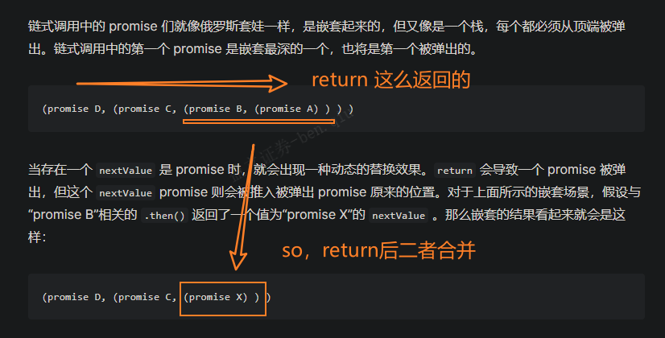

## 需求待排期

- [ ] [【SG】美股IPOB606 美股IPO佣金扣款和B608 IPO中签投资咨询费需要收取消费税](http://jira.yxzq.com/browse/JYTRADE-4419)

---

```html
解决：[Vue warn]: Failed to resolve component: center
If this is a native custom element, make sure to exclude it from component resolution via compilerOptions.isCustomElement. 
  at <AuditList onVnodeUnmounted=fn<onVnodeUnmounted> ref=Ref< undefined > key="upgrade-manage" > 
  at <KeepAlive include= [] > 
  at <RouterView> 
  at <Home onVnodeUnmounted=fn<onVnodeUnmounted> ref=Ref< undefined > > 
  at <KeepAlive> 
  at <RouterView> 
  at <App>
      
> 这个警告表明 Vue 在解析组件时无法找到名为 "center" 的组件。实际上我是想用center标签让按钮居中，既然vue使用center标签会报warn，那么使用flex布局或text-align的方式来替换居中方案吧
      
      <div style="display: flex; justify-content: center;">
          <el-button>居中显示</el-button>
      </div>
      
      <el-button style="text-align: center; width: 100%;">居中显示</el-button>
```

## 待看文章

> 小结：官方文档阅读难（翻译中文文档的）先看社区文章（掘金、博客园等等），再看官方文档。反之则reverse进行

- [x] [关于常用的http请求头以及响应头详解](https://juejin.cn/post/6844903745004765198)
- [x] [HTTP 标头（header）| MDN](https://developer.mozilla.org/zh-CN/docs/Web/HTTP/Headers)
- [x] [Flex 布局教程：语法篇](https://www.ruanyifeng.com/blog/2015/07/flex-grammar.html)
  - [ ] [彻底理解CSS Flexbox布局，看这一篇就够了！](https://juejin.cn/post/7004622232378966046)
- [x] [路由守卫 | Router官方文档](https://router.vuejs.org/zh/guide/advanced/navigation-guards.html)
- [x] [使用 Promise | MDN](https://developer.mozilla.org/zh-CN/docs/Web/JavaScript/Guide/Using_promises)
  - [x] [事件循环 | MDN](https://developer.mozilla.org/zh-CN/docs/Web/JavaScript/Event_loop#%E4%BA%8B%E4%BB%B6%E5%BE%AA%E7%8E%AF) ([[8月24日#事件循环 | 事件循环的定义和过程]])
  - [x] [Promise | MDN](https://developer.mozilla.org/zh-CN/docs/Web/JavaScript/Reference/Global_Objects/Promise)
  - [x] [Promise.reject() | MDN](https://developer.mozilla.org/zh-CN/docs/Web/JavaScript/Reference/Global_Objects/Promise/reject)
  - [x] [Promise.resolve() | MDN](https://developer.mozilla.org/zh-CN/docs/Web/JavaScript/Reference/Global_Objects/Promise/resolve)
  - [x] [Promise.prototype.then() | MDN](https://developer.mozilla.org/zh-CN/docs/Web/JavaScript/Reference/Global_Objects/Promise/then)
  - [x] [Promise.prototype.catch() | MDN](https://developer.mozilla.org/zh-CN/docs/Web/JavaScript/Reference/Global_Objects/Promise/catch)
- [x] [大白话讲解Promise（一）](https://www.cnblogs.com/lvdabao/p/es6-promise-1.html)
- [x] [高效获取信息，你需要这份 RSS 入门指南](https://sspai.com/post/56391)
  - [x] [论 RSS 的「复兴」](https://sspai.com/post/43998)
  - [x] [RSSHub Radar — 订阅一个 RSS 源不应该这么难](https://sspai.com/post/56079)（搜一下RSS如何搭建，有哪些好用的RSS阅读器）
- [ ] [组件基础 | Vue官方文档](https://cn.vuejs.org/guide/essentials/component-basics.html)
  - [ ] [组件注册](https://cn.vuejs.org/guide/components/registration.html#local-registration)
  - [ ] [Props](https://cn.vuejs.org/guide/components/props.html)
  - [ ] [组件事件](https://cn.vuejs.org/guide/components/events.html)
- [ ] [事件循环：微任务和宏任务](https://zh.javascript.info/event-loop)
- [ ] [微任务、宏任务与Event-Loop](https://juejin.cn/post/6844903657264136200)
- [x] [响应式设计 | MDN](https://developer.mozilla.org/zh-CN/docs/Learn/CSS/CSS_layout/Responsive_Design)
- [ ] [媒体查询入门指南 | MDN](https://developer.mozilla.org/zh-CN/docs/Learn/CSS/CSS_layout/Media_queries)
- [ ] [面试官：什么是响应式设计？响应式设计的基本原理是什么？如何做？](https://vue3js.cn/interview/css/responsive_layout.html#%E4%B8%80%E3%80%81%E6%98%AF%E4%BB%80%E4%B9%88)
- [ ] [前端响应式布局原理与方案（详细版）](https://juejin.cn/post/6844903814332432397)
- [ ] [渲染页面：浏览器的工作原理](https://developer.mozilla.org/zh-CN/docs/Web/Performance/How_browsers_work)
- [x] [带你深入了解 GitLab CI/CD 原理及流程](https://segmentfault.com/a/1190000037748013)
- [ ] 在 JavaScript 中，[并行执行](https://www.wikiwand.com/zh/%E5%B9%B6%E8%A1%8C%E8%AE%A1%E7%AE%97)只能通过 [worker 线程](https://developer.mozilla.org/zh-CN/docs/Web/API/Web_Workers_API)实现。
- [ ] [腾讯云-对象存储 | 快速入门](https://cloud.tencent.com/document/product/436/11459)

```html
这两种写法有什么区别
        // next(vm => {
        // vm.$nextTick(() => {
        //     console.log('0823-beforeRouteEnter')
        //     vm.handleClickSearch(1)
        //     vm.handleClickSearch(2)
        //     vm.handleClickSearch(3)
        // })
        next(vm => {
            console.log('0823-beforeRouteEnter')
            vm.handleClickSearch(1)
            vm.handleClickSearch(2)
            vm.handleClickSearch(3)
        })
```

> 在你提供的两种写法中，主要的区别在于对 `vm.$nextTick` 方法的使用。
>
> 1. 第一种写法：
>    ```javascript
>    next(vm => {
>        vm.$nextTick(() => {
>            console.log('0823-beforeRouteEnter');
>            vm.handleClickSearch(1);
>            vm.handleClickSearch(2);
>            vm.handleClickSearch(3);
>        });
>    });
>    ```
>    在这种写法中，使用了 `vm.$nextTick` 来确保在 DOM 更新后执行回调函数。这意味着在回调函数内部的代码会等到 DOM 更新完成后才执行。这对于在 DOM 更新后执行操作是非常有用的，例如修改页面上的元素或触发异步操作。
>
> 2. 第二种写法：
>    ```javascript
>    next(vm => {
>        console.log('0823-beforeRouteEnter');
>        vm.handleClickSearch(1);
>        vm.handleClickSearch(2);
>        vm.handleClickSearch(3);
>    });
>    ```
>    在这种写法中，直接在 `next` 的回调函数中调用了 `vm.handleClickSearch`，没有使用 `vm.$nextTick`。这意味着这些方法调用会在下一个事件循环中执行，而不必等到 DOM 更新完成。
>
> 综上所述，两种写法都可以实现你的目标，但是如果你的目的是确保在 DOM 更新后执行回调，**建议使用第一种写法**，以便更好地控制操作的执行时机。如果你只需要在下一个事件循环中执行操作，那么可以使用第二种写法。

​	

### 那我使用了beforeRouteEnter 页面状态就会更新吗

`beforeRouteEnter` 守卫本身并不会直接导致页面状态的更新。它是在路由进入之前被调用的一个钩子函数，可以用于在页面加载之前执行某些操作，例如获取数据、验证权限等。在 `beforeRouteEnter` 钩子中执行的操作不会导致页面状态的更新。

如果你在 `beforeRouteEnter` 钩子内部执行了一些操作，而这些操作会影响到页面状态，那么页面状态的更新通常是在钩子之后进行的。Vue 在数据更新后会触发重新渲染页面，从而呈现更新后的状态。

如果你想确保在路由切换后页面状态已更新，你可以考虑在 `beforeRouteEnter` 钩子内部执行操作后，**使用 `vm.$nextTick` 来确保 DOM 更新后再执行相关操作，以便在新页面上显示正确的状态。**

总之，`beforeRouteEnter` 钩子用于在路由切换前执行一些操作，而页面状态的更新通常是在 DOM 更新后进行的。

​	


​	

## undefined返回的是true吗？

在 JavaScript 中，`undefined` 是一个特殊的值，不是布尔值 `true` 或 `false`。当你使用条件语句（例如 `if` 语句）来判断一个变量或表达式的真假时，`undefined` 会被视为假值。

示例：

```javascript
let variable;

if (variable) {
  console.log("Variable is truthy"); // This will not be printed because `variable` is `undefined`
} else {
  console.log("Variable is falsy"); // This will be printed because `variable` is `undefined`
}
```

在上面的示例中，由于 `variable` 是 `undefined`，它被视为假值，因此进入了 `else` 分支。

总结：`undefined` 不是 `true`，而是假值，会被视为条件判断中的假。

​	

## RFC 是什么

"RFC" 通常是 "Request for Comments" 的缩写，它是一种标准文档的格式，用于描述互联网上的协议、方法、过程等。RFC 是一种用于记录和定义互联网标准的文档类型，它们通常由技术专家、研究人员和社区成员编写，然后由互联网工程任务组（IETF）或其他标准化组织审核和发布。

RFC 文档对于互联网上各种协议和标准的定义非常重要。例如，HTTP（超文本传输协议）的规范、SMTP（简单邮件传输协议）的规范以及许多其他网络协议的规范都以 RFC 文档的形式发布和维护。这些文档提供了详细的技术规范，以确保在不同系统和平台之间实现互操作性。

RFC 文档按照一定的编号和分类体系进行组织，每个文档都有一个唯一的编号，例如 "RFC 2616" 表示 HTTP 1.1 的规范。这些文档可以在互联网上免费获取，任何人都可以查阅并了解相关的标准和协议。

​	

## 导航守卫的next参数用来干嘛

在 Vue 的导航守卫中，`next` 参数是一个函数，用来控制路由跳转的行为。它是一个必须调用的函数，在导航守卫中调用 `next` 函数，才会继续执行路由跳转。

`next` 函数可以接受一个可选的参数，用来指定跳转的行为。它可以有以下几种用法：

1. 不传递参数：继续执行路由跳转，进入目标路由。

2. 传递 `false`：阻止路由跳转，保持在当前路由。

3. 传递一个路由对象：跳转到指定的路由。例如：`next({ path: '/login' })`。

4. 传递一个命名路由：跳转到具名的路由。例如：`next({ name: 'home' })`。

5. 传递一个带有 `replace: true` 的路由对象或命名路由：执行替换当前路由而不是添加新的历史记录。例如：`next({ path: '/login', replace: true })`。

通常情况下，至少需要调用一次 `next` 函数，以便在导航守卫中控制路由的行为。不同的 `next` 调用会产生不同的导航结果，从而影响用户的路由跳转体验。

​	

## 路由守卫

> [官方文档 | 路由守卫](https://router.vuejs.org/zh/guide/advanced/navigation-guards.html#%E5%AF%BC%E8%88%AA%E5%AE%88%E5%8D%AB)

### 全局前置守卫

当一个导航触发时，全局前置守卫按照创建顺序调用。守卫是异步解析执行，此时导航在所有守卫 resolve 完之前一直处于等待中。

你可以使用 `router.beforeEach` 注册一个全局前置守卫：

```js
const router = createRouter({ ... })

router.beforeEach((to, from) => {
  // ...
  // 返回 false 以取消导航
  return false
})
```

​	

### 全局解析守卫

解析守卫刚好会在导航被确认之前、所有组件内守卫和异步路由组件被解析之后调用。

`router.beforeResolve` 是获取数据或执行任何其他操作（如果用户无法进入页面时你希望避免执行的操作）的理想位置。

​	

### 全局后置钩子

`router.afterEach` 这些钩子不会接受 next 函数也不会改变导航本身，它们对于分析、更改页面标题、声明页面等辅助功能以及许多其他事情都很有用。

它们也反映了 navigation failures 作为第三个参数：

```js
router.afterEach((to, from, failure) => {
  if (!failure) sendToAnalytics(to.fullPath)
})
```

​	

### 路由独享的守卫

`beforeEnter` 守卫 **只在进入路由时触发**，不会在 params、query 或 hash 改变时触发。

​	

### 组件内的守卫

最后，你可以在路由组件内直接定义路由导航守卫(传递给路由配置的)

#### 可用的配置 API

你可以为路由组件添加以下配置：

- `beforeRouteEnter`
- `beforeRouteUpdate`
- `beforeRouteLeave`

```js
const UserDetails = {
  template: `...`,
  beforeRouteEnter(to, from) {
    // 在渲染该组件的对应路由被验证前调用
    // 不能获取组件实例 `this` ！
    // 因为当守卫执行时，组件实例还没被创建！
  },
  beforeRouteUpdate(to, from) {
    // 在当前路由改变，但是该组件被复用时调用
    // 举例来说，对于一个带有动态参数的路径 `/users/:id`，在 `/users/1` 和 `/users/2` 之间跳转的时候，
    // 由于会渲染同样的 `UserDetails` 组件，因此组件实例会被复用。而这个钩子就会在这个情况下被调用。
    // 因为在这种情况发生的时候，组件已经挂载好了，导航守卫可以访问组件实例 `this`
  },
  beforeRouteLeave(to, from) {
    // 在导航离开渲染该组件的对应路由时调用
    // 与 `beforeRouteUpdate` 一样，它可以访问组件实例 `this`
  },
}
```

beforeRouteEnter 守卫 不能 访问 this，因为守卫在导航确认前被调用，因此即将登场的新组件还没被创建。

不过，你可以通过传一个回调给 next 来访问组件实例。在导航被确认的时候执行回调，并且把组件实例作为回调方法的参数：

```js
beforeRouteEnter (to, from, next) {
  next(vm => {
    // 通过 `vm` 访问组件实例
  })
}
```

注意 `beforeRouteEnter` 是支持给 `next` 传递回调的唯一守卫。对于 `beforeRouteUpdate` 和 `beforeRouteLeave` 来说，`this` 已经可用了，所以*不支持* 传递回调，因为没有必要了

​	

### 完整的导航解析流程

1. 导航被触发。
2. 在失活的组件里调用 `beforeRouteLeave` 守卫。
3. 调用全局的 `beforeEach` 守卫。
4. 在重用的组件里调用 `beforeRouteUpdate` 守卫(2.2+)。
5. 在路由配置里调用 `beforeEnter`。
6. 解析异步路由组件。
7. 在被激活的组件里调用 `beforeRouteEnter`。
8. 调用全局的 `beforeResolve` 守卫(2.5+)。
9. 导航被确认。
10. 调用全局的 `afterEach` 钩子。
11. 触发 DOM 更新。
12. 调用 `beforeRouteEnter` 守卫中传给 `next` 的回调函数，创建好的组件实例会作为回调函数的参数传入。

​	

github除了issue还有discussions


​	

[lodash CDN](https://www.jsdelivr.com/package/npm/lodash)

​	

## JS 加"use strict"; 和不加有什么区别

在JavaScript中，添加"use strict";或使用严格模式（strict mode）与不使用严格模式之间有一些重要的区别：

1. **错误检测：** 使用严格模式可以帮助你更早地捕获代码中的潜在错误。在严格模式下，一些不合规范的行为会抛出错误，而不会默默地导致不明确的行为或安全问题。

2. **变量声明：** 在严格模式下，变量必须先声明后使用，否则会抛出错误。而在非严格模式下，如果你忘记声明变量，JavaScript会隐式地创建一个全局变量，这可能会导致不易发现的问题。

3. **保留字：** 严格模式引入了一些新的保留字，这些保留字在非严格模式下可以用作标识符（变量名、函数名等）。在严格模式下使用这些保留字会导致语法错误。

4. **this 的值：** 在严格模式下，全局上下文中的this的值是undefined，而在非严格模式下，this的值可能是全局对象（在浏览器环境中通常是window）。

5. **函数参数：** 严格模式要求函数的参数名必须是唯一的，而在非严格模式下，可以使用相同的参数名。

6. **eval 函数：** 在严格模式下，eval的行为更受限制，它创建的变量不会被提升到包含作用域，而在非严格模式下，eval的变量可能会影响包含作用域。

7. **八进制字面量：** 在非严格模式下，八进制字面量（如0123）被解释为八进制数值，而在严格模式下，会抛出错误。

总的来说，严格模式有助于编写更加健壮、可维护和安全的JavaScript代码，因为它会捕获一些潜在的问题，并限制一些不合规范的行为。因此，在新的JavaScript项目中，推荐始终使用严格模式。你可以通过在代码文件或函数的开头添加"use strict";来启用严格模式。

### 介绍一下 eval 函数

`eval` 是 JavaScript 中的一个内置函数，用于将字符串作为 JavaScript 代码来执行。它的基本语法如下：

```javascript
eval(string)
```

- `string`：一个包含要执行的 JavaScript 代码的字符串。

`eval` 函数的主要功能是将传递给它的字符串解析为 JavaScript 代码，并在当前的执行环境中执行该代码。这可以用于动态地生成和执行 JavaScript 代码。然而，`eval` 应该谨慎使用，因为它具有潜在的安全风险和性能问题。

以下是一些 `eval` 函数的用法示例：

1. **动态创建变量和函数**：

   ```javascript
   var varName = "x";
   var x = 10;
   eval("var " + varName + " = 20;");
   console.log(x); // 输出 20
   ```

   这个示例中，`eval` 用于动态创建一个变量。

2. **执行动态生成的代码**：

   ```javascript
   var code = "console.log('Hello, world!');";
   eval(code); // 输出 "Hello, world!"
   ```

   这里，`eval` 用于执行存储在变量 `code` 中的动态生成的代码。

尽管 `eval` 在某些情况下非常有用，但它存在一些潜在的问题：

- **安全性问题**：如果不谨慎使用，`eval` 可能会执行恶意代码。因此，不建议将未经验证的用户输入直接传递给 `eval`。

- **性能问题**：由于 `eval` 在运行时解析代码，它的性能可能比直接编写的代码慢。

出于这些原因，应该尽量避免在生产环境中使用 `eval`，并且在使用时要格外小心，确保只在可信任的情况下使用。在大多数情况下，可以使用更安全和可控的替代方法来达到相同的目的。

## CI / CD

为了使用GitLab CI/CD，你需要一个托管在GitLab上的应用程序代码库，并且在根目录中的 `.gitlab-ci.yml` 文件中指定构建、测试和部署的脚本。

为了可视化处理过程，假设添加到配置文件中的所有脚本与在计算机的终端上运行的命令相同。一旦你已经添加了.gitlab-ci.yml到仓库中，GitLab将检测到该文件，并使用名为GitLab Runner的工具运行你的脚本。该工具的操作与终端类似。

​	

## 理解

### 链式调用-嵌套

链式调用中的第一个 promise 是嵌套最深的一个，也将是第一个被弹出的。 

```js
(promise D, (promise C, (promise B, (promise A) ) ) )
```

当你开始解决这个 Promise 链时，Promise D 首先被解决，然后结果传递给 Promise C，接着是 Promise B，最后是 Promise A。这是因为最深嵌套的 Promise D 是第一个被解决的，然后按照链式结构依次传递结果，直到达到最外层的 Promise A。



### Promise 执行顺序

下面第二行代码和第三行代码是依次顺序执行，还是同时执行 

```js
const promiseA = new Promise(myExecutorFunc); 
const promiseB = promiseA.then(handleFulfilled1, handleRejected1); 
const promiseC = promiseA.then(handleFulfilled2, handleRejected2);
```

> 在这段代码中，第二行和第三行代码是依次顺序执行的。

让我解释一下：

1. 第一行代码创建了一个 Promise 实例 `promiseA`，并且它的构造函数中的 `myExecutorFunc` 会立即执行。这意味着 `myExecutorFunc` 内的代码会立即执行。

2. 第二行代码创建了一个新的 Promise 实例 `promiseB`，并将 `handleFulfilled1` 和 `handleRejected1` 作为 `promiseA` 被解决（fulfilled）或被拒绝（rejected）时的处理函数。这里是一个 `.then()` 方法，它会在 `promiseA` 被解决之后才会执行。

3. 第三行代码创建了另一个新的 Promise 实例 `promiseC`，与第二行类似，它将 `handleFulfilled2` 和 `handleRejected2` 作为 `promiseA` 被解决或被拒绝时的处理函数。同样，这个 `.then()` 方法也会在 `promiseA` 被解决之后才会执行。

因此，第二行和第三行代码中的 `.then()` 方法会等待 `promiseA` 被解决后才会执行，而且它们会依次顺序执行。在 `promiseA` 被解决后，会依次执行 `handleFulfilled1`、`handleRejected1`、`handleFulfilled2` 和 `handleRejected2`。它们不会同时执行。

​	

### 并发是否相当于同时执行

是的，"并发"通常用来表示多个任务在时间上重叠地执行，尽管它们不一定是真正的同时执行。在计算机领域，"并发"是指系统能够同时处理多个任务，即使这些任务在实际时间上可能不会完全重叠。

并发可以通过多种方式实现，包括多线程、多进程、异步编程等。在这些情况下，多个任务可以同时在不同的线程、进程或执行上下文中运行。然而，由于计算机资源有限，实际上只有少数任务能够在同一时刻得到处理，因此它们可能会在极短的时间间隔内交替执行。

在某些情况下，任务之间的切换可能非常快，以至于它们看起来几乎是同时执行的。但要注意，并发不等于真正的同时执行，因为在多核处理器上，多个任务可以同时在不同的核心上执行，而在单核处理器上，任务可能会交替地分时执行。

总之，"并发"指的是多个任务在时间上重叠地执行，但并不一定是真正的同时执行。这取决于系统的硬件和调度机制。

​	

### 持续交付和持续部署的联系与区别

> 持续集成：你可以预先创建一组脚本来自动构建和测试每次推送的代码，减少向应用程序引入错误的机会

联系：递增关系

流程：持续集成(CI) → 持续交付(CD) → 持续部署(CD)

区别：

- 持续交付会将每个功能或改进集成到主分支，涉及手动的交付和部署决策，需要开发组长手动部署
- 持续部署意味着你的改进或新功能可以立即提供给最终用户，无需人为干预，它是自动部署的

​	

## 实践

- 通常，如果你不知道一个值是否是 Promise，那么最好使用 [`Promise.resolve(value)`](https://developer.mozilla.org/zh-CN/docs/Web/JavaScript/Reference/Global_Objects/Promise/resolve) 将其转换成 Promise 对象，并将返回值作为 Promise 来处理。

- resolve(...) 函数中传入的任何内容，它不一定是字符串，但如果它只是一个成功的消息，那么它大概率是字符串

- - [ ] 手写实现Promise基本使用

  ```js
  // 为了尝试错误处理，使用“阈值”值会随机地引发错误。
  const THRESHOLD_A = 8; // 可以使用 0 使错误必现
  
  function tetheredGetNumber(resolve, reject) {
    setTimeout(() => {
      const randomInt = Date.now();
      const value = randomInt % 10;
      if (value < THRESHOLD_A) {
        resolve(value);
      } else {
        reject(`太大了：${value}`);
      }
    }, 500);
  }
  
  function determineParity(value) {
    const isOdd = value % 2 === 1;
    return { value, isOdd };
  }
  
  function troubleWithGetNumber(reason) {
    const err = new Error("获取数据时遇到问题", { cause: reason });
    console.error(err);
    throw err;
  }
  
  function promiseGetWord(parityInfo) {
    return new Promise((resolve, reject) => {
      const { value, isOdd } = parityInfo;
      if (value >= THRESHOLD_A - 1) {
        reject(`还是太大了：${value}`);
      } else {
        parityInfo.wordEvenOdd = isOdd ? "奇数" : "偶数";
        resolve(parityInfo);
      }
    });
  }
  
  new Promise(tetheredGetNumber)
    .then(determineParity, troubleWithGetNumber)
    .then(promiseGetWord)
    .then((info) => {
      console.log(`得到了：${info.value}, ${info.wordEvenOdd}`);
      return info;
    })
    .catch((reason) => {
      if (reason.cause) {
        console.error("已经在前面处理过错误了");
      } else {
        console.error(`运行 promiseGetWord() 时遇到问题：${reason}`);
      }
    })
    .finally((info) => console.log("所有回调都完成了"));
  
  ```

- 
