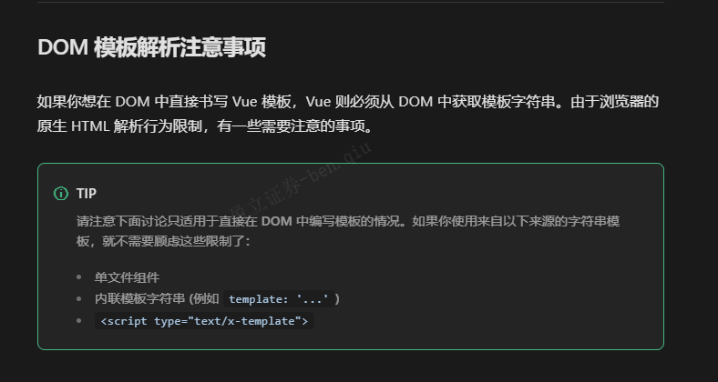
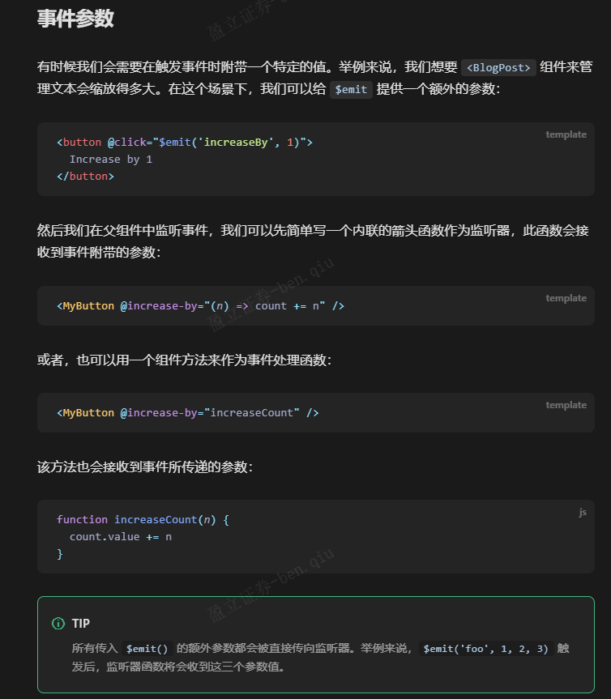
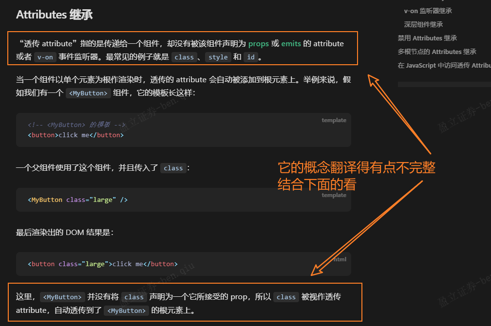

## 需求待排期

- [ ] [【SG】美股IPOB606 美股IPO佣金扣款和B608 IPO中签投资咨询费需要收取消费税](http://jira.yxzq.com/browse/JYTRADE-4419)

---

```html
解决：[Vue warn]: Failed to resolve component: center
If this is a native custom element, make sure to exclude it from component resolution via compilerOptions.isCustomElement. 
  at <AuditList onVnodeUnmounted=fn<onVnodeUnmounted> ref=Ref< undefined > key="upgrade-manage" > 
  at <KeepAlive include= [] > 
  at <RouterView> 
  at <Home onVnodeUnmounted=fn<onVnodeUnmounted> ref=Ref< undefined > > 
  at <KeepAlive> 
  at <RouterView> 
  at <App>
      
> 这个警告表明 Vue 在解析组件时无法找到名为 "center" 的组件。实际上我是想用center标签让按钮居中，既然vue使用center标签会报warn，那么使用flex布局或text-align的方式来替换居中方案吧
      
      <div style="display: flex; justify-content: center;">
          <el-button>居中显示</el-button>
      </div>
      
      <el-button style="text-align: center; width: 100%;">居中显示</el-button>
```

## 待看文章

> 小结：官方文档阅读难（翻译中文文档的）先看社区文章（掘金、博客园等等），再看官方文档。反之则reverse进行

- [x] [关于常用的http请求头以及响应头详解](https://juejin.cn/post/6844903745004765198)
- [x] [HTTP 标头（header）| MDN](https://developer.mozilla.org/zh-CN/docs/Web/HTTP/Headers)
- [x] [Flex 布局教程：语法篇](https://www.ruanyifeng.com/blog/2015/07/flex-grammar.html)
  - [ ] [彻底理解CSS Flexbox布局，看这一篇就够了！](https://juejin.cn/post/7004622232378966046)
- [x] [路由守卫 | Router官方文档](https://router.vuejs.org/zh/guide/advanced/navigation-guards.html)
- [x] [使用 Promise | MDN](https://developer.mozilla.org/zh-CN/docs/Web/JavaScript/Guide/Using_promises)
  - [x] [事件循环 | MDN](https://developer.mozilla.org/zh-CN/docs/Web/JavaScript/Event_loop#%E4%BA%8B%E4%BB%B6%E5%BE%AA%E7%8E%AF) ([[8月24日#事件循环 | 事件循环的定义和过程]])
  - [x] [Promise | MDN](https://developer.mozilla.org/zh-CN/docs/Web/JavaScript/Reference/Global_Objects/Promise)
  - [x] [Promise.reject() | MDN](https://developer.mozilla.org/zh-CN/docs/Web/JavaScript/Reference/Global_Objects/Promise/reject)
  - [x] [Promise.resolve() | MDN](https://developer.mozilla.org/zh-CN/docs/Web/JavaScript/Reference/Global_Objects/Promise/resolve)
  - [x] [Promise.prototype.then() | MDN](https://developer.mozilla.org/zh-CN/docs/Web/JavaScript/Reference/Global_Objects/Promise/then)
  - [x] [Promise.prototype.catch() | MDN](https://developer.mozilla.org/zh-CN/docs/Web/JavaScript/Reference/Global_Objects/Promise/catch)
- [x] [大白话讲解Promise（一）](https://www.cnblogs.com/lvdabao/p/es6-promise-1.html)
- [x] [高效获取信息，你需要这份 RSS 入门指南](https://sspai.com/post/56391)
  - [x] [论 RSS 的「复兴」](https://sspai.com/post/43998)
  - [x] [RSSHub Radar — 订阅一个 RSS 源不应该这么难](https://sspai.com/post/56079)（搜一下RSS如何搭建，有哪些好用的RSS阅读器）
- [x] [组件基础 | Vue官方文档](https://cn.vuejs.org/guide/essentials/component-basics.html)
  - [x] [组件注册](https://cn.vuejs.org/guide/components/registration.html#local-registration)
  - [x] [Props](https://cn.vuejs.org/guide/components/props.html)
  - [x] [组件事件](https://cn.vuejs.org/guide/components/events.html)
  - [ ] [透传 Attributes](https://cn.vuejs.org/guide/components/attrs.html)
  - [ ] [状态管理](https://cn.vuejs.org/guide/scaling-up/state-management.html)
  - [ ] [服务端渲染 (SSR)](https://cn.vuejs.org/guide/scaling-up/ssr.html)
- [ ] [事件循环：微任务和宏任务](https://zh.javascript.info/event-loop)
- [ ] [微任务、宏任务与Event-Loop](https://juejin.cn/post/6844903657264136200)
- [x] [响应式设计 | MDN](https://developer.mozilla.org/zh-CN/docs/Learn/CSS/CSS_layout/Responsive_Design)
- [ ] [媒体查询入门指南 | MDN](https://developer.mozilla.org/zh-CN/docs/Learn/CSS/CSS_layout/Media_queries)
- [ ] [面试官：什么是响应式设计？响应式设计的基本原理是什么？如何做？](https://vue3js.cn/interview/css/responsive_layout.html#%E4%B8%80%E3%80%81%E6%98%AF%E4%BB%80%E4%B9%88)
- [ ] [前端响应式布局原理与方案（详细版）](https://juejin.cn/post/6844903814332432397)
- [ ] [渲染页面：浏览器的工作原理](https://developer.mozilla.org/zh-CN/docs/Web/Performance/How_browsers_work)
- [x] [带你深入了解 GitLab CI/CD 原理及流程](https://segmentfault.com/a/1190000037748013)
- [ ] 在 JavaScript 中，[并行执行](https://www.wikiwand.com/zh/%E5%B9%B6%E8%A1%8C%E8%AE%A1%E7%AE%97)只能通过 [worker 线程](https://developer.mozilla.org/zh-CN/docs/Web/API/Web_Workers_API)实现。
- [ ] [腾讯云-对象存储 | 快速入门](https://cloud.tencent.com/document/product/436/11459)

```html
这两种写法有什么区别
        // next(vm => {
        // vm.$nextTick(() => {
        //     console.log('0823-beforeRouteEnter')
        //     vm.handleClickSearch(1)
        //     vm.handleClickSearch(2)
        //     vm.handleClickSearch(3)
        // })
        next(vm => {
            console.log('0823-beforeRouteEnter')
            vm.handleClickSearch(1)
            vm.handleClickSearch(2)
            vm.handleClickSearch(3)
        })
```

> 在你提供的两种写法中，主要的区别在于对 `vm.$nextTick` 方法的使用。
>
> 1. 第一种写法：
>    ```javascript
>    next(vm => {
>        vm.$nextTick(() => {
>            console.log('0823-beforeRouteEnter');
>            vm.handleClickSearch(1);
>            vm.handleClickSearch(2);
>            vm.handleClickSearch(3);
>        });
>    });
>    ```
>    在这种写法中，使用了 `vm.$nextTick` 来确保在 DOM 更新后执行回调函数。这意味着在回调函数内部的代码会等到 DOM 更新完成后才执行。这对于在 DOM 更新后执行操作是非常有用的，例如修改页面上的元素或触发异步操作。
>
> 2. 第二种写法：
>    ```javascript
>    next(vm => {
>        console.log('0823-beforeRouteEnter');
>        vm.handleClickSearch(1);
>        vm.handleClickSearch(2);
>        vm.handleClickSearch(3);
>    });
>    ```
>    在这种写法中，直接在 `next` 的回调函数中调用了 `vm.handleClickSearch`，没有使用 `vm.$nextTick`。这意味着这些方法调用会在下一个事件循环中执行，而不必等到 DOM 更新完成。
>
> 综上所述，两种写法都可以实现你的目标，但是如果你的目的是确保在 DOM 更新后执行回调，**建议使用第一种写法**，以便更好地控制操作的执行时机。如果你只需要在下一个事件循环中执行操作，那么可以使用第二种写法。

​	

### 那我使用了beforeRouteEnter 页面状态就会更新吗

`beforeRouteEnter` 守卫本身并不会直接导致页面状态的更新。它是在路由进入之前被调用的一个钩子函数，可以用于在页面加载之前执行某些操作，例如获取数据、验证权限等。在 `beforeRouteEnter` 钩子中执行的操作不会导致页面状态的更新。

如果你在 `beforeRouteEnter` 钩子内部执行了一些操作，而这些操作会影响到页面状态，那么页面状态的更新通常是在钩子之后进行的。Vue 在数据更新后会触发重新渲染页面，从而呈现更新后的状态。

如果你想确保在路由切换后页面状态已更新，你可以考虑在 `beforeRouteEnter` 钩子内部执行操作后，**使用 `vm.$nextTick` 来确保 DOM 更新后再执行相关操作，以便在新页面上显示正确的状态。**

总之，`beforeRouteEnter` 钩子用于在路由切换前执行一些操作，而页面状态的更新通常是在 DOM 更新后进行的。

​	


​	

## undefined返回的是true吗？

在 JavaScript 中，`undefined` 是一个特殊的值，不是布尔值 `true` 或 `false`。当你使用条件语句（例如 `if` 语句）来判断一个变量或表达式的真假时，`undefined` 会被视为假值。

示例：

```javascript
let variable;

if (variable) {
  console.log("Variable is truthy"); // This will not be printed because `variable` is `undefined`
} else {
  console.log("Variable is falsy"); // This will be printed because `variable` is `undefined`
}
```

在上面的示例中，由于 `variable` 是 `undefined`，它被视为假值，因此进入了 `else` 分支。

总结：`undefined` 不是 `true`，而是假值，会被视为条件判断中的假。

​	

## RFC 是什么

"RFC" 通常是 "Request for Comments" 的缩写，它是一种标准文档的格式，用于描述互联网上的协议、方法、过程等。RFC 是一种用于记录和定义互联网标准的文档类型，它们通常由技术专家、研究人员和社区成员编写，然后由互联网工程任务组（IETF）或其他标准化组织审核和发布。

RFC 文档对于互联网上各种协议和标准的定义非常重要。例如，HTTP（超文本传输协议）的规范、SMTP（简单邮件传输协议）的规范以及许多其他网络协议的规范都以 RFC 文档的形式发布和维护。这些文档提供了详细的技术规范，以确保在不同系统和平台之间实现互操作性。

RFC 文档按照一定的编号和分类体系进行组织，每个文档都有一个唯一的编号，例如 "RFC 2616" 表示 HTTP 1.1 的规范。这些文档可以在互联网上免费获取，任何人都可以查阅并了解相关的标准和协议。

​	

## 导航守卫的next参数用来干嘛

在 Vue 的导航守卫中，`next` 参数是一个函数，用来控制路由跳转的行为。它是一个必须调用的函数，在导航守卫中调用 `next` 函数，才会继续执行路由跳转。

`next` 函数可以接受一个可选的参数，用来指定跳转的行为。它可以有以下几种用法：

1. 不传递参数：继续执行路由跳转，进入目标路由。

2. 传递 `false`：阻止路由跳转，保持在当前路由。

3. 传递一个路由对象：跳转到指定的路由。例如：`next({ path: '/login' })`。

4. 传递一个命名路由：跳转到具名的路由。例如：`next({ name: 'home' })`。

5. 传递一个带有 `replace: true` 的路由对象或命名路由：执行替换当前路由而不是添加新的历史记录。例如：`next({ path: '/login', replace: true })`。

通常情况下，至少需要调用一次 `next` 函数，以便在导航守卫中控制路由的行为。不同的 `next` 调用会产生不同的导航结果，从而影响用户的路由跳转体验。

​	

## 路由守卫

> [官方文档 | 路由守卫](https://router.vuejs.org/zh/guide/advanced/navigation-guards.html#%E5%AF%BC%E8%88%AA%E5%AE%88%E5%8D%AB)

### 全局前置守卫

当一个导航触发时，全局前置守卫按照创建顺序调用。守卫是异步解析执行，此时导航在所有守卫 resolve 完之前一直处于等待中。

你可以使用 `router.beforeEach` 注册一个全局前置守卫：

```js
const router = createRouter({ ... })

router.beforeEach((to, from) => {
  // ...
  // 返回 false 以取消导航
  return false
})
```

​	

### 全局解析守卫

解析守卫刚好会在导航被确认之前、所有组件内守卫和异步路由组件被解析之后调用。

`router.beforeResolve` 是获取数据或执行任何其他操作（如果用户无法进入页面时你希望避免执行的操作）的理想位置。

​	

### 全局后置钩子

`router.afterEach` 这些钩子不会接受 next 函数也不会改变导航本身，它们对于分析、更改页面标题、声明页面等辅助功能以及许多其他事情都很有用。

它们也反映了 navigation failures 作为第三个参数：

```js
router.afterEach((to, from, failure) => {
  if (!failure) sendToAnalytics(to.fullPath)
})
```

​	

### 路由独享的守卫

`beforeEnter` 守卫 **只在进入路由时触发**，不会在 params、query 或 hash 改变时触发。

​	

### 组件内的守卫

最后，你可以在路由组件内直接定义路由导航守卫(传递给路由配置的)

#### 可用的配置 API

你可以为路由组件添加以下配置：

- `beforeRouteEnter`
- `beforeRouteUpdate`
- `beforeRouteLeave`

```js
const UserDetails = {
  template: `...`,
  beforeRouteEnter(to, from) {
    // 在渲染该组件的对应路由被验证前调用
    // 不能获取组件实例 `this` ！
    // 因为当守卫执行时，组件实例还没被创建！
  },
  beforeRouteUpdate(to, from) {
    // 在当前路由改变，但是该组件被复用时调用
    // 举例来说，对于一个带有动态参数的路径 `/users/:id`，在 `/users/1` 和 `/users/2` 之间跳转的时候，
    // 由于会渲染同样的 `UserDetails` 组件，因此组件实例会被复用。而这个钩子就会在这个情况下被调用。
    // 因为在这种情况发生的时候，组件已经挂载好了，导航守卫可以访问组件实例 `this`
  },
  beforeRouteLeave(to, from) {
    // 在导航离开渲染该组件的对应路由时调用
    // 与 `beforeRouteUpdate` 一样，它可以访问组件实例 `this`
  },
}
```

beforeRouteEnter 守卫 不能 访问 this，因为守卫在导航确认前被调用，因此即将登场的新组件还没被创建。

不过，你可以通过传一个回调给 next 来访问组件实例。在导航被确认的时候执行回调，并且把组件实例作为回调方法的参数：

```js
beforeRouteEnter (to, from, next) {
  next(vm => {
    // 通过 `vm` 访问组件实例
  })
}
```

注意 `beforeRouteEnter` 是支持给 `next` 传递回调的唯一守卫。对于 `beforeRouteUpdate` 和 `beforeRouteLeave` 来说，`this` 已经可用了，所以*不支持* 传递回调，因为没有必要了

​	

### 完整的导航解析流程

1. 导航被触发。
2. 在失活的组件里调用 `beforeRouteLeave` 守卫。
3. 调用全局的 `beforeEach` 守卫。
4. 在重用的组件里调用 `beforeRouteUpdate` 守卫(2.2+)。
5. 在路由配置里调用 `beforeEnter`。
6. 解析异步路由组件。
7. 在被激活的组件里调用 `beforeRouteEnter`。
8. 调用全局的 `beforeResolve` 守卫(2.5+)。
9. 导航被确认。
10. 调用全局的 `afterEach` 钩子。
11. 触发 DOM 更新。
12. 调用 `beforeRouteEnter` 守卫中传给 `next` 的回调函数，创建好的组件实例会作为回调函数的参数传入。

​	

github除了issue还有discussions


​	

[lodash CDN](https://www.jsdelivr.com/package/npm/lodash)

​	

## JS 加"use strict"; 和不加有什么区别

在JavaScript中，添加"use strict";或使用严格模式（strict mode）与不使用严格模式之间有一些重要的区别：

1. **错误检测：** 使用严格模式可以帮助你更早地捕获代码中的潜在错误。在严格模式下，一些不合规范的行为会抛出错误，而不会默默地导致不明确的行为或安全问题。

2. **变量声明：** 在严格模式下，变量必须先声明后使用，否则会抛出错误。而在非严格模式下，如果你忘记声明变量，JavaScript会隐式地创建一个全局变量，这可能会导致不易发现的问题。

3. **保留字：** 严格模式引入了一些新的保留字，这些保留字在非严格模式下可以用作标识符（变量名、函数名等）。在严格模式下使用这些保留字会导致语法错误。

4. **this 的值：** 在严格模式下，全局上下文中的this的值是undefined，而在非严格模式下，this的值可能是全局对象（在浏览器环境中通常是window）。

5. **函数参数：** 严格模式要求函数的参数名必须是唯一的，而在非严格模式下，可以使用相同的参数名。

6. **eval 函数：** 在严格模式下，eval的行为更受限制，它创建的变量不会被提升到包含作用域，而在非严格模式下，eval的变量可能会影响包含作用域。

7. **八进制字面量：** 在非严格模式下，八进制字面量（如0123）被解释为八进制数值，而在严格模式下，会抛出错误。

总的来说，严格模式有助于编写更加健壮、可维护和安全的JavaScript代码，因为它会捕获一些潜在的问题，并限制一些不合规范的行为。因此，在新的JavaScript项目中，推荐始终使用严格模式。你可以通过在代码文件或函数的开头添加"use strict";来启用严格模式。

### 介绍一下 eval 函数

`eval` 是 JavaScript 中的一个内置函数，用于将字符串作为 JavaScript 代码来执行。它的基本语法如下：

```javascript
eval(string)
```

- `string`：一个包含要执行的 JavaScript 代码的字符串。

`eval` 函数的主要功能是将传递给它的字符串解析为 JavaScript 代码，并在当前的执行环境中执行该代码。这可以用于动态地生成和执行 JavaScript 代码。然而，`eval` 应该谨慎使用，因为它具有潜在的安全风险和性能问题。

以下是一些 `eval` 函数的用法示例：

1. **动态创建变量和函数**：

   ```javascript
   var varName = "x";
   var x = 10;
   eval("var " + varName + " = 20;");
   console.log(x); // 输出 20
   ```

   这个示例中，`eval` 用于动态创建一个变量。

2. **执行动态生成的代码**：

   ```javascript
   var code = "console.log('Hello, world!');";
   eval(code); // 输出 "Hello, world!"
   ```

   这里，`eval` 用于执行存储在变量 `code` 中的动态生成的代码。

尽管 `eval` 在某些情况下非常有用，但它存在一些潜在的问题：

- **安全性问题**：如果不谨慎使用，`eval` 可能会执行恶意代码。因此，不建议将未经验证的用户输入直接传递给 `eval`。

- **性能问题**：由于 `eval` 在运行时解析代码，它的性能可能比直接编写的代码慢。

出于这些原因，应该尽量避免在生产环境中使用 `eval`，并且在使用时要格外小心，确保只在可信任的情况下使用。在大多数情况下，可以使用更安全和可控的替代方法来达到相同的目的。

## CI / CD

为了使用GitLab CI/CD，你需要一个托管在GitLab上的应用程序代码库，并且在根目录中的 `.gitlab-ci.yml` 文件中指定构建、测试和部署的脚本。

为了可视化处理过程，假设添加到配置文件中的所有脚本与在计算机的终端上运行的命令相同。一旦你已经添加了.gitlab-ci.yml到仓库中，GitLab将检测到该文件，并使用名为GitLab Runner的工具运行你的脚本。该工具的操作与终端类似。

​	

## 理解

### 链式调用-嵌套

链式调用中的第一个 promise 是嵌套最深的一个，也将是第一个被弹出的。 

```js
(promise D, (promise C, (promise B, (promise A) ) ) )
```

当你开始解决这个 Promise 链时，Promise D 首先被解决，然后结果传递给 Promise C，接着是 Promise B，最后是 Promise A。这是因为最深嵌套的 Promise D 是第一个被解决的，然后按照链式结构依次传递结果，直到达到最外层的 Promise A。


### Promise 执行顺序

下面第二行代码和第三行代码是依次顺序执行，还是同时执行 

```js
const promiseA = new Promise(myExecutorFunc); 
const promiseB = promiseA.then(handleFulfilled1, handleRejected1); 
const promiseC = promiseA.then(handleFulfilled2, handleRejected2);
```

> 在这段代码中，第二行和第三行代码是依次顺序执行的。

让我解释一下：

1. 第一行代码创建了一个 Promise 实例 `promiseA`，并且它的构造函数中的 `myExecutorFunc` 会立即执行。这意味着 `myExecutorFunc` 内的代码会立即执行。

2. 第二行代码创建了一个新的 Promise 实例 `promiseB`，并将 `handleFulfilled1` 和 `handleRejected1` 作为 `promiseA` 被解决（fulfilled）或被拒绝（rejected）时的处理函数。这里是一个 `.then()` 方法，它会在 `promiseA` 被解决之后才会执行。

3. 第三行代码创建了另一个新的 Promise 实例 `promiseC`，与第二行类似，它将 `handleFulfilled2` 和 `handleRejected2` 作为 `promiseA` 被解决或被拒绝时的处理函数。同样，这个 `.then()` 方法也会在 `promiseA` 被解决之后才会执行。

因此，第二行和第三行代码中的 `.then()` 方法会等待 `promiseA` 被解决后才会执行，而且它们会依次顺序执行。在 `promiseA` 被解决后，会依次执行 `handleFulfilled1`、`handleRejected1`、`handleFulfilled2` 和 `handleRejected2`。它们不会同时执行。

​	

### 并发是否相当于同时执行

是的，"并发"通常用来表示多个任务在时间上重叠地执行，尽管它们不一定是真正的同时执行。在计算机领域，"并发"是指系统能够同时处理多个任务，即使这些任务在实际时间上可能不会完全重叠。

并发可以通过多种方式实现，包括多线程、多进程、异步编程等。在这些情况下，多个任务可以同时在不同的线程、进程或执行上下文中运行。然而，由于计算机资源有限，实际上只有少数任务能够在同一时刻得到处理，因此它们可能会在极短的时间间隔内交替执行。

在某些情况下，任务之间的切换可能非常快，以至于它们看起来几乎是同时执行的。但要注意，并发不等于真正的同时执行，因为在多核处理器上，多个任务可以同时在不同的核心上执行，而在单核处理器上，任务可能会交替地分时执行。

总之，"并发"指的是多个任务在时间上重叠地执行，但并不一定是真正的同时执行。这取决于系统的硬件和调度机制。

​	

### 持续交付和持续部署的联系与区别

> 持续集成：你可以预先创建一组脚本来自动构建和测试每次推送的代码，减少向应用程序引入错误的机会

联系：递增关系

流程：持续集成(CI) → 持续交付(CD) → 持续部署(CD)

区别：

- 持续交付会将每个功能或改进集成到主分支，涉及手动的交付和部署决策，需要开发组长手动部署
- 持续部署意味着你的改进或新功能可以立即提供给最终用户，无需人为干预，它是自动部署的

​	

## 实践

- 通常，如果你不知道一个值是否是 Promise，那么最好使用 [`Promise.resolve(value)`](https://developer.mozilla.org/zh-CN/docs/Web/JavaScript/Reference/Global_Objects/Promise/resolve) 将其转换成 Promise 对象，并将返回值作为 Promise 来处理。

- resolve(...) 函数中传入的任何内容，它不一定是字符串，但如果它只是一个成功的消息，那么它大概率是字符串

- - [ ] 手写实现Promise基本使用

  ```js
  // 为了尝试错误处理，使用“阈值”值会随机地引发错误。
  const THRESHOLD_A = 8; // 可以使用 0 使错误必现
  
  function tetheredGetNumber(resolve, reject) {
    setTimeout(() => {
      const randomInt = Date.now();
      const value = randomInt % 10;
      if (value < THRESHOLD_A) {
        resolve(value);
      } else {
        reject(`太大了：${value}`);
      }
    }, 500);
  }
  
  function determineParity(value) {
    const isOdd = value % 2 === 1;
    return { value, isOdd };
  }
  
  function troubleWithGetNumber(reason) {
    const err = new Error("获取数据时遇到问题", { cause: reason });
    console.error(err);
    throw err;
  }
  
  function promiseGetWord(parityInfo) {
    return new Promise((resolve, reject) => {
      const { value, isOdd } = parityInfo;
      if (value >= THRESHOLD_A - 1) {
        reject(`还是太大了：${value}`);
      } else {
        parityInfo.wordEvenOdd = isOdd ? "奇数" : "偶数";
        resolve(parityInfo);
      }
    });
  }
  
  new Promise(tetheredGetNumber)
    .then(determineParity, troubleWithGetNumber)
    .then(promiseGetWord)
    .then((info) => {
      console.log(`得到了：${info.value}, ${info.wordEvenOdd}`);
      return info;
    })
    .catch((reason) => {
      if (reason.cause) {
        console.error("已经在前面处理过错误了");
      } else {
        console.error(`运行 promiseGetWord() 时遇到问题：${reason}`);
      }
    })
    .finally((info) => console.log("所有回调都完成了"));
  
  ```

- 

​	

## 记忆

### 组件基础

#### 使用组件

通过 `<script setup>`，导入的组件都在模板中直接可用。

ButtonCounter.vue

```vue
<script setup>
import { ref } from 'vue'

const count = ref(0)
</script>

<template>
  <button @click="count++">
    You clicked me {{ count }} times.
  </button>
</template>
```

App.vue

```vue
<script setup>
import ButtonCounter from './ButtonCounter.vue'
</script>

<template>
	<h1>Here are many child components!</h1>
	<ButtonCounter />
	<ButtonCounter />
	<ButtonCounter />
</template>
```

你会注意到，每当点击这些按钮时，每一个组件都维护着自己的状态，是不同的 `count`。这是因为每当你使用一个组件，就创建了一个新的**实例**。

#### Props传递示例

BlogPost.vue

```vue
<script setup>
defineProps(['title'])
</script>

<template>
  <h4>{{ title }}</h4>
</template>
```

App.vue

```vue
<script setup>
import { ref } from 'vue'
import BlogPost from './BlogPost.vue'
  
const posts = ref([
  { id: 1, title: 'My journey with Vue' },
  { id: 2, title: 'Blogging with Vue' },
  { id: 3, title: 'Why Vue is so fun' }
])
</script>

<template>
	<BlogPost
  	v-for="post in posts"
	  :key="post.id"
  	:title="post.title"
	></BlogPost>
</template>
```

留意我们是如何使用 `v-bind` 来传递动态 prop 值的。当事先不知道要渲染的确切内容时，这一点特别有用。

#### @ 后面可以是标准的 DOM 事件名称，也可以是自定义事件名称，这个有什么区别吗

`@` 后面可以是标准的 DOM 事件名称，也可以是自定义事件名称，它们在用法和行为上有一些区别：

1. **标准 DOM 事件名称：** 当你使用标准 DOM 事件名称时，例如 `@click`、`@input`、`@keydown` 等，Vue.js会在DOM元素上直接绑定对应的DOM事件监听器。这意味着你监听的是底层的浏览器事件，可以在组件中处理与DOM事件相关的行为。

   示例：
   
   ```html
   <button @click="handleClick">点击我</button>
   ```

   在这种情况下，`@click` 监听了按钮的点击事件。

2. **自定义事件名称：** 当你使用自定义事件名称时，例如 `@enlarge-text`、`@custom-event` 等，你实际上是在组件之间建立了一种自定义通信方式。你需要在触发事件的组件中使用 `$emit` 方法触发自定义事件，然后在父组件中使用 `@` 监听该事件。这允许不同组件之间的数据和事件传递。

   示例：

   ```html
   <custom-component @enlarge-text="handleEnlargeText"></custom-component>
   ```

   在这种情况下，`@enlarge-text` 监听了一个自定义事件，该事件由 `custom-component` 组件触发。

总的来说，区别在于标准 DOM 事件是与底层浏览器事件相关的，而自定义事件是组件之间的通信机制。你可以根据具体的需求和场景来选择使用哪种方式。标准 DOM 事件通常用于处理用户与DOM元素的交互，而自定义事件通常用于组件之间的数据传递和通信。

#### 监听事件（$emit示例）

子组件可以通过调用内置的 $emit 方法，通过传入事件名称来抛出一个事件：

BlogPost.vue

```vue
<script setup>
defineProps(['title'])
defineEmits(['enlarge-text'])
</script>

<template>
  <div class="blog-post">
    <h4>{{ title }}</h4>
    <button @click="$emit('enlarge-text')">Enlarge text</button>
  </div>
</template>
```

App.vue

```vue
<script setup>
import { ref } from 'vue'
import BlogPost from './BlogPost.vue'
  
const posts = ref([
  { id: 1, title: 'My journey with Vue' },
  { id: 2, title: 'Blogging with Vue' },
  { id: 3, title: 'Why Vue is so fun' }
])

const postFontSize = ref(1)
</script>

<template>
	<div :style="{ fontSize: postFontSize + 'em' }">
    <BlogPost
      v-for="post in posts"
      :key="post.id"
      :title="post.title"
      @enlarge-text="postFontSize += 0.1"
    ></BlogPost>
  </div>
</template>
```

因为有了 `@enlarge-text="postFontSize += 0.1"` 的监听，父组件会接收这一事件，从而更新 `postFontSize` 的值。

#### slot

AlertBox.vue

```vue
<template>
  <div class="alert-box">
    <strong>Error!</strong>
    <br/>
    <slot />
  </div>
</template>

<style scoped>
.alert-box {
  color: #666;
  border: 1px solid red;
  border-radius: 4px;
  padding: 20px;
  background-color: #f8f8f8;
}
  
strong {
	color: red;    
}
</style>
```

如上所示，我们使用 `<slot>` 作为一个占位符，父组件传递进来的内容就会渲染在这里。

App.vue

```vue
<script setup>
import AlertBox from './AlertBox.vue'
</script>

<template>
	<AlertBox>
  	Something bad happened.
	</AlertBox>
</template>
```

#### 动态组件

```vue
<!-- vue3这组件导入不需要注册吗？-->
<script setup>
import Home from './Home.vue'
import Posts from './Posts.vue'
import Archive from './Archive.vue'
import { ref } from 'vue'
 
const currentTab = ref('Home')

const tabs = {
  Home,
  Posts,
  Archive
}
</script>
```

在 Vue 3 的 `<script setup>` 语法中，不需要显式注册组件，因为它自动处理了组件的注册。这是 `<script setup>` 的一个方便之处，你只需要导入组件，并且在模板中使用它们，而不需要在组件选项中显式注册它们。

在你的示例中，你导入了 `Home`、`Posts` 和 `Archive` 组件，并将它们包含在 `tabs` 对象中。只要你在模板中使用了这些组件，Vue 3 的编译器会自动将它们注册为你的组件。

例如，如果你在模板中使用了 `Home` 组件，无需额外的注册步骤，它会正常工作：

```vue
<template>
  <div>
    <component :is="tabs[currentTab]" />
  </div>
</template>
```

上述代码中，`<component :is="tabs[currentTab]" />` 会根据 `currentTab` 的值来动态渲染 `Home`、`Posts` 或 `Archive` 组件，而无需在组件选项中显式注册它们。

这种自动注册的特性使得 `<script setup>` 更加简洁和便捷，减少了繁琐的注册步骤，同时保持了代码的可读性。

​	

##### 场景

有些场景会需要在两个组件间来回切换，比如 Tab 界面：

Home.vue

```vue
<template>
  <div class="tab">
    Home component
  </div>
</template>
```

Posts.vue

```vue
<template>
  <div class="tab">
    Posts component
  </div>
</template>
```

Archive.vue

```vue
<template>
  <div class="tab">
    Archive component
  </div>
</template>
```

App.vue

```vue
<script setup>
import Home from './Home.vue'
import Posts from './Posts.vue'
import Archive from './Archive.vue'
import { ref } from 'vue'
 
const currentTab = ref('Home')

const tabs = {
  Home,
  Posts,
  Archive
}
</script>

<template>
  <div class="demo">
    <button
       v-for="(_, tab) in tabs"
       :key="tab"
       :class="['tab-button', { active: currentTab === tab }]"
       @click="currentTab = tab"
     >
      {{ tab }}
      <!--这里本来有个疑问，为什么用 {{tab}} 不用 {{_}} 发现tabs定义的对象只有key，没有value，所以循环的value用占位符_代替-->
    </button>
	  <component :is="tabs[currentTab]" class="tab"></component>
  </div>
</template>

<style>
.demo {
  font-family: sans-serif;
  border: 1px solid #eee;
  border-radius: 2px;
  padding: 20px 30px;
  margin-top: 1em;
  margin-bottom: 40px;
  user-select: none;
  overflow-x: auto;
}

.tab-button {
  padding: 6px 10px;
  border-top-left-radius: 3px;
  border-top-right-radius: 3px;
  border: 1px solid #ccc;
  cursor: pointer;
  background: #f0f0f0;
  margin-bottom: -1px;
  margin-right: -1px;
}
.tab-button:hover {
  background: #e0e0e0;
}
.tab-button.active {
  background: #e0e0e0;
}
.tab {
  border: 1px solid #ccc;
  padding: 10px;
}
</style>
```

在上面的例子中，被传给 `:is` 的值可以是以下几种：

- 被注册的组件名
- 导入的组件对象

你也可以使用 `is` attribute 来创建一般的 HTML 元素。

当使用 `<component :is="...">` 来在多个组件间作切换时，被切换掉的组件会被卸载。我们可以通过 [<KeepAlive>组件](https://cn.vuejs.org/guide/built-ins/keep-alive.html)强制被切换掉的组件仍然保持“存活”的状态。

#### DOM 模板解析注意事项



##### [`<component>`](https://cn.vuejs.org/api/built-in-special-elements.html#component)

```vue
<script setup>
import { ref } from 'vue'

const tag = ref('input')
const username = ref('')
</script>

<template>
  <!-- 由于 'input' 是原生 HTML 元素，因此这个 v-model 不起作用 -->
  <component :is="tag" v-model="username" />
</template>
```

在实践中，这种极端情况并不常见，因为原生表单字段通常包裹在实际应用的组件中。如果确实需要直接使用原生元素，那么你可以手动将 `v-model` 拆分为 attribute 和事件。

​	

##### [is](https://cn.vuejs.org/api/built-in-special-attributes.html#is)

用于绑定[动态组件](https://cn.vuejs.org/guide/essentials/component-basics.html#dynamic-components)。

- **预期**：`string | Component`

- **用于原生元素** 3.1+

  当 `is` attribute 用于原生 HTML 元素时，它将被当作 [Customized built-in element](https://html.spec.whatwg.org/multipage/custom-elements.html#custom-elements-customized-builtin-example)，其为原生 web 平台的特性。

  但是，在这种用例中，你可能需要 Vue 用其组件来替换原生元素，如 [DOM 模板解析注意事项](https://cn.vuejs.org/guide/essentials/component-basics.html#dom-template-parsing-caveats)所述。你可以在 `is` attribute 的值中加上 `vue:` 前缀，这样 Vue 就会把该元素渲染为 Vue 组件：

  template

  ```
  <table>
    <tr is="vue:my-row-component"></tr>
  </table>
  ```

- **参考**

  - [内置特殊元素 - ``](https://cn.vuejs.org/api/built-in-special-elements.html#component)
  - [动态组件](https://cn.vuejs.org/guide/essentials/component-basics.html#dynamic-components)

​	

##### 元素位置限制

某些 HTML 元素对于放在其中的元素类型有限制，例如 <ul>，<ol>，<table> 和 <select>，相应的，某些元素仅在放置于特定元素中时才会显示，例如 <li>，<tr> 和 <option>。

这将导致在使用带有此类限制元素的组件时出现问题。例如：

```template
<table>
  <blog-post-row></blog-post-row>
</table>
```

自定义的组件 <blog-post-row> 将作为无效的内容被忽略，因而在最终呈现的输出中造成错误。我们可以使用特殊的 `is` attribute 作为一种解决方案：

```template
<table>
  <tr is="vue:blog-post-row"></tr>
</table>
```

**TIP**

> 当使用在原生 HTML 元素上时，is 的值必须加上前缀 vue: 才可以被解析为一个 Vue 组件。这一点是必要的，为了避免和原生的自定义内置元素相混淆。

以上就是你需要了解的关于 DOM 模板解析的所有注意事项，同时也是 Vue 基础部分的所有内容。祝贺你！虽然还有很多需要学习的，但你可以先暂停一下，去用 Vue 做一些有趣的东西，或者研究一些示例。

完成了本页的阅读后，回顾一下你刚才所学到的知识，如果还想知道更多细节，我们推荐你继续阅读关于组件的完整指引。

### 组件注册

#### tree-shaking

**Tree shaking** 是一个用于优化 JavaScript 代码的术语，它的主要目标是去除未使用的代码，以减小最终构建（bundle）的文件大小。这个概念最初是由 Webpack 团队引入的，用于描述他们在打包工具中的优化技术。

#### 全局注册组件的缺点

- 全局注册组件，即使它并没有被实际使用，但无法在生产打包时被自动移除 (也叫“tree-shaking”)，也就是说它仍然会出现在打包后的 JS 文件中。

- 全局注册在大型项目中使项目的依赖关系变得不那么明确。在父组件中使用子组件时，不太容易定位子组件的实现。和使用过多的全局变量一样，这可能会影响应用长期的可维护性。

相比之下，局部注册的组件需要在使用它的父组件中显式导入，并且只能在该父组件中使用。它的优点是使组件之间的依赖关系更加明确，并且对 tree-shaking 更加友好。

​	

在使用 `<script setup>` 的单文件组件中，导入的组件可以直接在模板中使用，无需注册：

```vue
<script setup>
import ComponentA from './ComponentA.vue'
</script>

<template>
  <ComponentA />
</template>
```

如果没有使用 `<script setup>`，则需要使用 `components` 选项来显式注册：

```js
import ComponentA from './ComponentA.js'

export default {
  components: {
    ComponentA
  },
  setup() {
    // ...
  }
}
```

对于每个 `components` 对象里的属性，它们的 key 名就是注册的组件名，而值就是相应组件的实现。上面的例子中使用的是 ES2015 的缩写语法，等价于：

```js
export default {
  components: {
    ComponentA: ComponentA
  }
  // ...
}
```

请注意：**局部注册的组件在后代组件中并\*不\*可用**。在这个例子中，`ComponentA` 注册后仅在当前组件可用，而在任何的子组件或更深层的子组件中都不可用。（有点像废话，这句话的意思就是说，爸爸不能给儿子当儿子）

### Props

动态绑定的 props 要用 `v-bind` 或  `:` （即使动态绑定的是常量），**任何**类型的值都可以作为 props 的值被传递。

使用一个对象绑定多个 prop
如果你想要将一个对象的所有属性都当作 props 传入，你可以使用没有参数的 v-bind，即只使用 v-bind 而非 :prop-name。例如，这里有一个 post 对象：

```js
const post = {
  id: 1,
  title: 'My Journey with Vue'
}
```


以及下面的模板：

```template
<BlogPost v-bind="post" />
```


而这实际上等价于：

```template
<BlogPost :id="post.id" :title="post.title" />
```

​	

`defineProps()` 宏中的参数**不可以访问 `<script setup>` 中定义的其他变量**，因为在编译时整个表达式都会被移到外部的函数中。

工厂函数类似类的概念，定义好字面量，后面只需继承就好，没必要重复定义，优化代码

​	

一些补充细节：

- 所有 prop 默认都是可选的，除非声明了 `required: true`。
- 除 `Boolean` 外的未传递的可选 prop 将会有一个默认值 `undefined`。
- `Boolean` 类型的未传递 prop 将被转换为 `false`。这可以通过为它设置 `default` 来更改——例如：设置为 `default: undefined` 将与非布尔类型的 prop 的行为保持一致。
- 如果声明了 `default` 值，那么在 prop 的值被解析为 `undefined` 时，无论 prop 是未被传递还是显式指明的 `undefined`，都会改为 `default` 值。

当 prop 的校验失败后，Vue 会抛出一个控制台警告 (在开发模式下)。

如果使用了[基于类型的 prop 声明](https://cn.vuejs.org/api/sfc-script-setup.html#type-only-props-emit-declarations) ，Vue 会尽最大努力在运行时按照 prop 的类型标注进行编译。举例来说，`defineProps<{ msg: string }>` 会被编译为 `{ msg: { type: String, required: true }}`。

​	

#### 宏是什么

> "宏" 通常指的是编程语言中的宏（Macro），它是一种用于代码生成和代码重用的技术。宏允许程序员定义一些抽象的代码片段，然后在代码中引用这些宏，编译器或预处理器会将宏展开为实际的代码片段。
>
> 在不同的编程语言和环境中，宏有不同的实现方式和语法。下面是一些常见的宏的用途和示例：
>
> 1. **预处理器宏（C/C++）：** 在C和C++中，预处理器宏是使用 `#define` 指令定义的符号，用于在代码中进行文本替换。这些宏在编译前由预处理器处理，并且通常用于创建常量、简化代码、以及条件编译等任务。
>
>    ```c
>    #define MAX(a, b) ((a) > (b) ? (a) : (b))
>
>    int result = MAX(10, 20); // 展开为 int result = ((10) > (20) ? (10) : (20));
>    ```
>
> 2. **函数宏（Lisp）：** Lisp编程语言使用宏来定义新的语法，以简化代码。Lisp宏允许程序员创建自定义的控制结构和DSL（领域特定语言）。
>
>    ```lisp
>    (defmacro when (condition &rest body)
>      `(if ,condition (progn ,@body)))
>    
>    (when (> x 10)
>      (print "x is greater than 10"))
>    ```
>
> 3. **模板宏（Rust）：** Rust编程语言引入了宏系统，允许程序员编写自定义的代码生成器。Rust宏可以生成代码、处理模式匹配等。
>
>    ```rust
>    macro_rules! my_print {
>        () => (println!("Hello, world!"));
>    }
>    
>    my_print!(); // 展开为 println!("Hello, world!");
>    ```
>
> 4. **文本宏（JavaScript）：** 在JavaScript中，文本宏是一种在编译期间或运行时处理字符串文本的技术。它通常涉及使用模板字符串或正则表达式来进行文本操作。
>
>    ```javascript
>    const name = "Alice";
>    const greeting = `Hello, ${name}!`; // 使用文本宏，将变量插入到字符串中
>    ```
>
> 总的来说，宏是一种强大的代码生成和抽象化工具，它可以用于简化代码、提高可读性、创建新的语法结构以及实现高度通用的函数和模板。不同编程语言和环境提供了不同类型的宏，每种宏都有其自己的用途和语法规则。

​	

`instanceof` 用于判断实例属于哪个类或构造函数，具体用法：`实例` instanceof `类/构造函数`

​	

#### Boolean 类型转换

当一个 prop 被声明为允许多种类型时，`Boolean` 的转换规则也将被应用。然而，当同时允许 `String` 和 `Boolean` 时，有一种边缘情况——只有当 `Boolean` 出现在 `String` 之前时，`Boolean` 转换规则才适用：

```js
// disabled 将被转换为 true
defineProps({
  disabled: [Boolean, Number]
})
  
// disabled 将被转换为 true
defineProps({
  disabled: [Boolean, String]
})
  
// disabled 将被转换为 true
defineProps({
  disabled: [Number, Boolean]
})
  
// disabled 将被解析为空字符串 (disabled="")
defineProps({
  disabled: [String, Boolean]
})
```

​	

### 组件事件

像组件与 prop 一样，事件的名字也提供了自动的格式转换。注意这里我们触发了一个以 camelCase 形式命名的事件，但在父组件中可以使用 kebab-case 形式来监听。与 [prop 大小写格式](https://cn.vuejs.org/guide/components/props.html#prop-name-casing)一样，在模板中我们也推荐使用 kebab-case 形式来编写监听器。

> 和原生 DOM 事件不一样，组件触发的事件**没有冒泡机制**。你只能监听直接子组件触发的事件。平级组件或是跨越多层嵌套的组件间通信，应使用一个外部的事件总线，或是使用一个[全局状态管理方案](https://cn.vuejs.org/guide/scaling-up/state-management.html)。

​	

==”组件触发的事件没有冒泡机制。你只能监听直接子组件触发的事件。“，这句话怎么理解？==

> 这句话是在上下文中讨论 Vue.js 组件中的事件传递时提到的。让我解释一下它的含义：
>
> 在 Vue.js 中，组件之间可以通过触发和监听事件来进行通信。一个组件可以触发（发射）一个自定义事件，而另一个组件可以监听这个事件来获取信息或执行某些操作。然而，需要理解的是，Vue 组件的事件传递是基于组件树结构的，它并不像浏览器中的原生事件那样具有冒泡机制。
>
> 具体来说，这句话的含义是：
>
> 1. **组件触发的事件没有冒泡机制：** 当一个组件触发（发射）一个自定义事件时，这个事件不会像原生DOM事件那样自动向上传递到父组件、祖父组件或其他组件。它只会在组件内部进行传播。
>
> 2. **只能监听直接子组件触发的事件：** 如果你希望父组件监听子组件触发的事件，那么监听事件的父组件必须直接包含这个子组件。如果在父组件的祖父组件或更高层级的组件中监听，是无法直接捕获到子组件触发的事件的，因为事件传递不会跳过层级。
>
> 这意味着事件的传递是局部的，只在触发事件的组件及其子组件之间进行，不会自动传递到更高层级的组件。如果需要在更高层级的组件中监听事件，你需要手动将事件通过嵌套层级的每个组件传递，或者考虑使用全局事件总线或状态管理工具（如 Vuex）来实现组件之间的全局通信。
>
> 总之，Vue.js 的事件传递是基于组件树结构的，要理解哪些组件可以监听哪些事件，需要考虑组件的层级关系。这种设计有助于组件之间的隔离和封装，但也需要开发者在组件通信时进行适当的设计和管理。

==那哪些有冒泡机制==

> 冒泡机制通常与浏览器中的原生 DOM 事件相关联，但并不是所有原生 DOM 事件都支持冒泡机制。以下是一些具有冒泡机制的常见原生 DOM 事件：
>
> 1. **点击事件（click）：** 当用户点击页面上的元素时，点击事件会从被点击的元素开始冒泡，并依次传递给它的父元素，直到达到文档树的根节点。
>
> 2. **鼠标事件（mouseenter、mouseleave、mouseover、mouseout）：** 这些事件在鼠标进入或离开元素以及在元素上移动时都会触发，并支持冒泡。
>
> 3. **键盘事件（keydown、keyup）：** 当用户按下或释放键盘上的按键时，键盘事件会从触发事件的元素开始冒泡。
>
> 4. **表单事件（submit、input、change）：** 表单元素上的事件，如提交表单、输入文本、选择选项等，也支持冒泡。
>
> 5. **焦点事件（focus、blur）：** 当元素获取或失去焦点时，焦点事件也会冒泡。
>
> 6. **自定义事件（Custom Events）：** 你可以创建自定义事件，并在需要的时候触发它们。自定义事件可以选择是否冒泡，因此你可以根据需求自由控制。
>
> 请注意，并不是所有事件都支持冒泡。例如，`mousemove` 事件通常不冒泡，它只在触发事件的元素上触发，而不传递给父元素。冒泡是一种事件传递的机制，它可以让你在文档树中的多个元素之间传递事件，以便更灵活地处理用户交互。
>
> 需要特别注意的是，Vue.js 的自定义事件是不支持冒泡的，只会在触发事件的组件及其子组件之间传递，不会自动冒泡到更高层级的组件。这与原生 DOM 事件的冒泡机制不同。如果需要在 Vue.js 中实现类似冒泡的行为，你需要手动设计事件传递逻辑。

#### v-on

给元素绑定事件监听器。

- **缩写：**`@`

- **期望的绑定值类型：**`Function | Inline Statement | Object (不带参数)`

- **参数：**`event` (使用对象语法则为可选项)

- **修饰符**

  - `.stop` - 调用 `event.stopPropagation()`。
  - `.prevent` - 调用 `event.preventDefault()`。
  - `.capture` - 在捕获模式添加事件监听器。
  - `.self` - 只有事件从元素本身发出才触发处理函数。
  - `.{keyAlias}` - 只在某些按键下触发处理函数。
  - `.once` - 最多触发一次处理函数。
  - `.left` - 只在鼠标左键事件触发处理函数。
  - `.right` - 只在鼠标右键事件触发处理函数。
  - `.middle` - 只在鼠标中键事件触发处理函数。
  - `.passive` - 通过 `{ passive: true }` 附加一个 DOM 事件。

- **详细信息**

  事件类型由参数来指定。表达式可以是一个方法名，一个内联声明，如果有修饰符则可省略。

  当用于普通元素，只监听[**原生 DOM 事件**](https://developer.mozilla.org/en-US/docs/Web/Events)。当用于自定义元素组件，则监听子组件触发的**自定义事件**。

  当监听原生 DOM 事件时，方法接收原生事件作为唯一参数。如果使用内联声明，声明可以访问一个特殊的 `$event` 变量：`v-on:click="handle('ok', $event)"`。

  `v-on` 还支持绑定不带参数的事件/监听器对的对象。请注意，当使用对象语法时，不支持任何修饰符。

- **示例**

  ```vue
  <!-- 方法处理函数 -->
  <button v-on:click="doThis"></button>
  
  <!-- 动态事件 -->
  <button v-on:[event]="doThis"></button>
  
  <!-- 内联声明 -->
  <button v-on:click="doThat('hello', $event)"></button>
  
  <!-- 缩写 -->
  <button @click="doThis"></button>
  
  <!-- 使用缩写的动态事件 -->
  <button @[event]="doThis"></button>
  
  <!-- 停止传播 -->
  <button @click.stop="doThis"></button>
  
  <!-- 阻止默认事件 -->
  <button @click.prevent="doThis"></button>
  
  <!-- 不带表达式地阻止默认事件 -->
  <form @submit.prevent></form>
  
  <!-- 链式调用修饰符 -->
  <button @click.stop.prevent="doThis"></button>
  
  <!-- 按键用于 keyAlias 修饰符-->
  <input @keyup.enter="onEnter" />
  
  <!-- 点击事件将最多触发一次 -->
  <button v-on:click.once="doThis"></button>
  
  <!-- 对象语法 -->
  <button v-on="{ mousedown: doThis, mouseup: doThat }"></button>
  ```

  监听子组件的自定义事件 (当子组件的“my-event”事件被触发，处理函数将被调用)：

  ```vue
  <MyComponent @my-event="handleThis" />
  
  <!-- 内联声明 -->
  <MyComponent @my-event="handleThis(123, $event)" />
  ```

- **参考**

  - [事件处理](https://cn.vuejs.org/guide/essentials/event-handling.html)
  - [组件 - 自定义事件](https://cn.vuejs.org/guide/essentials/component-basics.html#listening-to-events)

​	

#### 内联声明

内联声明（Inline Declaration）是指在Vue.js模板中直接声明事件处理函数或绑定方法，并且可以在声明时传递参数。通常，内联声明是通过在模板中使用 `@` 符号来绑定事件，并在事件后面使用括号 `()` 来传递参数。

在Vue.js中，有两种方式声明事件处理函数：

1. **非内联声明（Non-Inline Declaration）**：事件处理函数通常在组件的 `methods` 部分中定义，然后在模板中通过方法名来引用。这种方式适用于在多个地方重复使用相同的事件处理函数。

   ```vue
   <!-- 在模板中绑定事件，引用组件中的方法 -->
   <button @click="handleClick">Click me</button>
   ```

   ```vue
   // 在组件中定义方法
   methods: {
     handleClick() {
       // 处理点击事件
     },
   },
   ```

2. **内联声明（Inline Declaration）**：事件处理函数可以直接在模板中声明，并且可以在声明时传递参数。这种方式适用于需要在事件绑定时传递特定数据给事件处理函数的情况。

   ```vue
   <!-- 在模板中绑定事件，并传递参数 -->
   <button @click="handleClick(123, 'Hello')">Click me</button>
   ```

   这里的 `handleClick(123, 'Hello')` 是一个内联声明，因为事件处理函数直接在模板中定义，并且传递了参数 `123` 和 `'Hello'` 给事件处理函数。

内联声明通常用于在模板中灵活地传递数据给事件处理函数，而不必在组件的 `methods` 中提前定义一个方法。这对于需要在不同地方使用不同的参数调用相同事件处理函数的情况很有用。但请注意，内联声明可能使模板变得复杂，因此需要谨慎使用，以确保代码的可读性和维护性。

​	

##### 也就是说函数是直接在模板中定义的？

是的，内联声明中的函数是直接在模板中定义的。在Vue.js模板中，你可以使用内联声明来定义事件处理函数，而无需在组件的`methods`部分事先声明它们。这样可以使模板更加灵活，允许你传递特定的参数给事件处理函数。

例如，以下示例中的内联声明定义了一个点击事件处理函数，它在点击按钮时会触发，同时传递了参数：

```vue
<button @click="handleClick(123, 'Hello')">Click me</button>
```

在上述示例中，`handleClick` 函数是直接在模板中定义的，而不需要在组件的 `methods` 部分预先声明它。这使得你可以轻松地在模板中处理事件并传递特定的参数，而无需为每个事件都创建额外的方法。这对于一次性或特定上下文的事件处理非常有用，但在处理复杂逻辑的情况下，建议仍然将事件处理函数放在组件的 `methods` 部分，以提高代码的可维护性。

​	

#### 事件参数



#### 声明触发的事件

> 如果一个原生事件的名字 (例如 `click`) 被定义在 `emits` 选项中，则监听器只会监听组件触发的 `click` 事件而不会再响应原生的 `click` 事件。

​	

### 透传 Attributes



#### [`v-on` 监听器继承](https://cn.vuejs.org/guide/components/attrs.html#v-on-listener-inheritance)

同样的规则也适用于 `v-on` 事件监听器：

```vue
<MyButton @click="onClick" />
```

`click` 监听器会被添加到 `<MyButton>` 的根元素，即那个原生的 `<button>` 元素之上。当原生的 `<button>` 被点击，会触发父组件的 `onClick` 方法。同样的，如果原生 `button` 元素自身也通过 `v-on` 绑定了一个事件监听器，则这个监听器和从父组件继承的监听器都会被触发。
