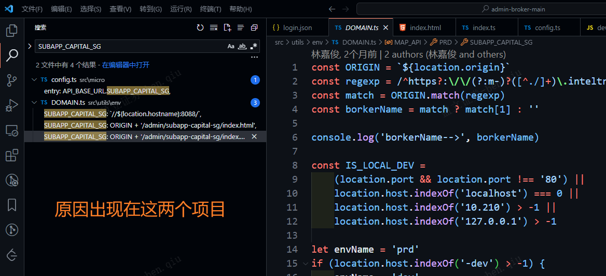

## 新需求

[HK白标EDDA需求-前端](http://jira.yxzq.com/browse/COMOMAPP-452)

### 项目所需 node 版本

- youxin-admin-transaction——12.22.12
- admin-broker-main——14.16.0
- admin-broker-capital——14.16.0
- admin-broker-admin——12.22.12

### 前端提测日期

- 9月5号

### 迁移项目流程

了解项目-->配置路由-->填充html和js逻辑-->调试接口-->css调整

​	

### Bug

- [x] 银行信息维护：`eddaBankState`、`defaultEddaBankCodeDTOList`、`eddaSupportIdentity`，三个字段调用修改接口 ` /intel-trade/admin-api/admin-bank-bankInfo-update/v1` 后，获取列表发现值未修改

  - [ ] 编辑弹框做了，新增的弹框内容未修改

- [x] EDDA手续费配置找不到在哪里项目（在 youxin-admin-account 里，因为各个项目都有前缀，故 `repository` 目录可以存放所有项目在根目录，不必再分级）

- [x] 线上转账开户审核 `admin-broker-admin`：http://jira.yxzq.com/browse/COMOMAPP-454@ 邱泽楷(Ben) 看下页面布局的，提交接口等旅游提供给你，你再同步下
  - [x] 页面布局（未合并到sit）
  - [x] 重新开户接口调试
  - [x] viewerjs图片预览失败，找不到原因，inline=true 可用，但全屏的用不了，热更新有加载css文件，失败的原因是页面没有载入css文件，但不知道怎么解决（后面用v-viewer插件也不行，最后解决方案选择element plus的图片预览解决的）

- [x] edda授权管理（auth-manage）：接口尚为放置正确接口文件中，请根据[接口文档](https://jy-ruifeng.inteltrade.hk/doc.html#/%E8%B5%84%E4%BA%A7%E6%A8%A1%E5%9D%97/app-Config%E7%9B%B8%E5%85%B3%E6%8E%A5%E5%8F%A3/queryAccountBillUsingPOST)搜索接口名进行验证归位(待验证)

  - [x] 字段待对齐（1：edda服务银行有误，是入参eddaAuthBankChannel不是响应参数userBankName）

  - [x] 入参（根据userShortId（客户ID）、bankName（客户扣款银行）无法正常检索，englishName（英文姓名），receivedStartTime和receivedEndTime 服务器处理异常报错）
    
    ```html
    亮总，edda入金管理的这个接口（/capital-center-sg/admin-api/query-fps-message/v1）入参有几个字段检索的时候有点问题，麻烦看下后端有没有问题哈
    
    userShortId：无法准确筛选
    bankName、englishName、receivedStartTime和receivedEndTime：服务器处理异常
    ```
    
    - [ ] 入参收款银行有问题

- [x] edda入金管理：导出功能接口未调

  - [x] /query-fps-message/v1 亮总未提供 没事多催
  - [ ] `英文姓名`、`收款银行`、`银行流水号`、`银行入金状态` 无法搜索筛选，请查看字段和查询方法（检查入参）

- [x] ##### edda手续费配置 有一点疑惑，为什么路由前缀需要是/subapp-capital-sg/ 才能挂载子项目 不然会挂载失败，这个是在哪里配置的

  - [x] `const { userAuthList = {} } = this.$store.state || {}`   // this.$store.state 报错先注释


#### 404接口

- edda入金管理
  - [x] /query-fps-message/v1

- edda手续费配置
  - [x] admin-bank-bankFeeRule-listEqualCondition/v1

​	

### 接口字段

#### EDDA授权管理

接口 `/stock-capital-server/admin-api/query-edda-message/v1` 返回数据类型

```json
{
    "code": 0,
    "data": {
        "list": [
            {
                "auditFailReason": "",
                "auditFailReasonEnglish": "",
                "auditFailReasonTradition": "",
                "auditStatus": 10,
                "bankAccountCurrency": "MAC",
                "bankAccountName": "MO CHINA",
                "bankAccountNo": "012-35678",
                "bankChannel": 0,
                "bankCode": "HSBC",
                "bankIdentifyId": "34134314134666666",
                "bankIdentifyImageLink": "",
                "bankIdentifyType": 1,
                "bankName": "汇丰银行",
                "bankNameEnglish": "The Hongkong and Shanghai Banking",
                "bankNameTraditional": "匯豐銀行",
                "bankNumber": "004",
                "chineseName": "莫云雯",
                "createdTime": "2019-12-26 20:44:32",
                "dbsRejectCode": "",
                "ddaRef": "",
                "dealFinishTime": null,
                "eddaBankState": 1,
                "eddaStatus": 40,
                "englishName": "",
                "extendData": "",
                "failReason": "",
                "familyNameSpell": "mo",
                "finalStatus": 40,
                "firstNameSpell": "china",
                "hsFundAccount": "12000299",
                "id": "727752755099410432",
                "identifyNumber": "34134314134666666",
                "identifyType": 1,
                "isValidAuth": 0,
                "latestApplicationTime": "2019-12-27 14:13:24",
                "mandateAmount": 20000.00,
                "mandateCurrency": "HKD",
                "mandateId": "",
                "openAuthType": 1,
                "remark": "",
                "updatedTime": "2019-12-30 11:46:04",
                "userId": "330856529813295104",
                "userShortId": "1716",
                "version": 0,
                "yxBankAccountNo": "001055946",
                "yxBankName": "yxzq"
            },
```

- auth-manage/list*.js 属性已做删除，如有需要增加回原来的，请前往 `youxin-admin-transaction` 对应路径 `src\pages\bussiness-manage\edda\auth-manage\list.js` 重新添加

#### EDDA入金管理

`/capital-center-sg/admin-api/query-fps-message/v1` 返回字段

```json
{
    "code": 0,
    "data": {
        "list": [
            {
                "applyAmount": 10000.00,
                "applyTime": "2023-07-27 02:14:58",
                "applyType": 1,
                "bankChineseName": "DBS BANK LTD",
                "businessId": "1202035529131601920",
                "cashType": 12,
                "cashinStatus": 52,
                "chineseName": "测试账号5",
                "createTime": "2023-07-27 02:14:58",
                "extendData": "",
                "familyNameSpell": "测试账号5",
                "feeAmount": 0.000000,
                "firstNameSpell": "",
                "firstSuccessTransFlag": "否",
                "fundAccount": "TEST00001",
                "id": "1202035529131601920",
                "moneyType": "HKD",
                "openAccountType": 3,
                "partnerTradeNo": "1202035529131601920",
                "payChannel": 201,
                "payStatus": 30,
                "payWay": "FPS",
                "remark": "",
                "thirdAccountName": "chen ying",
                "thirdAccountNo": "222123131248",
                "thirdFailCode": "",
                "thirdFailReason": "",
                "thirdFinishTime": null,
                "thirdHandleStatus": "",
                "thirdReferenceNo": "",
                "tradeTime": null,
                "tradeType": 4011,
                "tranAmount": 10000.000000,
                "tranDate": null,
                "updateTime": "2023-09-04 11:09:00",
                "userBankName": "星展银行",
                "userId": "872526333788614656",
                "version": 3
            },
```

#### EDDA手续费配置

`/intel-trade/admin-api/admin-bank-bankFeeRule-listEqualCondition/v1` 返回字段

```json
{
    "code": 0,
    "data": {
        "list": [
            {
                "beginTime": "2023-09-01 00:00:00",
                "createTime": "2023-09-04 11:41:42",
                "endTime": "2023-10-10 23:59:59",
                "feeRule": "[{\"high\":99990000,\"low\":0,\"show\":0.5}]",
                "feeType": 20,
                "id": "3",
                "operatorName": "system",
                "remark": "",
                "ruleState": 1,
                "updateTime": "2023-09-04 11:41:42",
                "version": 0
            },
            {
                "beginTime": "2023-09-04 00:00:00",
                "createTime": "2023-09-04 11:32:53",
                "endTime": "2023-10-04 23:59:59",
                "feeRule": "[{\"high\":12,\"low\":0,\"show\":0.5},{\"high\":1000000,\"low\":12,\"show\":1}]",
                "feeType": 10,
                "id": "2",
                "operatorName": "system",
                "remark": "",
                "ruleState": 1,
                "updateTime": "2023-09-04 11:32:53",
                "version": 0
            }
        ],
        "otherDatas": null,
        "pageNum": 1,
        "pageSize": 20,
        "pages": 1,
        "total": 2
    },
    "msg": "成功"
}
```


​	

### 小结

1. 控制台很多error或warn 都是连锁报错的，如果是连锁报错，只要能解决源头，其他问题也会相应被解决
1. 查看审核状态可以从表头字段入手（在list.js文件中查找对应key，然后在全局中查找相对于的字段定义）
1. list.js 的 `filterList` 字段有时候不显示是因为有报错导致无法被渲染（如出现重复的key报错）
1. 二次封装组件库组件样式都要deep穿透
1. 有的时候，接口返回服务器异常，有可能是你传的值不对导致服务器那边无法正常处理，我想说的是不一定报错信息提示服务器异常就是后端的问题，先根据报错信息看是否问题与前端有关，如果无关再通知后端同事接口后端异常，让他修改
1. Object ... not a function 这个一般是未定义，像我做edda入金管理的时候，错误来源不是c-filter-table表结构有问题（尽管提示与它有关），而是你解构出来的变量有问题，原来的：`const { createdTime, updatedTime } = row` 打印查看row发现正确的是 `const { createTime, updateTime } = row`
1. 如果你接口调试入参发现无法筛选出想要的响应数据（例如总是展示全部数据，无法根据特定入参限制显示数据，去接口文档进行调试，如果结果一样则是后端的问题）

### 历史报错记录

#### [Vue warn]: Duplicate keys detected: 'bankChannel'. This may cause an update error.


#### Git:>running pre-commit hook: lint-staged

这句话的意思，大概是有一个钩子，提交前检查项目代码的规范，eslint的检查。提交失败的原因：项目中error过多，导致检测未通过，提交失败。

#### Uncaught (in promise) TypeError: Object(...) is not a function

一般是未定义属性

我定义完属性后，报错仍持续，无奈注释掉涉及该变量的相关代码后还报错，我意识到可能是缓存问题，重启服务试试，成功了

### 探索 

> 源码阅读系列~

#### 1 适配桶名

王世桥：@董焕(Colin) @邱泽楷(Ben) 适配一下桶名， 生产的应该是prd

王世桥：桶名uat 访问生产域名就会跨域

王世桥：

王世桥：这个要改成生产的桶名

陈颖：我看了下预生产访问到uat那边

- [ ] 项目是 `admin-broker-admin` 桶在 `DOMAIN.js` 里配，目前还不懂配置，等董哥待会合并代码后学习一下

---

#### 2 获取本地菜单

admin-broker-main\src\store\modules\tab.ts 源码待阅读，这个是获取本地菜单到tab的

### 补充知识点

#### eDDA

電子直接付款授權(eDDA)允許收款人直接向付款人收取款項。付款人可向指定的收款人設立電子直接付款授權指示，決定其最高金額、生效日期長度和週期，完成設立後可即時生效*。與此同時，商戶亦可向付款人要求設立電子直接付款授權。在電子直接付款授權生效後，本行會根據指示向相關的收款人付款。

#### CFO

CFO 是 Chief Financial Officer（首席财务官）的缩写。CFO 是一个高级管理职位，通常在组织中负责财务和会计方面的决策、战略规划以及财务管理。CFO 在组织中的角色非常重要，因为他们负责确保财务健康和稳定，以支持公司的运营和增长。

CFO 的职责和职能可能包括：

1. 财务战略：制定和执行财务策略，以确保公司达到财务目标并支持业务增长。

2. 预算和规划：制定年度预算，监督资金规划，确保资源的合理分配。

3. 资本管理：管理公司的资金流动，包括资本支出和运营资金。

4. 财务报告：负责准备和分析财务报表，向高层管理层和股东提供关键的财务信息。

5. 风险管理：评估和管理财务风险，制定适当的风险管理策略。

6. 投资决策：参与投资决策，评估并推动项目的财务可行性。

7. 资金筹集：负责寻找和筹集资金，管理债务和股本结构。

8. 法律合规：确保财务活动符合法律法规和会计准则。

9. 股东关系：与投资者和股东保持沟通，提供关于公司财务表现的信息。

10. 财务团队管理：领导和管理财务团队，确保财务职能的高效运作。

CFO 在公司的高级管理团队中扮演着至关重要的角色，他们的决策和战略直接影响着公司的财务稳定和未来发展。

​	

####  i 标签

`<i>` 标签是 HTML 中的内联元素，通常被用来表示文本中的斜体或图标。然而，需要注意的是，虽然 `<i>` 最初被用来表示斜体文本，但在语义上它并不是表示斜体的最佳选择。

如果你想使用图标，建议使用专门的图标字体、SVG 图标或其他图标库，而不是滥用 `<i>` 标签。在某些情况下，开发者也会使用 CSS 类来为元素添加图标样式。

​	

#### el-date-picker

`el-date-picker` 是 Element UI 框架中的一个日期选择器组件，用于在网页应用程序中方便地选择日期和时间。

#### 这里这些选择器是递进关系吗，最终改变的只有 .el-input 样式？

```css
.yx-container .search-box.el-form .el-form-item .area-code__select .el-input {
    width: 130px;
    margin-right: 10px;
}
```

是的，你理解得很正确。这些选择器是逐层递进的关系，最终只改变了 `.el-input` 元素的样式。让我再次解释一下这个选择器链的关系：

1. `.yx-container`：选择具有 `yx-container` 类的元素（可能是一个容器）。

2. `.search-box.el-form`：在 `.yx-container` 选择的元素中，再选择同时具有 `search-box` 类和 `el-form` 类的元素（可能是一个搜索框和表单组合）。

3. `.el-form-item`：在 `.search-box.el-form` 选择的元素中，再选择具有 `el-form-item` 类的元素（可能是表单项）。

4. `.area-code__select`：在 `.el-form-item` 选择的元素中，再选择具有 `area-code__select` 类的元素（可能是一个选择区域码的下拉菜单）。

5. `.el-input`：在 `.area-code__select` 选择的元素中，再选择具有 `el-input` 类的元素（可能是一个输入框）。

最终，上述选择器链中的所有层级都将影响到最后一个选择器 `.el-input` 所选中的元素，从而改变它的样式。其他层级的选择器是为了更精确地定位到想要改变样式的元素，而 `.el-input` 选择器最终定义了实际的样式规则。

​	

#### beforeRouteEnter

`beforeRouteEnter(to, from, next)` 第一次进入时执行，第二次进入相同的路由的时候，不会执行。

​	

#### :visible.sync

**el-dialog组件里的:visible.sync="reOpenAccountDialogVisit" 是什么意思？**

`el-dialog` 是 Element UI 组件库中的一个用于创建对话框（弹出框）的组件。`:visible.sync` 是 `el-dialog` 组件的一个属性，用于控制对话框是否显示，并且通过双向绑定来实现状态的同步。

让我逐步解释这段代码的含义：

- `el-dialog`：这是一个 Element UI 的对话框组件。

- `:visible.sync`：这是 `el-dialog` 组件的属性，`.sync` 是 Vue.js 中的一个修饰符，用于在子组件和父组件之间建立双向绑定。在这个上下文中，它用于将对话框的显示状态与父组件中的一个数据属性进行双向绑定。

- `"reOpenAccountDialogVisit"`：这是父组件中的一个数据属性，表示对话框的显示状态。在 `el-dialog` 组件中，将该属性与对话框的显示状态进行双向绑定。

所以，这段代码的作用是，通过将 `el-dialog` 组件的显示状态与父组件中名为 `"reOpenAccountDialogVisit"` 的数据属性进行双向绑定，实现了打开和关闭对话框的功能。当父组件中的 `"reOpenAccountDialogVisit"` 数据属性变化时，对话框的显示状态也会随之变化，反之亦然。这种双向绑定的方式使得在父子组件之间共享对话框的显示状态变得更加方便。

​	

#### eDIRO是什么，和eDDA有什么联系吗

eDIRO 和 eDDA 都是与银行和金融领域相关的术语，但它们指代不同的概念。让我为你解释一下它们的含义以及可能的联系：

1. **eDIRO（电子交易确认系统）：** eDIRO 是 "Electronic Deal Input, Review and Output" 的缩写，意为电子交易输入、审核和输出系统。它通常是金融机构或交易所使用的一种系统，用于电子化处理和管理金融交易的确认、审核和输出。eDIRO 系统可以帮助金融机构提高交易处理效率、降低错误率，并实现交易数据的实时监控和管理。

2. **eDDA（电子直达协议）：** eDDA 是 "Electronic Direct Debit Authorization" 的缩写，意为电子直达扣款授权。它是一种用于银行扣款授权的电子化方式。传统上，人们需要填写纸质表单来授权银行从其账户中扣款，而 eDDA 则允许客户通过电子渠道（如互联网银行、移动应用等）进行扣款授权，更加方便快捷。

虽然 eDIRO 和 eDDA 都涉及到电子化的金融流程，但它们的具体领域和功能不同，没有直接的联系。eDIRO 更关注于交易确认和处理的系统，而 eDDA 更关注于扣款授权的电子化方式。它们可能在金融机构的业务中分别发挥着不同的作用，但并没有直接的功能关联。

​	

#### Faas是什么

"Faas" 代表 "Function as a Service"，它是一种云计算服务模型，属于服务器less计算的一部分。在 FaaS 中，开发者可以编写和部署函数，而无需管理底层的服务器基础架构。这使开发者能够将注意力集中在编写代码和业务逻辑上，而无需担心服务器的管理和维护。

FaaS 模型的核心思想是将代码组织成离散的函数单元，每个函数都可以被独立地触发和执行。开发者只需要为每个函数指定触发条件，例如 HTTP 请求、数据库更新、消息队列等，当触发条件满足时，云提供商会自动执行相应的函数。

一些常见的 FaaS 云服务提供商包括 AWS Lambda、Azure Functions、Google Cloud Functions 等。这些服务允许开发者上传代码，定义触发器，并指定代码执行的运行环境。当触发器被触发时，云服务提供商会自动分配必要的计算资源，并执行相应的函数。这种按需分配资源的方式意味着开发者只需为实际使用的计算资源付费，而不需要为预留的固定资源付费。

FaaS 的优势包括：
- **弹性和扩展性**：系统会根据请求的数量自动扩展或缩减计算资源，无需手动干预。
- **高度可管理**：开发者只需关注函数的代码逻辑，不需要关心服务器的运维。
- **低开销**：因为按需分配资源，开发者只需支付实际使用的资源，不需要预支付或维护不使用的服务器。

FaaS 适用于需要快速部署、灵活扩展和响应瞬时工作负载的应用场景。它在构建无服务器架构、处理事件驱动的任务和微服务等方面具有广泛的应用。

​	

#### .ejs是什么文件

`.ejs` 是一种模板文件的扩展名，它代表 Embedded JavaScript Template（嵌入式 JavaScript 模板）。EJS 是一种用于创建动态网页内容的模板语言，允许你在模板中嵌入 JavaScript 代码，以便根据数据生成动态的 HTML 页面。

在一个 `.ejs` 文件中，你可以编写 HTML 代码，并使用特定的标签嵌入 JavaScript 代码，来动态生成页面内容。这些标签通常使用尖括号和百分号，例如 `<% %>` 用于嵌入 JavaScript 代码，而 `<%= %>` 则用于输出 JavaScript 表达式的结果。

示例：

```html
<!DOCTYPE html>
<html>
<head>
    <title><%= pageTitle %></title>
</head>
<body>
    <h1><%= greeting %></h1>
    <ul>
        <% for (let item of items) { %>
            <li><%= item %></li>
        <% } %>
    </ul>
</body>
</html>
```

在这个示例中，`<%= %>` 标签会输出 JavaScript 表达式的结果，而 `<% %>` 标签用于执行 JavaScript 代码，例如循环。

EJS 可以与各种服务器端技术（如 Node.js、Express.js 等）一起使用，将动态生成的 HTML 页面呈现给客户端。服务器会将数据注入到模板中，EJS 会解析模板，并生成最终的 HTML 页面。

需要注意的是，由于 EJS 允许在模板中执行 JavaScript 代码，因此在使用时需要谨慎，避免注入恶意代码或执行不安全的操作。