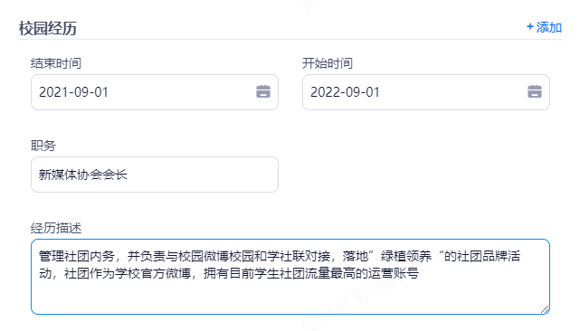
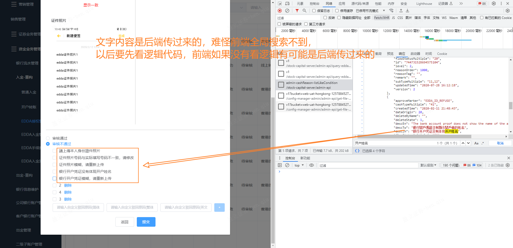

## [24 届秋招岗位汇总](https://yuyuanweb.feishu.cn/wiki/EOszw9DiZigiXSkHHg9cSIdPnZg)

​	

## GPT 提问列表

1. 说下vue通信方式有哪些，并说一下props/emit怎么用的
2. 一个数组，每个元素都是一个对象，对象有属性，你改变了其中某一个值但在页面上没有生效，遇到过吗？
3. TCP的可靠传输通过哪些机制来保证？
4. DNS协议解析过程，刚刚说到递归查询，具体是怎样流程呢？
5. DNS解析用的什么协议？是TCP还是UDP？UDP在这过程中有遇到吗？
6. 怎么指定传输putting格式内容呢？比如传输一个json或form表单我怎么去指定它？
7. 通过css如何将四行文本显示为两行，余下部分用省略号显示
8. http和https
9. vue中的 $set
10. vue的路由传值有几种方式
11. 讲一下vue3的更新/新特征

​	

## 校园经历



​	

main基座开发的时候要切分支，不然发生产有功能问题就不好，子项目可以不切，直接sit

​	

预览功能最终通过element plus[预览图片](https://element-plus.org/zh-CN/component/image.html#%E5%9B%BE%E7%89%87%E9%A2%84%E8%A7%88)的组件解决的，viewerjs和v-viewer不知道为什么都失效，无法在第一次启动的时候正常导入css文件，但js文件可以

​	



​	

```js
// 这里使用了两个es6语法，解构赋值和默认参数
let { list = [] } = await getAdminCashReasonListLikeCondition 
```