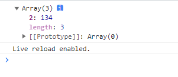

## 手写 Promise.all

### js中两个 ! 一起用是啥意思，例如 `!!obj && (typeof obj === 'function' || typeof obj === 'object') && typeof obj.then == 'function'`

在JavaScript中，两个感叹号 `!!` 一起用是用来将一个值转换为其对应的布尔值（true或false）的简便方法。具体来说，它的作用是将一个值强制转换为布尔值，并且可以用于确定一个值是否"真值"（truthy）还是"假值"（falsy）。

- 如果 `!!` 前面的值是一个"真值"，则 `!!` 运算会返回 `true`。
- 如果 `!!` 前面的值是一个"假值"，则 `!!` 运算会返回 `false`。

"真值"和"假值"的定义在JavaScript中是相对的，但通常情况下，以下值被视为"假值"（falsy）：

- `false`
- `null`
- `undefined`
- `0`
- `NaN`
- `''`（空字符串）

其他所有的值都被视为"真值"（truthy）。

在你提供的代码示例中，`!!obj` 用于将 `obj` 转换为布尔值，并检查它是否是一个"真值"。这样可以确保 `obj` 是一个存在的、非空的对象。

然后，`typeof obj === 'function' || typeof obj === 'object'` 用于进一步检查 `obj` 是否是一个函数或对象。

最后，`typeof obj.then == 'function'` 用于检查 `obj` 是否有一个名为 `then` 的方法，通常用于检查一个对象是否符合Promise的约定。

综合来看，这段代码用于确保 `obj` 是一个存在的、非空的对象，并且它要么是一个函数，要么是一个对象，而且具有一个 `then` 方法。

### 下面两个函数有什么区别

```js
// 这两个function有什么区别

function isPromise(obj) {
  return (
    !!obj && (typeof obj === 'function' || typeof obj === 'object') && typeof obj.then == 'function'
  );
}

function isPromise(object) {
  return (
    !!object && (typeof obj === 'function' || typeof obj === 'object') && object instanceof Promise
  );
}
```

主要区别在于它们检查Promise对象的方式：

1. **第一个函数** 使用 `typeof obj.then == 'function'` 来检查一个对象是否是Promise。这种方式仅检查对象是否具有一个 `then` 方法，而不会验证对象是否是通过 `Promise` 构造函数创建的真正的Promise对象。这意味着它可以误判其他具有 `then` 方法的对象为Promise，即使它们不是真正的Promise对象。
2. **第二个函数** 使用 `object instanceof Promise` 来检查一个对象是否是Promise。这种方式更准确，因为它会检查对象是否是Promise构造函数的实例，即只有真正的Promise对象才会通过检查。

**如果你希望严格检查一个对象是否是真正的Promise对象，第二个函数是更可靠的选择。如果你只关心对象是否具有 `then` 方法，那么第一个函数也可以工作，但可能会产生误判。**

### instanceof 

`instanceof` 是 JavaScript 中的一个运算符，用于检查一个对象是否是一个特定类（或构造函数）的实例。它的语法如下：

```javascript
object instanceof constructor
```

- `object`：要检查的对象。
- `constructor`：用来检查对象是否是其实例的构造函数。

`instanceof` 运算符返回一个布尔值，如果 `object` 是 `constructor` 的实例，则返回 `true`，否则返回 `false`。

下面是一个简单的示例：

```javascript
function Animal(name) {
  this.name = name;
}

const cat = new Animal('Whiskers');

console.log(cat instanceof Animal); // true，cat 是 Animal 的实例
console.log(cat instanceof Object); // true，cat 也是 Object 的实例，因为所有对象都是 Object 的实例
```

在上面的示例中，`cat` 是 `Animal` 构造函数的实例，因此 `cat instanceof Animal` 返回 `true`。同时，由于所有对象都是 `Object` 构造函数的实例，`cat instanceof Object` 也返回 `true`。

`instanceof` 运算符通常用于检查对象的原型链（prototype chain）中是否存在某个构造函数。如果存在，就返回 `true`，否则返回 `false`。这在确定对象的类型时非常有用，特别是在处理继承和多态的情况下。但要注意，`instanceof` 不适用于原始数据类型（如字符串、数字、布尔等），它主要用于检查对象的类型。

### 居然不报错

```js
let result = [];
result[2] = 134;
console.log(result);
```

运行结果：



​	

## 构建步骤是指setup吗

在软件开发中，"构建步骤" 通常指的是构建项目或应用程序的过程，通常包括以下主要步骤：

1. **设置（Setup）**：这是开始构建过程的第一步。在这一步中，你通常会配置开发环境，安装所需的依赖项和工具，以便能够构建你的项目。这包括安装编译器、构建工具、库和框架等。

2. **编码（Coding）**：在设置之后，你会开始编写实际的代码。这是将你的想法和需求转化为实际应用程序的过程。这包括编写源代码、设计数据库模型、创建用户界面等。

3. **构建（Building）**：在编码完成后，你需要将源代码转化为可执行的应用程序或部署到服务器上。这通常涉及到编译、打包、压缩和优化代码等步骤，以生成最终的可执行文件或部署文件。

4. **测试（Testing）**：构建之后，你需要对应用程序进行测试，以确保它在各种情况下都能正常工作。这包括单元测试、集成测试、功能测试等不同级别的测试。

5. **部署（Deployment）**：一旦你的应用程序通过了测试，就可以将其部署到生产环境中，以供用户使用。这可能涉及到将应用程序上传到服务器、配置服务器环境、设置域名等步骤。

6. **维护和更新（Maintenance and Updates）**：一旦应用程序部署到生产环境中，你需要定期维护和更新它，以确保它持续运行良好并满足用户需求。这包括修复错误、添加新功能、进行性能优化等。

所以，"构建步骤" 不仅仅是 "设置（Setup）"，而是涵盖了整个软件开发周期中的多个关键步骤，从最初的设置和编码，到最终的部署和维护。不同项目和开发环境可能会有不同的构建步骤和流程。