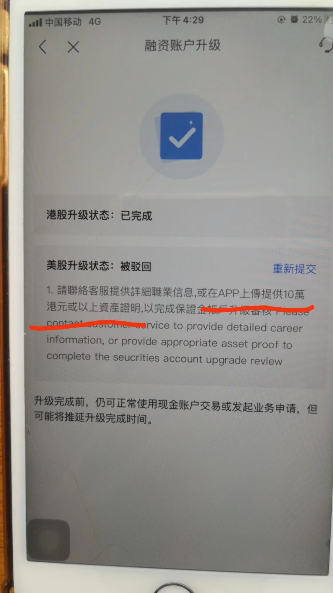
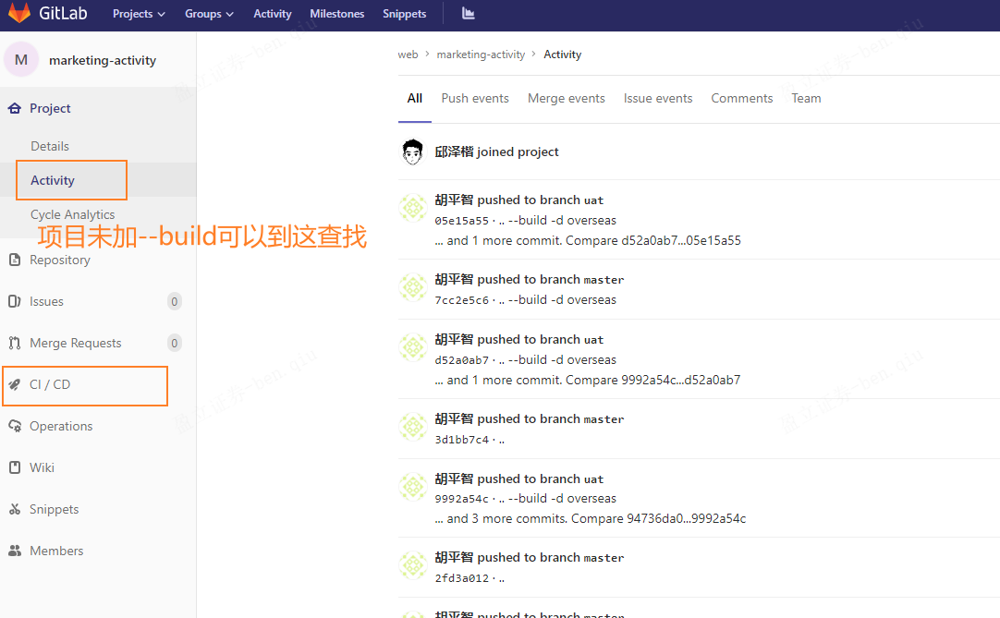

# 新需求

- [ ] [HK融资账户升级新增客服联系方式](http://jira.yxzq.com/browse/WEBSITE-812?filter=-1)
- [ ] [投放落地页内容替换](http://jira.yxzq.com/browse/WEBSITE-814)



只有图片没有链接找不到对应哪个项目，让产品经理在该页面的console中获取给页面链接给你

### 小结

- 产品提需求（例如修改某页面的内容） 需要产品提供需求所在的地址链接给你 如果他们不提供（怎么去找是他们内部的事情，不用你管） 可以不接受该需求 因为你项目都找不到在哪 怎么做？
- 拿到新项目先看 `README.md` 有不懂再询问

```js
// 对象根据yingLiNo添加相应字段
export const objAddUserId = async (obj, key = 'userId') => {
    let yingLiNo = obj.yingLiNo
    if (!yingLiNo) {
        obj[key] = ''
        return
    }
    let res = await getUserIdByYingLiNo({ yingLiNo })
    obj[key] = +res || MAX_USERID
}
```

`obj[key] = +res || MAX_USERID`: 最后，根据异步获取的 `res` 结果，它将新字段 `key` 的值设置为 `res` 的数值形式（通过 `+` 转换，如果 `res` 不是数字，将会是 NaN），如果无法获取有效的 `res` 结果，就将 `MAX_USERID` 赋值给新字段 `key`。这个 `MAX_USERID` 变量的来源在代码中没有给出，但它是一个默认值，用于在无法获取用户 ID 时提供一个备选值。



​	

### "props 或 emits 的 attribute" 是什么意思

"props 或 emits 的 attribute" 意味着在 Vue 3 的 `<script setup>` 区块中，你可以直接访问和使用组件的 `props` 和 `emits`，而不需要额外的导入步骤。这是 Vue 3 的一项方便的特性，有助于简化组件代码。

​	

### 在markdown折叠的标签是什么

在Markdown中，折叠内容通常使用HTML的 `<details>` 和 `<summary>` 元素来实现。这允许你创建一个可展开和折叠的内容块。下面是一个示例：

```markdown
<details>
  <summary>点击展开/折叠</summary>
  
  这里是折叠的内容。
  
  可以包含多行文本。
</details>
```

在上面的示例中，`<details>` 元素包含一个可点击的标题（使用 `<summary>` 元素），以及折叠的内容。当你点击标题时，折叠的内容将展开或折叠。

请注意，不是所有的Markdown解释器都支持 `<details>` 和 `<summary>` 元素，因此在使用之前，你应该确保你的Markdown解释器或目标平台支持这些元素。如果不支持，那么你可能需要查找其他方式来实现折叠效果，或者使用特定于该平台的功能（如果有的话）。

​	

<h3>
    <details>   
        <summary>VSCode因构建时内存不足导致项目启动失败</summary>
        报错信息：
        项目启动失败
        [webpack.Progress] 64% building 682/748 modules 66 active D:\Repository\sg\marketing-activity\node_modules\cache-loader\dist\cjs.js??ref--12-0!D:\Repository\sg\marketing-activity\node_modules\babel-loader\lib\index.js!D:\Repository\sg\marketing-activity\node_modules\@vue\cli-service\node_modules\vue-loader-v16\dist\templateLoader.js??ref--6!D:\Repository\sg\marketing-activity\node_modules\pug-plain-loader\index.js!D:\Repository\sg\marketing-activity\node_modules\cache-loader\dist\cjs.js??ref--0-0!D:\Repository\sg\marketing-activity\node_modules\@vue\cli-service\node_modules\vue-loader-v16\dist\index.js??ref--0-1!D:\Repository\sg\marketing-activity\src\pages\overseas\sg-ad\views\index.vue?vue&type=template&id=80d0a9aa&scoped=true&lang=pug
        [webpack.Progress] 64% building 682/749 modules 67 active D:\Repository\sg\marketing-activity\node_modules\sa-sdk-javascript\sensorsdata.min.js
        #
        # Fatal error in , line 0
        # Fatal process out of memory: Zone
        #
        #
        #
        #FailureMessage Object: 0000006C133FA890
         1: 00007FF6A98561BF
         2: 00007FF6A977E97F
         3: 00007FF6AA3F51A2
         4: 00007FF6AA0BA59E
         5: 00007FF6A9B4B350
         6: 00007FF6AA5EAB5C
         7: 00007FF6AA5F17CB
         8: 00007FF6AA5EF51D
         9: 00007FF6AA5F076C
        10: 00007FF6AA5EC4E8
        11: 00007FF6AA4B4E25
        12: 00007FF6AA4BA52E
        13: 00007FF6AA4B5B93
        14: 00007FF6AA025D80
        15: 00007FF6AA00A005
        16: 00007FF6AA00AA04
        17: 00007FF6A978133D
        18: 00007FF6A98A35BD
        19: 00007FF6AA65B0D0
        20: 00007FFB2FE57614
        21: 00007FFB316A26B1
        at ChildProcess.exithandler (child_process.js:383:12)
        at ChildProcess.emit (events.js:400:28)
        at maybeClose (internal/child_process.js:1088:16)
        at Process.ChildProcess._handle.onexit (internal/child_process.js:296:5) {
      killed: false,
      code: 3221225477,
      signal: null,
      cmd: 'vue-cli-service serve --project=overseas'
    }
    Done in 36.81s.
    </details>
</h3>

这个错误提示表明项目在构建时遇到了内存不足的问题，导致了 "Fatal process out of memory" 错误。这种情况通常发生在项目的构建或打包阶段需要大量内存资源时，而当前的内存限制不足以满足需求。（关闭几个vscode窗口或浏览器窗口即可解决内存不足）

要解决这个问题，你可以尝试以下几种方法：

1. **增加内存限制：** 你可以尝试增加构建工具的内存限制，以便在构建过程中分配更多的内存资源。在 `package.json` 文件中的 `scripts` 部分，为构建命令添加 `--max-old-space-size` 选项来指定内存限制。例如：

   ```json
   "scripts": {
     "serve": "vue-cli-service serve",
     "build": "node --max-old-space-size=4096 ./node_modules/@vue/cli-service/bin/vue-cli-service.js build"
   }
   ```

   在上述示例中，`--max-old-space-size=4096` 将内存限制设置为 4GB，你可以根据需要调整这个值。

2. **优化构建配置：** 检查你的项目配置和构建过程，确保没有不必要的资源消耗。有时候，一些配置或插件可能会导致内存占用过高。尝试通过简化配置或禁用不必要的插件来减少内存使用。

3. **升级硬件：** 如果你的开发环境内存较小，你可以考虑升级硬件，以确保有足够的内存可供项目构建使用。

4. **检查代码质量：** 有时，代码中存在内存泄漏或不合理的资源使用也可能导致内存不足问题。确保你的代码没有这些问题，并且合理释放不再使用的资源。

5. **分块加载：** 如果你的项目非常大，考虑使用分块加载（code splitting）来将代码拆分为多个小块，而不是一次性加载整个应用程序。这可以减少单个构建过程中的内存需求。

通过采取这些措施，你应该能够解决项目构建过程中的内存不足问题。如果问题仍然存在，可能需要进一步调查和诊断，以确定具体的原因。

