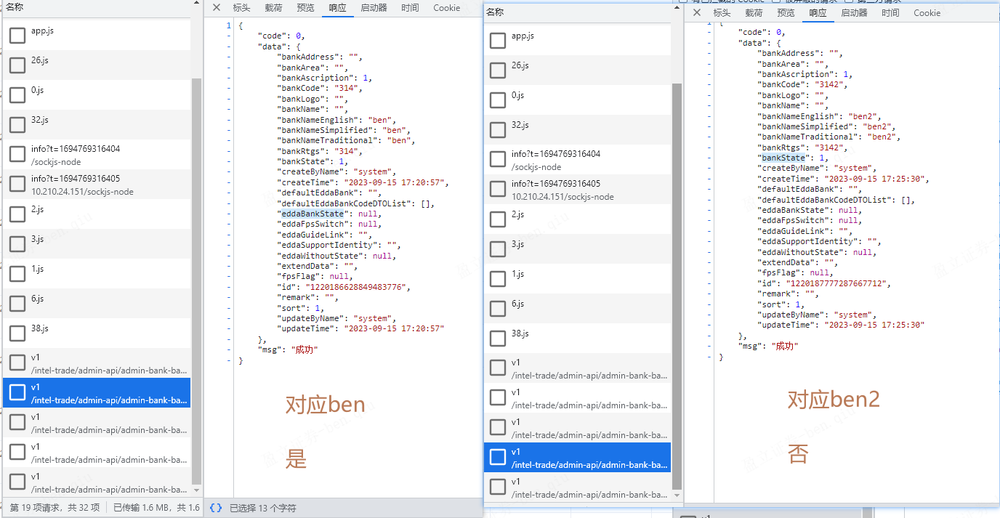
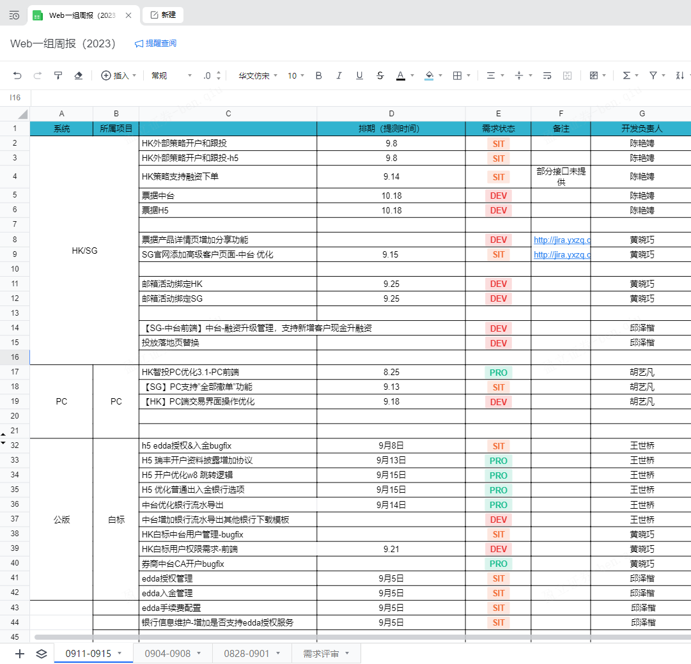

**公司项目 git push 使用--build 没在 CI/CD 构建，只出现在Project菜单下的Activity的原因**

> 这次的原因是没有及时git pull直接git push 导致远端没跑jobs 构建CI/CD ，以后push先pull就可以了

​	

[【白标EDDA】中台-银行信息维护，前端新增页面，初始化异常](http://jira.yxzq.com/browse/COMOMAPP-490?filter=-1)



```js
帮我看下下面代码为什么能做重置表单的操作，并解释一下 this.filters = this.$options.data().filters
        handleClickReset() {
            this.filters = this.$options.data().filters
            this.handleClickSearch()
        }
```

> 这段代码涉及Vue.js组件中的数据操作和表单重置。
>
> 首先，让我们来解释一下代码中的两个方法：
>
> 1. `handleClickReset()`: 这是一个方法，用于重置表单的操作。它执行了两个步骤：
>    - `this.filters = this.$options.data().filters`: 这一行代码将 `filters` 属性重置为组件实例的默认数据。`this.$options.data().filters` 获取了组件的默认数据中的 `filters` 值，并将其赋值给 `this.filters`，从而恢复了初始状态。
>    - `this.handleClickSearch()`: 然后，它调用了 `handleClickSearch` 方法，可能用于触发重新执行搜索操作。
>
> 2. `handleClickSearch()`: 这是另一个方法，可能用于执行搜索操作。代码中未提供该方法的实现，但根据方法名，它可能会执行搜索并使用当前的 `filters` 来过滤数据。
>
> 现在让我们来解释为什么代码能够重置表单的操作：
>
> - 在 Vue.js 中，组件的数据通常会存储在 `data` 选项中，而且这些数据是响应式的，意味着它们会随着数据的改变而自动更新视图。
>
> - 当你调用 `this.$options.data()` 时，它会返回组件的默认数据对象。在这种情况下，你获取了 `filters` 的默认值。
>
> - 然后，通过将 `this.filters` 设置为默认数据的值，你实际上将组件的 `filters` 属性重置为默认值。由于 `filters` 是响应式的，这将触发 Vue 的响应式系统，更新视图以反映新的值。
>
> 总结起来，这段代码通过将组件的某个属性（`filters`）重置为默认值，来实现表单的重置操作。这种方法利用了Vue的响应式数据特性，使得重置后的值能够自动反映到视图上。然后，它可能会调用 `handleClickSearch` 方法来触发搜索操作，以确保搜索使用最新的过滤条件。

​	

### [慕课网前端开发畅销榜](https://coding.imooc.com/index/courseranking?utm_source=coding&utm_term=643&utm_medium=hot&type=fe)

1. [程序员的 AI 启蒙课，ChatGPT 辅助开发 Vue3 项目](https://coding.imooc.com/class/684.html?utm_source=rank&utm_medium=hot)
2. [WebGL+Three.js 入门与实战，系统学习 Web3D 技术](https://coding.imooc.com/class/622.html?utm_source=rank&utm_medium=hot)
3. [【2023 年更新】Vue3 + TS仿知乎专栏企业级项目](https://coding.imooc.com/class/449.html?utm_source=rank&utm_medium=hot)
4. [ChatGPT 从零到一打造私人智能英语学习助手](https://coding.imooc.com/class/663.html?utm_source=rank&utm_medium=hot)
5. [【新版】Node.js+Express+Koa2 开发Web Server博客](https://coding.imooc.com/class/320.html?utm_source=rank&utm_medium=hot)

​	


