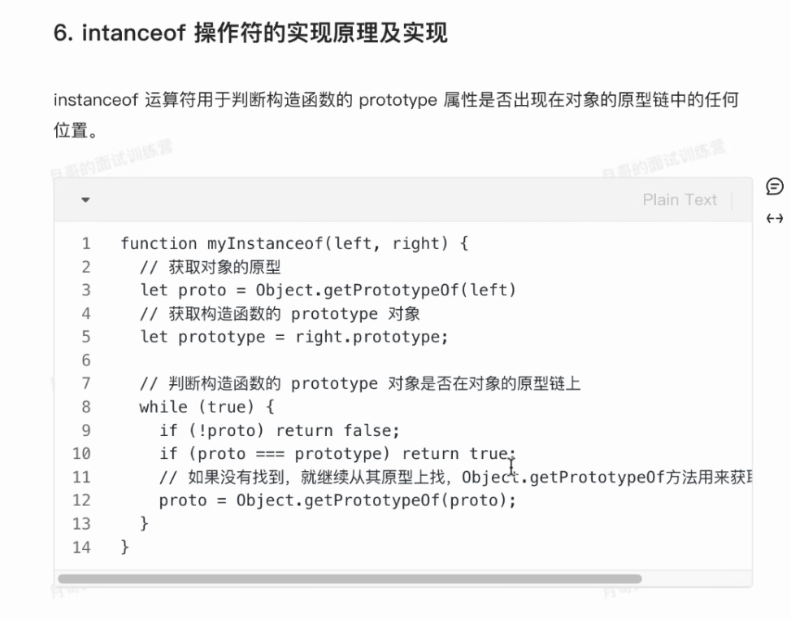

### 待看文章

- [ ] [defineComponent()](https://cn.vuejs.org/api/general.html#definecomponent)
- [ ] [自动补全输入框](https://element-plus.org/zh-CN/component/autocomplete.html#%E8%87%AA%E5%8A%A8%E8%A1%A5%E5%85%A8%E8%BE%93%E5%85%A5%E6%A1%86)

​	

bilibili-前端月哥

[村长-掘金](https://juejin.cn/user/3896324937234839/posts)

​	

### isNaN 和 Number.isNaN 函数的区别?

- 函数 isNaN 接收参数后，会尝试将这个参数转换为数值，任何不能被转换为数值的的值都会返回 true，因此非数字值传入也会返回 true ，会影响 NaN 的判断

- 函数 Number.isNaN 会首先判断传入参数是否为数字，如果是数字再继续判断是否为NaN，不会进行数据类型的转换，这种方法对于 NaN 的判断更为准确

​	

tofixed(number)：保留几位小数，公司封装有juestToFixed()

