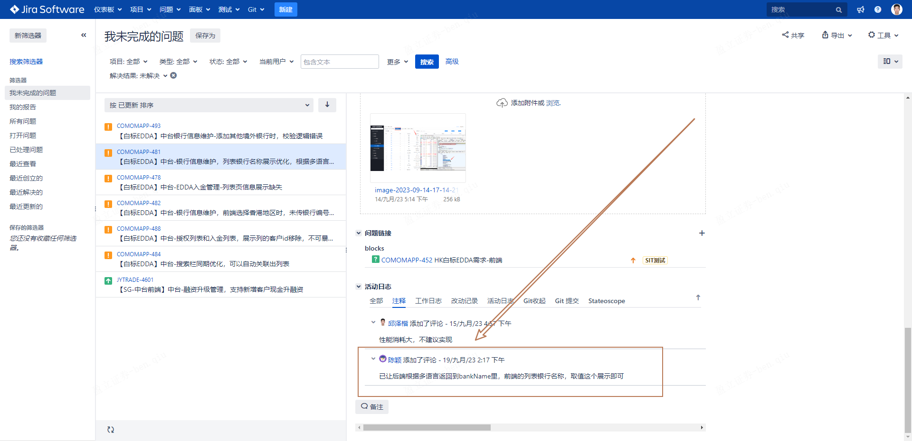
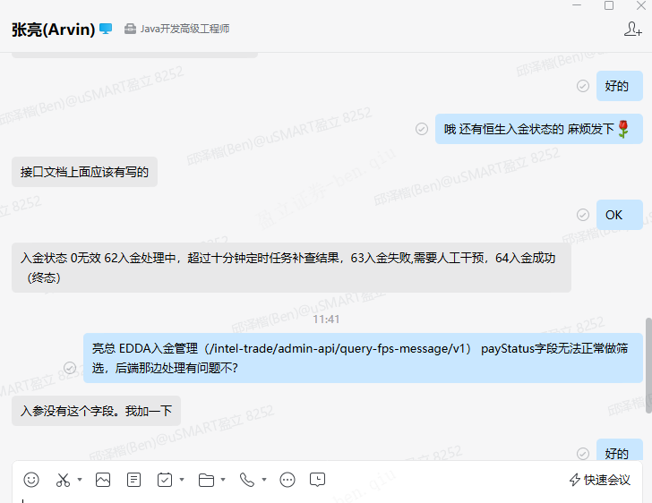

如果jira单被重新打开，测试有在活动日志中说明打开的原因问题



​	

接口字段的枚举，前后端是要一模一样的，前端多了其它字段没用，因为后端永远不会传，还会造成代码污染



> 可以了

​	

## [el-table 合并行或列](https://element.eleme.cn/#/zh-CN/component/table#he-bing-xing-huo-lie)

官方文档可能太久没更新了介绍了，合并行或列操作有点小疑惑

```js
      arraySpanMethod({ row, column, rowIndex, columnIndex }) {
        if (rowIndex % 2 === 0) {
          if (columnIndex === 0) {
            return [1, 2];
          } else if (columnIndex === 1) {
            return [0, 0]; // 实践了一下这里[0, 0]会导致当前单元行被清除 如果是[1,1] 单元格没有被合并，只是前一行占据了两列，后一列后移了一个单元格后正常显示，这会导致下一列的数值无法显示在既定大小的表格中（溢出）
          }
        }
      },
```

所以我目前只能这么写，代码性能有待提升

```js
el-table(v-for="(citem, cindex) in item.tableData" :key="cindex" :data="citem" :span-method="arraySpanMethod" :show-header="cindex === 0" border)
	el-table-column()
...
...

        arraySpanMethod({ row, column, rowIndex, columnIndex }) {
            if (columnIndex === 1 && row.charger!=='uSMART SG') {
                console.log(row,column,rowIndex)
                return [1, 2] // 使当前单元格占据你想要的宽度（2格）
            } else if(columnIndex === 2 && row.charger!=='uSMART SG'){
                return [0, 0] // 清除被合并的单元格数据
            }
        },
```

我发现了这么写也可以生效，说明arraySpanMethod方法不止一次在当前row中被执行

​	

## 记录一个bug

fee-module.vue(broker-nuxt项目，这个单组件代码可以琢磨一下，值得学习)

```vue
<template>
        .right
            .fee(v-for="item in feeList" :key="item.subTitle")
                .fee-container(:style="{height: !item.collapseHeight ? 'auto' : item.collapse ? `${item.collapseHeight}px` : `${item.originHeight}px`}")
                    .fee-header {{ item.subTitle }}
                    .fee-tags(v-if="item.tabs && item.tabs.length")
                        .tag(
                            v-for="(citem, cindex) in item.tabs"
                            :key="citem"
                            :class="{active: item.activeTabIndex === cindex}"
                            @click="item.activeTabIndex = cindex"
                        ) {{ citem }}
                    el-table(v-for="(citem, cindex) in item.tableData" :key="cindex" :data="citem" :span-method="arraySpanMethod" :show-header="cindex === 0" border)
                        el-table-column(prop="category" :label="$t('feeCategory')" width="150")
                            template(slot-scope="scope")
                                p {{ scope.row.category }}
                                p.sub(v-if="scope.row.category_sub") {{ scope.row.category_sub }}
                        el-table-column(prop="amount" :label="$t('feeAmount')" width="340")
                            template(slot-scope="scope")
                                div(v-html="scope.row.amount || scope.row[`amount${item.activeTabIndex}`]")
                        el-table-column(prop="rates" :label="$t('offlineAssistedRates')")
                            template(slot-scope="scope")
                                div(v-html="scope.row.rates || scope.row[`rates${item.activeTabIndex}`]")
                        el-table-column(prop="charger" :label="$t('chargedBy')" width="150")
                            template(slot-scope="scope")
                                div(v-html="scope.row.charger")
</template>

<script>
methods(){
        arraySpanMethod({ row, column, rowIndex, columnIndex }) {
            if (columnIndex === 1 && row.charger !== 'uSMART SG' && row.rates) {
                console.log(row,column,rowIndex)
                return [1, 2]
            } else if(columnIndex === 2 && row.charger!=='uSMART SG' && row.rates){
                return [0, 0]
            }
        },
}
</script>
```

stock-fee.js

```js
            {
                subTitle: 'SG Stock Fees',
                note: 'Note:<br>1) 0.6% Stock Transaction Tax & 0.03% Tax Service Fee on transaction amount (sell only) is applicable for Philippines stock dual listed in SGX (collected by Bureau of Internal Revenue Philippines).<br>2) The Singapore Government charges 8% <span>GST</span> for the above commission, platform fee, trading fee, clearing fee, and SI fee.',
                activeTabIndex: 0,
                tabs: ['SGD', 'USD', 'HKD'],
                tableData: [
                    [
                        {
                            category: 'Commission',
                            amount0: '0.05% * Transaction Amount\nMinimum SGD 1.00 Per Order',
                            amount1: '0.05% * Transaction Amount\nMinimum USD 0.74 Per Order',
                            amount2: '0.05% * Transaction Amount\nMinimum HKD 5.90 Per Order',
                            charger: 'uSMART SG',
                            rates: 'Negotiable'
                        },
                        {
                            category: 'Platform Fee',
                            amount0: '0.05% * Transaction Amount\nMinimum SGD 1.88 Per Order',
                            amount1: '0.05% * Transaction Amount\nMinimum USD 1.40 Per Order',
                            amount2: '0.05% * Transaction Amount\nMinimum HKD 11.06 Per Order',
                            charger: 'uSMART SG',
                            rates: 'Negotiable'
                        }
                    ],
                    [
                        {
                            category: 'Trading Fee',
                            amount: '0.0075% * Transaction Amount',
                            charger: 'Singapore Exchange (SGX)',
                            rates: '0.0075% * Transaction Amount'
                        },
                        {
                            category: 'Clearing Fee',
                            amount: '0.0325% * Transaction Amount',
                            charger: 'Singapore Exchange (SGX)',
                            rates: '0.0325% * Transaction Amount'
                        },
                        {
                            category: 'SI Fee',
                            amount0: 'SGD 0.35',
                            amount1: 'USD 0.26',
                            amount2: 'HKD 2.06',
                            charger: 'Singapore Exchange (SGX)',
                            rates: 'SGD 0.35' // bug：这里如果使用下面(多)三个参数来控制一个单元格数值 fee-module.vue中的:span-method="arraySpanMethod" 无法正常合并该单元格,因为这里rates是要被合并，所以直接写一个实现目标效果即可
                            // rates0: 'SGD 0.35',
                            // rates1: 'USD 0.26',
                            // rates2: 'HKD 2.06',
                        }
                    ]
                ]
            }

```

