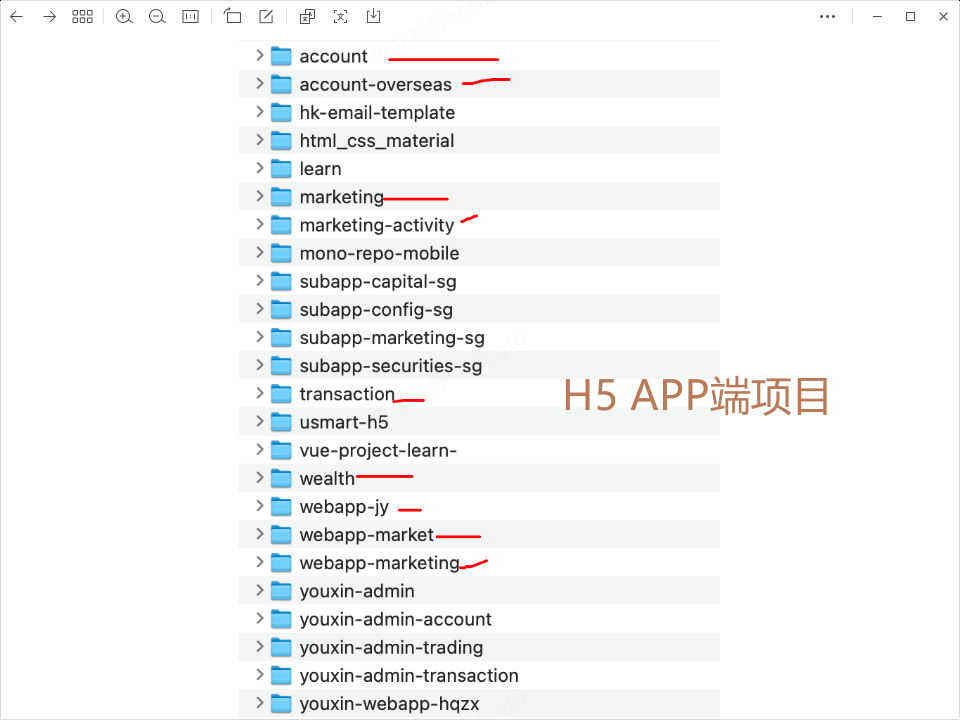
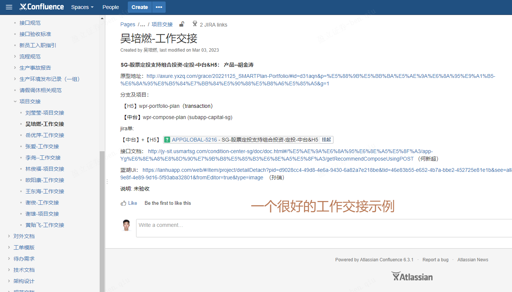
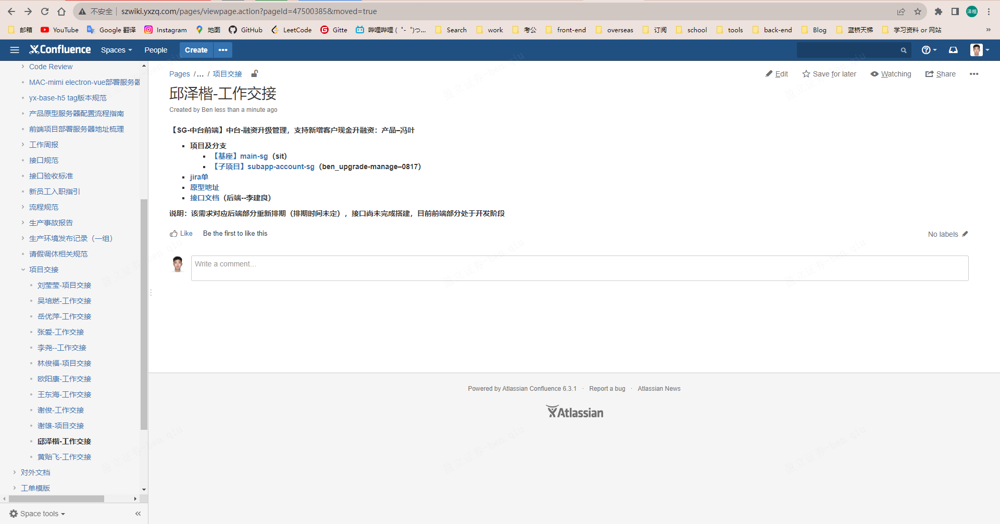

- [ ] 缺一个做Web端和移动端兼容性的项目
- [ ] 有没有仿翻译软件的项目（例如网易有道词典，为什么翻译的速度这么快？）(还有一点是：为什么使用clash翻墙软件，网易有道词典无法翻译呢？显示网络不可用)
- [ ] 找个前端需要做（单元）测试的项目练练

​	

## EDDA表格数据处理转换多语言

这种情况前端从接口响应返回的字段拿来进行根据中台localStorage的lang处理展示多语言（字段bankNameSimplified、bankNameTraditional、bankNameEnglish转化后存储再bankName中），性能消耗大，不建议实现（因为你不知道接口响应多少数据），这应该让后端解决，让后端根据多语言返回到bankName里，前端的列表银行名称，取值这个展示即可（后端处理多语言直接放到bankName，前端直接显示该值即可）


​	



​	

```bash
解决：$ git push
FATAL: Unable to connect to relay host, errno=10061
kex_exchange_identification: Connection closed by remote host
Connection closed by UNKNOWN port 65535
fatal: Could not read from remote repository.

Please make sure you have the correct access rights
and the repository exists.
```

> （主要是以下第六点错误的问题，配置了其他端口）错误消息 "FATAL: Unable to connect to relay host, errno=10061" 通常表示 SSH 连接失败，可能是由于 SSH 服务器配置或网络问题引起的。以下是一些可能的解决方法：
>
> 1. **检查 SSH 服务器配置**：如果你在连接到特定的 SSH 服务器时遇到问题，请确保该服务器的 SSH 配置正确。可能存在配置问题或服务器端口未正确打开。
>
> 2. **检查网络连接**：确保你的计算机与目标服务器之间的网络连接正常工作。检查你的网络连接和防火墙设置，确保没有阻止 SSH 连接的问题。
>
> 3. **检查 SSH 密钥**：如果你正在使用 SSH 密钥进行身份验证，请确保你的密钥对是正确的，并且私钥存储在正确的位置。你可以尝试重新生成 SSH 密钥对，然后将公钥添加到目标服务器的 `~/.ssh/authorized_keys` 文件中。
>
> 4. **尝试使用其他 SSH 客户端**：如果你使用的是默认的 SSH 客户端，尝试使用其他 SSH 客户端（如 PuTTY 或 Git Bash）来查看是否可以解决问题。
>
> 5. **检查目标服务器状态**：有时目标 SSH 服务器可能会遇到问题或服务中断。请确保目标服务器正常运行，并且 SSH 服务正在监听正确的端口。
>
> 6. **尝试更改 SSH 端口**：默认情况下，SSH 使用端口 22 进行连接。如果你的服务器配置了不同的 SSH 端口，请确保在连接时指定了正确的端口号。
>
> 7. **检查 SSH 协议版本**：某些情况下，目标服务器可能只支持特定版本的 SSH 协议。尝试在 SSH 连接命令中指定协议版本。例如：
>
>    ```bash
>    ssh -o PreferredAuthentications=publickey -o PubkeyAuthentication=yes -o PasswordAuthentication=no -o HostbasedAuthentication=no -o ChallengeResponseAuthentication=no -o GSSAPIAuthentication=no -o UseRoaming=no -o BatchMode=yes -o StrictHostKeyChecking=no -o UserKnownHostsFile=/dev/null -o ConnectTimeout=30 -o LogLevel=ERROR -o User=username -p port_number server_address
>    ```
>
>    其中 `port_number` 是目标服务器的端口号，`server_address` 是目标服务器的地址，`username` 是你的用户名。
>
> 8. **检查主机名**：确保你使用的主机名或 IP 地址正确，没有拼写错误。
>
> 9. **检查网络代理**：如果你在使用代理服务器，请确保代理服务器的配置正确，不会阻止 SSH 连接。
>
> 10. **联系服务器管理员**：如果问题仍然存在，联系目标服务器的管理员或技术支持部门，以获取进一步的帮助和诊断。
>
> 根据具体情况，尝试上述方法中的一个或多个，以解决 SSH 连接问题。如果问题仍然存在，请提供更多的上下文信息，以便能够提供更具体的帮助。

​	

## USMART 项目经历

```js
uSmart盈立证券海外App是一款专为海外客户打造的股票交易应用，提供港美股交易服务,提供实时股票行情、交易数据和资讯等功能。
  *使用技术：vue2, vue3, webpack, vant, TypeScript*
  **项目职责：**
    负责移动端H5页面的核心开发工作，对UI界面和交互进行改版和优化
    参与理财和跟投交易H5页面的开发，确保功能的稳定性和用户体验
    维护国际化(i18n)功能，使应用能够支持多语言需求，提供全球用户的本地化支持
    参与日常需求的开发和维护工作，保证项目的稳定运行和持续改进
    封装通用插件，如一键换肤插件，为用户提供自定义界面风格的功能
  **项目难点：**
    项目首屏加载慢
    项目包体积过大
    适配不同尺寸的设备
    大批量列表数据加载卡顿
  **项目业绩：**
    提高首屏加载速度，FCP 缩短至 1s 内,首屏性能提升 70%，首页白屏时间减少 70%
    通过虚拟滚动列表解决了大数据列表卡顿问题 
    抽象和封装公共组件，提高团队其他成员的开发效率，相似功能提效90%
    通过Webpack，分析和解决打包构建慢的问题，提升构建效率60%，包体积大小从40M减少到18M


uSmart盈立证券海外中台管理系统涉及用户权限管理、客户管理、出入金管理、交易业务管理等多个模块。
  *使用技术：vue2, vue3, qiankun, webpack, element-ui*
  **项目职责：**
    主要负责模块有账户管理、交易记录、用户权限和客户结单等功能
    参与日常需求的开发和维护工作，保证项目的稳定运行和持续改进
  **项目重点：**
      项目主要采用目前业界流行的Vue前端框架搭建的单页应用、结合Vue全家桶VueRouter、Vuex以及Webpack构建工具进行开发后期由于业务量暴增导致项目太大的问题，需求对根据不同的业务拆分，采用 qiankun 实现微前端单页应用。
```

​	

## 工作交接




[邱泽楷-工作交接](http://wiki.yxzq.com/pages/viewpage.action?pageId=47500385)



​	

## 离职纪念

要离职咯


> 痛失polo一件


> 干杂活不容易呀

