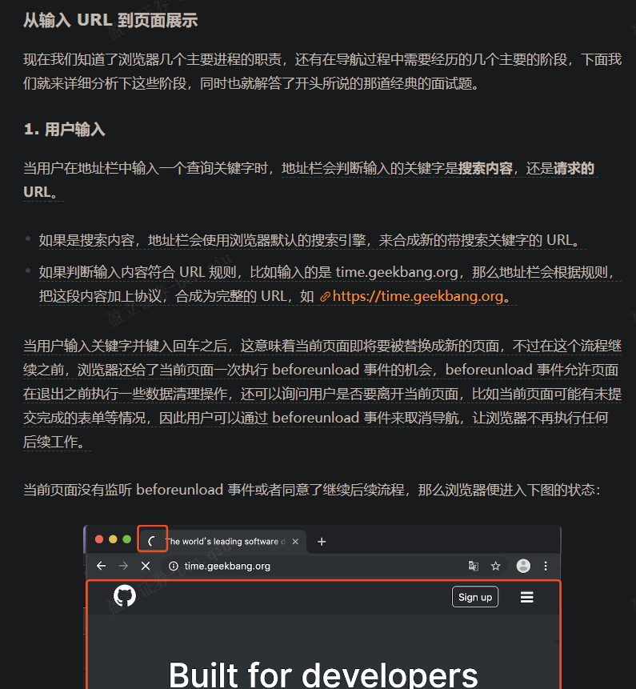
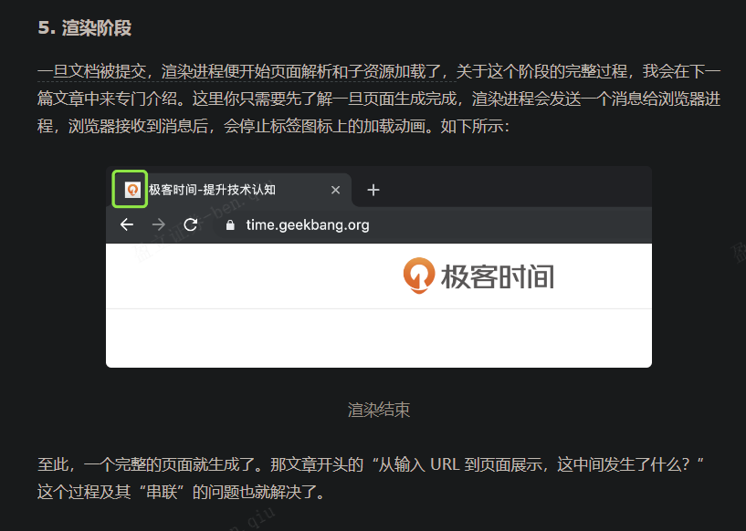

## 开篇词（1讲）

### 开篇词 | 参透了浏览器的工作原理，你就能解决80%的前端难题

#### PWA 方案是什么

PWA（Progressive Web App，渐进式网页应用）是一种用于改进Web应用的技术和方法，使其具备类似原生应用的功能和性能，可以在各种平台和设备上提供更好的用户体验。PWA的目标是克服传统Web应用的一些限制，例如依赖于网络连接、加载速度慢和在移动设备上性能不佳等问题。

以下是PWA的一些关键特性和解决方案：

1. **离线访问：** PWA可以在离线状态下工作，通过使用Service Workers技术缓存应用程序的资源，用户可以在没有网络连接的情况下访问应用程序。

2. **快速加载：** PWA通过缓存资源并使用预加载技术，可以快速加载并提供流畅的用户体验，即使在慢速或不稳定的网络条件下也能如此。

3. **可安装性：** 用户可以将PWA添加到主屏幕，就像原生应用一样，无需通过应用商店安装。这提供了更直接的访问方式。

4. **响应式设计：** PWA使用响应式设计原则，可以适应各种不同尺寸和分辨率的设备，包括手机、平板和桌面电脑。

5. **推送通知：** PWA可以发送推送通知给用户，以便及时提醒用户有关重要信息或更新。

6. **安全性：** PWA必须通过HTTPS提供服务，以确保数据的安全性和用户隐私的保护。

7. **渐进式增强：** PWA采用渐进式增强的方法，这意味着它们可以在不支持某些功能的老旧浏览器中正常工作，但在支持这些功能的现代浏览器中提供更好的体验。

8. **自动更新：** PWA可以自动更新，这意味着用户总是可以访问最新版本的应用程序，而无需手动安装更新。

9. **应用清单（Manifest）：** PWA可以提供一个Web App Manifest文件，用于定义应用程序的名称、图标、颜色和其他外观属性，以及应用程序的行为。

总的来说，PWA是一种强大的Web应用技术，它结合了Web和原生应用的优点，提供了更好的性能、可用性和用户体验，使Web应用更接近原生应用的表现。这些特性使得PWA在移动应用和Web应用的开发中越来越受欢迎。

​	

#### SOA 是什么

SOA（Service-Oriented Architecture，面向服务的架构）是一种软件架构模式，用于设计和开发大型、复杂的分布式应用系统。SOA旨在通过将应用程序划分为可重用的独立服务，以实现松耦合、灵活性和可维护性。

以下是SOA的主要特征和概念：

1. **服务（Services）：** SOA将应用程序划分为一系列独立的、可重用的服务。每个服务执行特定的功能，并通过网络提供接口供其他服务或应用程序调用。

2. **松耦合（Loose Coupling）：** SOA强调服务之间的松耦合关系，这意味着一个服务的改变不应该影响其他服务。松耦合使得系统更容易维护和扩展。

3. **服务契约（Service Contract）：** 服务的接口和行为通过明确定义的服务契约进行描述。契约定义了服务的输入参数、输出参数和操作。

4. **服务编排（Service Orchestration）：** 在SOA中，可以将多个服务组合在一起以执行复杂的业务逻辑。这种组合过程称为服务编排。

5. **服务注册与发现：** SOA系统通常使用服务注册与发现机制来帮助客户端应用程序找到需要的服务。服务通常在注册表中注册自己的元数据，并且客户端可以查询这些信息来定位服务。

6. **异步通信：** SOA支持异步通信模式，允许服务在需要时进行异步交互，以提高性能和可伸缩性。

7. **安全性和事务管理：** SOA注重安全性，提供了身份验证、授权和数据加密等安全机制。此外，它还支持事务管理，以确保数据的一致性。

8. **标准协议：** SOA通常使用标准协议来实现跨平台和跨语言的通信，如SOAP（Simple Object Access Protocol）和REST（Representational State Transfer）。

SOA可以应用于各种类型的应用程序，包括企业级应用、Web服务、云应用、微服务等。它有助于提高系统的可维护性、可扩展性和复用性，同时提供了一种有效的方式来管理复杂的分布式系统。尽管SOA有很多优势，但也需要谨慎设计和管理，以确保它能够成功实施并满足业务需求。

​	

#### WebAssembly 是什么

WebAssembly（通常缩写为Wasm）是一种面向Web的二进制代码格式，用于在现代Web浏览器中运行高性能的、跨平台的应用程序。它是一种可移植的、安全的虚拟机，可以在Web浏览器中以接近原生速度执行代码。WebAssembly的目标是提供一种通用的编译目标，以便将各种编程语言编写的应用程序部署到Web上，而无需依赖特定的浏览器或操作系统。

以下是关于WebAssembly的一些关键特点和信息：

1. **高性能：** WebAssembly的执行速度接近原生机器码，这使得它非常适合需要高性能的应用程序，例如游戏、图像处理、仿真等。

2. **跨平台：** WebAssembly是一种平台无关的技术，可以在各种不同的操作系统和体系结构上运行，包括Windows、macOS、Linux、iOS和Android等。

3. **安全性：** WebAssembly的设计考虑了安全性，并受到Web浏览器的严格沙盒机制保护。它无法直接访问主机系统资源，必须通过JavaScript与Web API进行通信。

4. **低级别：** WebAssembly是一种低级别的虚拟机，其指令集被设计为与现代计算机体系结构相匹配，这使得编译器能够生成高效的代码。

5. **多语言支持：** WebAssembly可以与多种编程语言一起使用，包括C、C++、Rust、Python和Java等。开发者可以使用编译器将这些语言的代码编译成WebAssembly字节码。

6. **与JavaScript互操作：** WebAssembly可以与JavaScript代码互操作，这意味着你可以在JavaScript中调用WebAssembly函数，并且WebAssembly代码也可以调用JavaScript函数。

7. **Web API：** WebAssembly通过Web API（例如WebAssembly JavaScript API）与JavaScript进行通信，允许传递数据和调用功能。

WebAssembly的出现为Web开发提供了更多的灵活性和性能优势，特别是对于需要高性能的应用程序。它已被广泛采用，包括游戏引擎、图像和音频处理库、模拟器等，为Web平台带来了更多的可能性。然而，要使用WebAssembly，开发者需要使用适当的编译工具和工作流程，以便将现有代码编译成WebAssembly模块并在Web应用程序中部署。

​	

## 宏观视角下的浏览器（6讲）

### 01 | Chrome架构：仅仅打开一个页面，为什么有4个进程？

#### 进程间通信（IPC）

进程间通信（Inter-Process Communication，IPC）是指在操作系统中，不同的进程之间进行数据交换和通信的机制。进程可以是独立运行的程序，它们可以在同一台计算机上运行，也可以在不同的计算机上运行。IPC允许这些进程在运行时互相通信、协作和共享数据。

以下是几种常见的IPC机制：

1. **管道（Pipes）：** 管道是一种单向通信机制，允许一个进程将数据写入管道，而另一个进程可以从同一管道读取数据。管道通常用于具有父子关系的进程之间的通信。

2. **命名管道（Named Pipes）：** 命名管道是一种具有命名标识符的管道，它允许不相关的进程之间进行通信。命名管道通常用于不同计算机上的进程之间的通信。

3. **消息队列（Message Queues）：** 消息队列是一种进程间通信的方式，允许进程通过将消息发送到队列中来与其他进程通信。消息队列通常支持多个读取者和写入者。

4. **共享内存（Shared Memory）：** 共享内存是一种高效的IPC方式，允许多个进程在同一块内存区域中读取和写入数据。共享内存通常需要进程之间进行同步和互斥，以避免竞争条件。

5. **信号（Signals）：** 信号是一种异步通信机制，进程可以发送信号给另一个进程，以通知其发生了某个事件或异常情况。例如，进程可以发送SIGTERM信号请求另一个进程优雅地终止。

6. **套接字（Sockets）：** 套接字是一种网络编程中常见的IPC方式，它允许不同计算机上的进程通过网络进行通信。套接字可用于实现客户端-服务器通信以及对等通信。

7. **远程过程调用（Remote Procedure Call，RPC）：** RPC是一种高级IPC机制，它允许一个进程调用远程计算机上的过程或函数，就像调用本地函数一样。RPC使分布式应用程序的构建更加容易。

每种IPC机制都有其自身的优点和限制，选择哪种机制取决于应用程序的需求、可用性和性能要求。在多进程或分布式系统中，IPC是一种重要的通信方式，它使不同的进程能够协同工作，执行各自的任务，从而构建出更复杂的应用程序。

​	

#### 讲一下内存泄漏

内存泄漏是指在程序运行过程中，分配的内存无法被正常释放或回收，导致程序占用的内存不断增加，最终可能导致应用程序性能下降，甚至崩溃。内存泄漏是一种常见的编程错误，通常由以下几种情况引起：

1. **未释放动态分配的内存：** 当在程序中使用诸如 `malloc`、`new` 或 `allocate` 等函数来分配内存时，必须在不再需要该内存时显式释放它，否则会导致内存泄漏。

   ```c
   // C/C++中的内存泄漏示例
   int* ptr = (int*)malloc(sizeof(int));
   // 没有释放内存
   ```

2. **循环引用：** 在某些编程环境（如JavaScript中的DOM节点）中，对象之间的循环引用可能会阻止垃圾回收器正确释放内存，因为这些对象仍然相互引用着。

   ```javascript
   // JavaScript中的循环引用示例
   function createObjects() {
     const obj1 = {};
     const obj2 = {};
     obj1.ref = obj2;
     obj2.ref = obj1;
     // 这里的obj1和obj2将不会被垃圾回收
   }
   ```

3. **未关闭文件或网络资源：** 在处理文件、数据库连接或网络资源时，如果忘记关闭这些资源，它们将保持打开状态并占用内存。

   ```python
   # Python中未关闭文件的示例
   file = open("example.txt", "r")
   # 忘记关闭文件
   ```

4. **缓存和数据结构问题：** 在使用缓存或数据结构时，如果不及时清理不再需要的数据，可能会导致内存泄漏。这通常发生在缓存中存储大量数据但不定期清理的情况下。

   ```java
   // Java中的缓存内存泄漏示例
   Map<String, String> cache = new HashMap<>();
   // 向缓存中添加数据，但不清理过期的数据
   ```

5. **事件监听器未移除：** 在事件驱动的编程环境中，如果添加了事件监听器但未正确移除，这些监听器可能会导致对象无法被垃圾回收。

   ```javascript
   // JavaScript中的事件监听器未移除示例
   const button = document.querySelector("#myButton");
   button.addEventListener("click", function() {
     // 未移除事件监听器
   });
   ```

为了避免内存泄漏，开发者应该定期检查代码，并确保释放不再使用的内存和资源。这包括显式释放动态分配的内存、关闭文件和网络资源、处理循环引用、及时清理缓存等。工具和编程语言通常提供了一些方式来帮助开发者识别和解决内存泄漏问题，例如内存分析工具和垃圾回收器。

​	

#### 架构图


下面我们来逐个分析下这几个进程的功能。

- **浏览器进程**。主要负责界面显示、用户交互、子进程管理，同时提供存储等功能。
- **渲染进程**。核心任务是将 HTML、CSS 和 JavaScript 转换为用户可以与之交互的网页，排版引擎 Blink 和 JavaScript 引擎 V8 都是运行在该进程中，默认情况下，Chrome 会为每个 Tab 标签创建一个渲染进程。出于安全考虑，渲染进程都是运行在沙箱模式下。
- **GPU 进程**。其实，Chrome 刚开始发布的时候是没有 GPU 进程的。而 GPU 的使用初衷是为了实现 3D CSS 的效果，只是随后网页、Chrome 的 UI 界面都选择采用 GPU 来绘制，这使得 GPU 成为浏览器普遍的需求。最后，Chrome 在其多进程架构上也引入了 GPU 进程。
- **网络进程**。主要负责页面的网络资源加载，之前是作为一个模块运行在浏览器进程里面的，直至最近才独立出来，成为一个单独的进程。
- **插件进程**。主要是负责插件的运行，因插件易崩溃，所以需要通过插件进程来隔离，以保证插件进程崩溃不会对浏览器和页面造成影响。

讲到这里，现在你应该就可以回答文章开头提到的问题了：仅仅打开了 1 个页面，为什么有 4 个进程？因为打开 1 个页面至少需要 1 个网络进程、1 个浏览器进程、1 个 GPU 进程以及 1 个渲染进程，共 4 个；如果打开的页面有运行插件的话，还需要再加上 1 个插件进程。


​	

#### 渲染进程和GPU进程有什么区别

渲染进程和GPU进程是浏览器进程中的两个不同组件，它们在浏览器中协同工作以实现网页渲染和图形处理。它们的主要区别在于其功能和任务分工：

1. **渲染进程（Renderer Process）：**
   - 渲染进程是负责呈现（渲染）Web页面内容的进程。
   - 每个标签页（Tab）通常都会有一个独立的渲染进程，以确保不同标签页的网页内容彼此隔离，提高安全性和稳定性。
   - 渲染进程负责解析HTML、CSS和JavaScript，并将其转化为可视化的页面。
   - 渲染进程还处理用户交互、执行JavaScript代码、绘制页面元素和处理事件等任务。
   - 渲染进程与主进程之间使用IPC进行通信，以便处理一些需要浏览器内核支持的操作，如网络请求。

2. **GPU进程（GPU Process）：**
   - GPU进程是负责图形处理的进程。
   - 现代Web页面通常包含复杂的图形和动画，GPU进程负责加速这些图形的渲染，以提高性能和流畅度。
   - GPU进程使用图形处理单元（GPU）来执行图形操作，例如合成页面元素、绘制文本、执行CSS过渡和动画效果等。
   - GPU进程与渲染进程协同工作，以确保页面元素正确渲染和显示。

总结一下，渲染进程和GPU进程在浏览器中扮演不同的角色。渲染进程负责处理网页内容和用户交互，而GPU进程负责图形处理，以提供更好的性能和用户体验。它们之间的协同工作使得现代Web应用程序能够呈现复杂的图形和动画效果，同时保持高性能和响应速度。

​	

#### 即使是如今的多进程架构，我偶尔还会碰到一些由于单个页面卡死最终崩溃导致所有页面崩溃的情况，请问这是什么原因呢

> 作者回复: 是这样的，通常情况下是一个页面使用一个进程，但是，有一种情况，叫"同一站点(same-site)"，具体地讲，我们将“同一站点”定义为根域名（例如，geekbang.org）加上协议（例如，https:// 或者http://），还包含了该根域名下的所有子域名和不同的端口，比如下面这三个：
>
> https://time.geekbang.org
> https://www.geekbang.org
> https://www.geekbang.org:8080
> 都是属于同一站点，因为它们的协议都是https，而根域名也都是geekbang.org。你也许了解同源策略，但是同一站点和同源策略还是存在一些不同地方，在这里你需要了解它们不是同一件事就行了。
>
> Chrome的默认策略是，每个标签对应一个渲染进程。但是如果从一个页面打开了新页面，而新页面和当前页面属于同一站点时，那么新页面会复用父页面的渲染进程。官方把这个默认策略叫process-per-site-instance。
>
> 直白的讲，就是如果几个页面符合同一站点，那么他们将被分配到一个渲染进程里面去。
>
> 所以，这种情况下，一个页面崩溃了，会导致同一站点的页面同时崩溃，因为他们使用了同一个渲染进程。
>
> 为什么要让他们跑在一个进程里面呢？
>
> 因为在一个渲染进程里面，他们就会共享JS的执行环境，也就是说A页面可以直接在B页面中执行脚本。因为是同一家的站点，所以是有这个需求的。

​	

### 04 | 导航流程：从输入URL到页面展示，这中间发生了什么？

- 首先，浏览器进程接收到用户输入的 URL 请求，浏览器进程便将该 URL 转发给网络进程。
- 然后，在网络进程中发起真正的 URL 请求。
- 接着网络进程接收到了响应头数据，便解析响应头数据，并将数据转发给浏览器进程。
- 浏览器进程接收到网络进程的响应头数据之后，发送“提交导航 (CommitNavigation)”消息到渲染进程；
- 渲染进程接收到“提交导航”的消息之后，便开始准备接收 HTML 数据，接收数据的方式是直接和网络进程建立数据管道；
- 最后渲染进程会向浏览器进程“确认提交”，这是告诉浏览器进程：“已经准备好接受和解析页面数据了”。
- 浏览器进程接收到渲染进程“提交文档”的消息之后，便开始移除之前旧的文档，然后更新浏览器进程中的页面状态。

这其中，**用户发出 URL 请求到页面开始解析的这个过程，就叫做导航。**



从图中可以看出，当浏览器刚开始加载一个地址之后，标签页上的图标便进入了加载状态。但此时图中页面显示的依然是之前打开的页面内容，并没立即替换为极客时间的页面。因为需要等待提交文档阶段，页面内容才会被替换。

#### TLS跟TCP/IP有什么联系与区别

TLS（Transport Layer Security）和TCP/IP（Transmission Control Protocol/Internet Protocol）是网络通信中的两个不同但相关的概念，它们在网络安全和通信层面有不同的作用和职责。

**联系：**

1. **层次结构：** TLS和TCP/IP都位于网络协议栈中，属于不同层次的协议。TCP/IP主要在传输层和网络层操作，而TLS位于传输层之上，通常用于保护应用层的通信。

2. **安全性：** TLS通常用于增加通信的安全性，通过加密、数据完整性验证和身份验证等机制，确保数据在传输过程中的保密性和完整性。TCP/IP本身不提供这些安全性保障，因此TLS可以用于在TCP/IP上层添加安全性。

**区别：**

1. **作用和功能：**
   - **TCP/IP：** TCP/IP是一组用于互联网通信的协议，包括TCP（Transmission Control Protocol）和IP（Internet Protocol）。它们负责在网络上可靠地传输数据包，但不提供数据的安全性保障。
   - **TLS：** TLS是一种加密和安全协议，用于在不安全的网络中保护数据的机密性和完整性。TLS通过加密数据、验证数据完整性和身份验证来增加通信的安全性。

2. **协议层次：**
   - **TCP/IP：** TCP/IP协议位于网络协议栈的传输层和网络层，用于管理数据传输和路由。
   - **TLS：** TLS位于传输层之上，通常在应用层和传输层之间，为应用层提供安全性支持。

3. **功能方面：**
   - **TCP/IP：** TCP/IP协议用于建立、维护和终止网络连接，以及在连接上可靠地传输数据。它关注的是连接的建立和数据的传输，但不关心数据的安全性。
   - **TLS：** TLS协议关注的是在已建立的连接上增加数据的安全性。它提供了数据加密、完整性验证和身份验证等安全机制，以确保通信的安全性。

总之，TLS和TCP/IP是网络通信中的两个不同层次的协议，它们分别关注不同方面的通信。TCP/IP是网络通信的基础，负责可靠地传输数据包，而TLS用于在不安全的网络中增加通信的安全性。通常，TLS会在应用层使用，以保护HTTP（HTTPS）、SMTP（SMTPS）、POP3（POP3S）、IMAP（IMAPS）等应用层协议的通信。

> 建立TLS连接的过程是在建立TCP连接之后的

​	

#### （2）响应数据类型处理

在处理了跳转信息之后，我们继续导航流程的分析。URL 请求的数据类型，有时候是一个下载类型，有时候是正常的 HTML 页面，那么浏览器是如何区分它们呢？

答案是 Content-Type。**Content-Type 是 HTTP 头中一个非常重要的字段， 它告诉浏览器服务器返回的响应体数据是什么类型**，然后浏览器会根据 Content-Type 的值来决定如何显示响应体的内容。

​	

#### curl是什么命令

`curl` 是一个在命令行中使用的工具，用于进行网络请求并获取远程资源的数据。它的名字是 "Client URL" 的缩写，它支持多种协议，包括 HTTP、HTTPS、FTP、SCP、SFTP、LDAP 等，可以用于发送请求、下载文件、测试 API、调试网络问题等。

以下是一些常用的 `curl` 命令示例：

1. **发送HTTP GET请求：**
   ```bash
   curl https://www.example.com
   ```

2. **发送HTTP POST请求：**
   ```bash
   curl -X POST -d "param1=value1&param2=value2" https://www.example.com/api
   ```

3. **下载文件：**
   ```bash
   curl -o filename.extension https://www.example.com/file.extension
   ```

4. **支持自动重定向：**
   ```bash
   curl -L https://www.example.com
   ```

5. **设置请求头：**
   ```bash
   curl -H "Authorization: Bearer token" https://www.example.com/api
   ```

6. **保存响应头和正文到文件：**
   ```bash
   curl -D headers.txt -o body.txt https://www.example.com
   ```

7. **发送表单数据：**
   ```bash
   curl -d "username=myusername&password=mypassword" https://www.example.com/login
   ```

8. **使用代理服务器：**
   ```bash
   curl -x proxy-server:port https://www.example.com
   ```

9. **上传文件：**
   ```bash
   curl -F "file=@localfile.txt" https://www.example.com/upload
   ```

10. **指定超时时间：**
    ```bash
    curl --connect-timeout 10 https://www.example.com
    ```

11. **显示详细的请求和响应信息：**
    ```bash
    curl -v https://www.example.com
    ```

12. **使用用户名和密码进行基本身份验证：**
    ```bash
    curl -u username:password https://www.example.com
    ```

`curl` 是一个功能强大的命令行工具，可以帮助开发者执行各种与网络相关的任务。它在各种操作系统中都可用，并且被广泛用于测试和调试网络服务、API和网站。

##### mac和windows都支持吗

是的，`curl` 是一个跨平台的命令行工具，支持 macOS、Windows 和许多其他操作系统。您可以在 macOS 和 Windows 上使用 `curl` 命令执行网络请求和访问远程资源。

在 macOS 上，`curl` 通常已经预安装在系统中，因此您可以直接在终端中使用它。

在 Windows 上，您可以通过以下方式使用 `curl`：

1. **使用 Windows 命令提示符：** 在 Windows 命令提示符或 PowerShell 中，您可以直接使用 `curl` 命令。请注意，在某些情况下，您可能需要指定完整的路径（如 `C:\path\to\curl.exe`）。

2. **使用 Windows Subsystem for Linux (WSL)：** 如果您安装了 Windows Subsystem for Linux（WSL），则可以在 WSL 中使用 `curl`，与在Linux上的用法相同。

3. **使用第三方工具：** 除了官方提供的 `curl` 命令行工具，还有一些第三方工具和图形界面应用程序，可以在 Windows 上更轻松地使用 `curl` 功能。

无论您使用哪种方式，`curl` 都可以用于执行各种网络请求和操作，包括下载文件、发送HTTP请求、测试API等。它在跨平台开发和调试中非常有用。

​	

#### 同一站点

- 同域名
- 同协议

```http
https://time.geekbang.org
https://www.geekbang.org
https://www.geekbang.org:8080
```

上面的url都是属于同一站点，因为它们的协议都是 HTTPS，而且根域名也都是 geekbang.org。

Chrome 的默认策略是，每个标签对应一个渲染进程。但如果从一个页面打开了另一个新页面，而新页面和当前页面属于同一站点的话，那么新页面会复用父页面的渲染进程。官方把这个默认策略叫 process-per-site-instance。

​	

