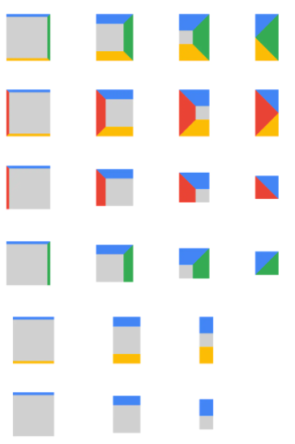

## 货拉拉一面-0906

```html
<h1>************************** 题目一 **************************</h1>
<html>
<head>
<style>
  body > div {
    width: 100px;
    height: 100px;
    background: green;
  }

  .test1 {
    
  }

  .test2 {
    
  }

  .test3 {
    width: 0;
    height: 0;
    border-left: 50px solid transparent; /* 左边透明 */
    border-right: 50px solid transparent; /* 右边透明 */
    /* 当仅有邻边时， 两个边会变成对分的三角（这也就解释了为什么left+right的边界等于盒子的宽度width） */
    border-bottom: 100px solid green; /* 底部红色，可以更改颜色 */
  }
</style>
</head>

<body>
  <h2>题目1、将方块内的文字 水平+垂直居中</h2>
  <div class="test1">文字居中</div>
  <h2>题目2、将方块在整个页面（窗口）中 水平+垂直居中</h2>
  <div class="test2"></div>
  <h2>题目3、将方块实现成一个三角形</h2>
  <div class="test3"></div>
</body>
</html>


<h1>************************** 题目二 **************************</h1>
<script type="text/javascript">
    // 题目2：解析一个 URL 里的参数部分，返回一个对象
    function getUrlParams(url) {
        return {};
    }

    // 以下例子输出为 { a: 'a', b: '', c: '3' }
    console.log(getUrlParams('https://ltl.huolala.cn/#/?a=a&b=&c=3'));
</script>


<h1>************************** 题目三 **************************</h1>
<script type="text/javascript">
    // 实现根据输入数值，输出格式化时间显示；显示如下console所示。
    function formatSecond(value) {
        return 'TODO';
    }

    console.log(formatSecond(59)); // 59秒
    console.log(formatSecond(60)); // 1分00秒
    console.log(formatSecond(3601)); // 1小时00分01秒
</script>
```

主要问基础，`html`、`css`、`js`、`http和浏览器原理`，手机音量低，用耳机没录音，下面凭印象复盘记录

- 笔试题
- span标签可以包裹p标签吗？（span标签是可以包裹p标签的（display: inline-block））
- dom的两个回调函数（不会，reload？）
- 去重的方法
- display：none 和 visibility：hdden的区别（说到了重排？）
- 在浏览器url输入域名后回车后这一过程发生了什么（找篇文章好好看看）
  - DNS域名解析
  - TCP/IP 连接（三次握手和四次挥手，只讲了这个）
  - 浏览器渲染
- 你在公司负责哪些项目？
- 做项目的时候遇到过什么重大挑战？（你花很多时间没解决，最后解决了发现也不难）

面试官反馈：基础不好，html的基础掌握不好，css相对好点，知道这个东西但掌握不好，js好点，可能是经常开发的原因，计算机网络基础也不好，然后刚刚笔试题由于你带没电脑，我也只是跟着你的思路走，不确定这个东西是不是真的能实现，用什么方式解决重点不在这，主要是里面解决问题的原理，的关键，面试官需要你回答的是这个，总之这次面试还是有收获的

### [面试官：CSS如何画一个三角形？原理是什么？](https://vue3js.cn/interview/css/triangle.html#%E4%B8%80%E3%80%81%E5%89%8D%E8%A8%80)

#### 原理分析

- 可以看到，边框是实现三角形的部分，边框实际上并不是一个直线，如果我们将四条边设置不同的颜色，将边框逐渐放大，可以得到每条边框都是一个梯形

  

  当分别取消边框的时候，发现下面几种情况：

  - 取消一条边的时候，与这条边相邻的两条边的接触部分会变成直的
  - 当仅有邻边时， 两个边会变成对分的三角（这也就解释了为什么left+right的边界等于盒子的宽度width，见下面图(1,4)）
  - 当保留边没有其他接触时，极限情况所有东西都会消失

  

  通过上图的变化规则，利用旋转、隐藏，以及设置内容宽高等属性，就能够实现其他类型的三角形

  如设置直角三角形，如上图倒数第三行实现过程，我们就能知道整个实现原理

  实现代码如下：

  ```css
  /* 上面的笔试题已经写好答案了，下面的仅供参考 */
  .box {
      /* 内部大小 */
      width: 0px;
      height: 0px;
      /* 边框大小 只设置两条边*/
      border-top: #4285f4 solid;
      border-right: transparent solid;
      border-width: 85px; 
      /* 其他设置 */
      margin: 50px;
  }
  ```

​	

## 法大大-0907

主要问业务和js的一些用法

- vue3的自定义hook
- css做三角形（这个很常考，一定要会）
- css原生变量
- 如何用js获取html的所有的元素标签（querySelectorAll(*)+用Set()）调用api的而已，但没接触过，也简单讲了一下set容器的特征和用法
- 了解在现公司的一些情况
- 反问
  - 对方公司业务所用技术栈（跟盈立差不多）
  - 对目前学前端的一些建议（也是建议后面要转全栈才跟稳住脚跟）

​	

## 朝野科技-0912

前面问了JS、Vue、TS（TS感觉面试官是比较在线的，我答的不好）和简历项目经历上业务实现的一些问题

#### TS：

类型XX和接口的区别？

#### Vue：

讲一下响应式原理

#### 项目经历：

实习期间做项目遇到的重大挑战（问题）以及如何解决？

> 这一部分不要再说预览图片的功能了，回去好好思考这一部分要如何答比较完美

（项目一）pdf判断

（项目二）支付功能的实现

> 小结：加强TS的使用和了解原理，这部分比较欠缺，Vue响应式原理需要重新回顾，这次项目上问题刚好还能回答，如果包装简历也请先了解项目实践的问题是如何解决的，将实现XX插件，不用提及第三方（自我唯心感觉不好）

